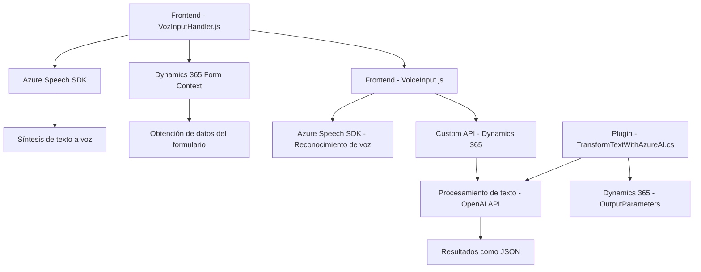

### Breve resumen técnico
Este proyecto consiste en integrar funcionalidades avanzadas de interacción con formularios (entrada y salida por voz) y procesamiento de texto utilizando servicios externos de Microsoft Azure (Speech SDK y OpenAI). Está diseñado para entornos como Dynamics 365 y combina interacción con formularios, accesibilidad mediante síntesis de voz y transformaciones inteligentes de datos.

---

### Descripción de arquitectura
La solución presenta una arquitectura híbrida que fusiona enfoque cliente-servidor y diseño modular:
1. **Cliente-servidor:** Los componentes interactúan constantemente con APIs externas (Speech SDK, Azure OpenAI).
2. **Modularidad:** Cada funcionalidad está implementada en funciones específicas (manejo de formularios, procesamiento de voz, síntesis de texto).
3. **Plugin-based:** En Dynamics CRM, los plugins como `TransformTextWithAzureAI.cs` ejecutan lógica adicional dentro de un flujo predefinido.
4. **N capas:** El código está dividido en diferentes capas:
   - **Frontend (JavaScript):** Procesa datos de formularios, entrada/salida por voz y gestiona la interacción con Dynamics 365.
   - **Servicios:** Interfaz con Azure Speech SDK y otras APIs (e.g., OpenAI).
   - **Backend Plugin:** Implementa lógica avanzada para la transformación y almacenamiento de datos en Dynamics 365.

---

### Tecnologías usadas
1. **JavaScript (ES6+)**: En el frontend, responsable de manipular el DOM, interactuar con forms, y manejar el Speech SDK.
2. **Dynamics CRM / Dynamics 365**: Entorno para la gestión de formularios y ejecución del plugin.
3. **Microsoft Azure Speech SDK**: Síntesis y reconocimiento de voz para mejorar accesibilidad y entrada de datos.
4. **Microsoft Azure OpenAI API**: Procesamiento avanzado de texto utilizando modelos de IA (ejemplo: GPT-4).
5. **C# (.NET)**: En la capa del plugin (`TransformTextWithAzureAI.cs`), para interactuar con Dynamics CRM y realizar peticiones HTTP a Azure OpenAI.
6. **JSON:** Formato para estructurar entradas y salidas entre servicios.

---

### Diagrama Mermaid completamente compatible con GitHub Markdown

---

### Conclusión final
Esta solución está diseñada para entornos empresariales con necesidades avanzadas de entrada y salida de datos mediante voz. Utiliza Microsoft Azure Speech SDK para mejorar la accesibilidad (síntesis y reconocimiento de voz) y Azure OpenAI para transformar texto siguiendo reglas predefinidas. Su arquitectura modular, junto con patrones de integración como cliente-servidor y plugins de Dynamics CRM, garantiza alta escalabilidad y adaptación a requerimientos personalizados. Elegir soluciones en la nube asegura compatibilidad con sistemas modernos y facilita la integración con otros servicios empresariales.