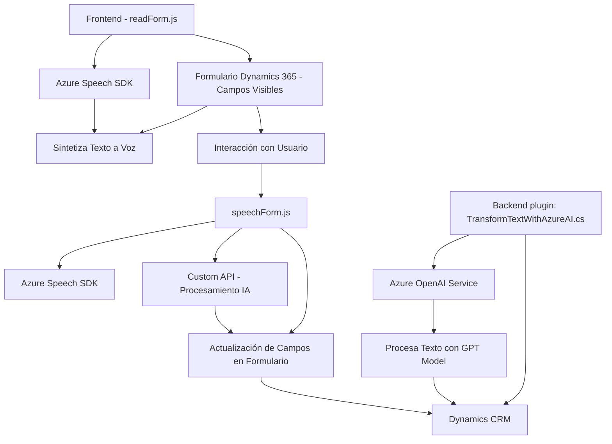

### Análisis técnico y arquitectónico

#### Breve resumen técnico
El repositorio contiene tres archivos principales que forman parte de una solución que interactúa con formularios en Dynamics 365 y utiliza servicios de Azure para sintetizar voz, reconocer texto hablado y procesar información con inteligencia artificial. Se enfoca en la entrada y salida relacionada con formularios visuales manejados por usuarios, empleando APIs externas como Azure Speech SDK y Azure OpenAI.

---

### Descripción de arquitectura
La arquitectura es una combinación de **n capas** y **integración desacoplada de servicios externos**. Cada capa de la solución está focalizada en una responsabilidad específica:
1. **Frontend (arquitectura modular)**:
   - El manejo de voz y texto interactúa con los formularios dinámicos de Dynamics 365.
   - Uso de patrones de procesamiento por eventos (verificación del SDK cargado dinámicamente y activación de flujo mediante callbacks).
   - Modularización clara con funciones independientes, como extracción del contexto de formulario y síntesis o reconocimiento de voz.

2. **Backend (arquitectura basada en plugins)**:
   - El archivo del plugin de Dynamics 365 es un componente personalizado que amplía la funcionalidad base del CRM, haciendo uso de servicios como Azure OpenAI para transformar texto dinámicamente.
   - Este diseño es adecuado para entornos empresariales que utilizan CRM personalizables como parte de su backend.

---

### Tecnologías usadas
1. **Frontend:**
   - **JavaScript ES6+:** Utilizado para lógica de interacción y dinamismo en la interfaz.
   - **Azure Speech SDK:** Para reconocimiento de voz y síntesis de texto-habla.
   - **Dynamics 365:** Integración de datos de formulario con objetos personalizados.

2. **Backend:**
   - **.NET Framework (C#):** Implementación del plugin que extiende funcionalidad en Dynamics CRM.
   - **Azure OpenAI Service:** Para procesamiento avanzado de texto (GPT-4 o similar).
   - **Librerías .NET estándar:** NewtonSoft.Json para serialización, System.Net.Http para comunicación basada en API.

---

### Patrones usados
1. **Modularización:**
   - En el frontend, cada archivo separa responsabilidades: manipulación del texto, reconocimiento mediante voz, interacción con el context-API, etc. Esto simplifica el mantenimiento y la extensión de funcionalidades.
2. **Adaptador para servicios externos:**
   - Tanto en el frontend como en el backend, los archivos actúan como adaptadores para interactuar con servicios de Azure Speech SDK y Azure OpenAI.
3. **Separación de Concerns:**
   - En el backend, el plugin se centra exclusivamente en extender la lógica de Dynamics CRM sin afectar su núcleo.
4. **Eventos encadenados:**
   - Uso de callbacks y promesas en JavaScript para manejar dependencias como la carga dinámica del SDK.

---

### Diagrama **Mermaid** basado en la interacción global del proyecto

---

### Conclusión final
La solución presentada forma parte de una arquitectura **modular híbrida** que combina capas de frontend y backend integradas con servicios externos. Es altamente escalable gracias a su estructura desacoplada:
- El frontend interactúa directamente con Dynamics 365 para extraer información de formularios y utiliza Azure Speech SDK para manejar síntesis y reconocimiento de voz.
- El backend extiende la lógica del CRM mediante un plugin que se comunica con Azure OpenAI para transformar texto.

Este diseño es ideal para entornos empresariales que requieren interacción avanzada de usuarios con sistemas CRM y servicios basados en inteligencia artificial.