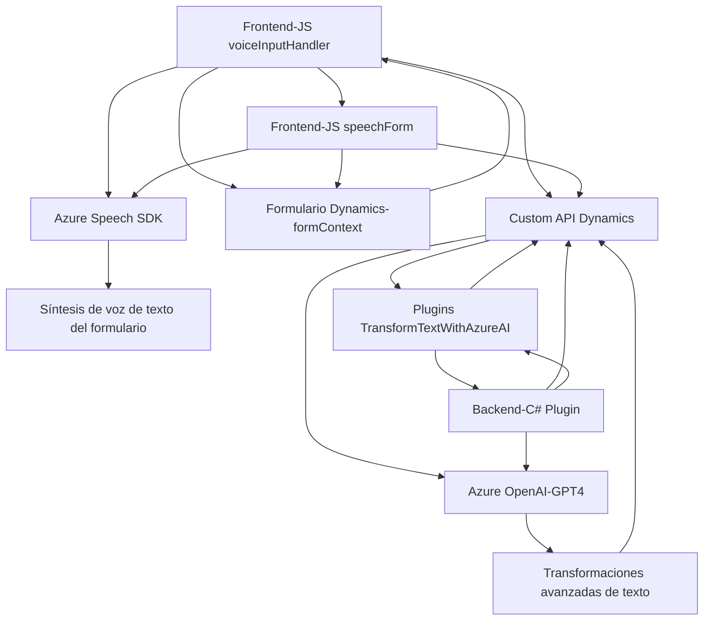

### Breve resumen técnico
Este repositorio está diseñado para una solución que integra reconocimiento y síntesis de voz con funcionalidades basadas en inteligencia artificial (Azure AI/OpenAI) en un entorno de formulación dinámica, con especial orientación para plataformas como Dynamics 365 CRM. Combina un frontend desarrollado con JavaScript para interacción entre usuario y servicios de voz, y un backend basado en .NET C# para lógica más compleja con Azure OpenAI.

### Descripción de arquitectura
La arquitectura es híbrida y combina:
- **Frontend (presentación)**: una solución basada en JavaScript que interactúa directamente con el entorno de Dynamics 365 CRM.
- **Servicios cloud integrados**: Azure Speech SDK para reconocimiento y síntesis de voz, y Azure OpenAI para transformación avanzada de texto.
- **Backend en .NET**: actuando como un plugin para esos sistemas, procesando lógica de negocio mediante integración con herramientas del CRM y servicios externos (HTTP API).

Aunque puede parecer una solución monolítica (por su dependencia de Dynamics como base principal), utiliza **principios de arquitectura de microservicios**, especialmente en la separación de responsabilidades entre frontend, backend y servicios en la nube. Además, el concepto de "capas" se hace presente en la separación lógica del procesamiento en dinámicas de frontend y backend.

### Tecnologías usadas
1. **Frontend**:
   - **JavaScript**: Para funcionalidad del cliente.
   - **Azure Speech SDK**: Reconocimiento y síntesis de voz.
   - **Dynamics CRM (formContext)**: Interacción directa con formularios del CRM.

2. **Backend**:
   - **C#** y **.NET Framework**: Para desarrollo de plugins en Dynamics CRM.
   - **Microsoft.Xrm.Sdk**: Librería nativa para interacción con Dynamics APIs.
   - **System.Net.Http**: Para llamadas a servicios externos.
   - **Newtonsoft.Json**: Para manejo de datos en formato JSON.

3. **Servicios Cloud**:
   - **Azure Speech SDK**: Integración para el reconocimiento y síntesis de voz.
   - **Azure OpenAI (GPT-4)**: Procesamiento avanzado e inteligencia artificial.

### Dependencias o componentes externos
- **Azure Speech SDK** y **Azure OpenAI**: Desempeñan un rol clave en la síntesis y reconocimiento de voz, así como en la construcción dinámica de texto estructurado.
- **Dynamics CRM**: Parte esencial del sistema es la integración directa y las operaciones basadas en atributos, contextos de formularios y llamadas a APIs de Dynamics.
- **Custom APIs de Dynamics**: Extienden la funcionalidad del CRM con lógica conectada a servicios como Azure OpenAI.
- **Newtonsoft.Json**: Procesamiento de JSON en el backend.
- **System.Text.Json**: Similar a Newtonsoft.Json, para serialize/deserializar objetos.
- **Campo `executionContext`**: Un objeto que provee contexto sobre interacciones activas con formularios en Dynamics CRM.

---

### Diagrama Mermaid

### Conclusión final
Este repositorio construye una solución híbrida que interrelaciona el frontend, el backend y servicios cloud, manteniendo una arquitectura horizontalmente modular. La solución está diseñada para un entorno específico (Dynamics CRM), pero tiene flexibilidad para integrar con APIs externas, como Azure Speech y OpenAI, para mejorar la experiencia del usuario y automatizar tareas con inteligencia artificial. Es un ejemplo moderno de cómo un diseño técnico bien estructurado puede facilitar la integración entre plataformas empresariales y tecnologías avanzadas.