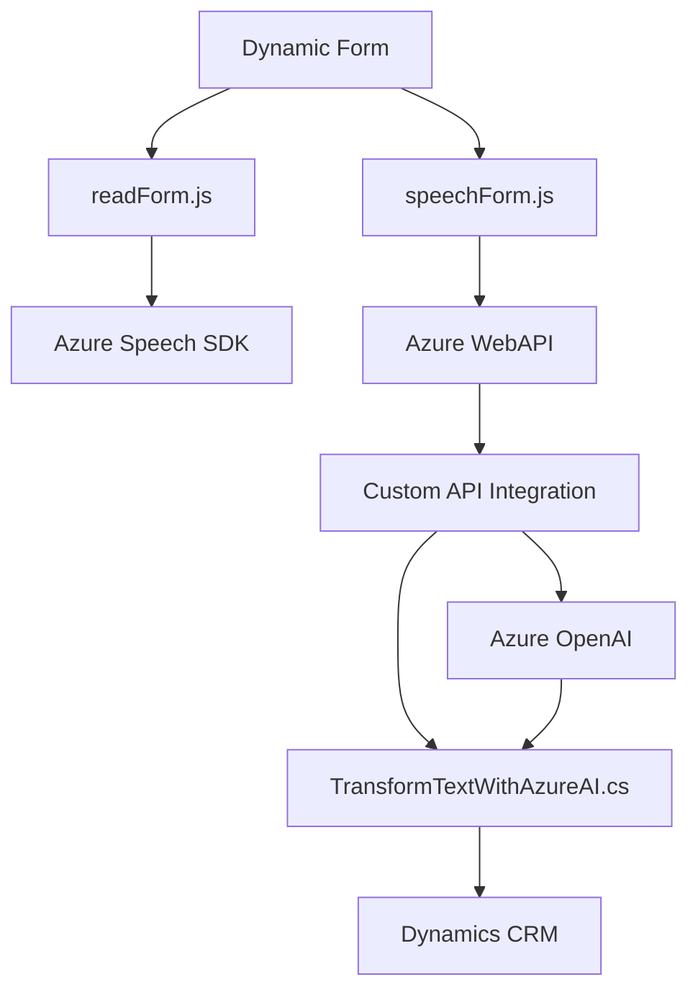

### Breve resumen técnico
El repositorio contiene implementaciones relacionadas con la interacción entre el usuario y formularios en una plataforma como Dynamics CRM utilizando reconocimientos de voz y generación de contenido con IA. Las principales funcionalidades incluyen síntesis de voz, reconocimiento de voz, manipulación de formularios dinámicos y el uso de Azure OpenAI para generar respuestas en formato JSON.

---

### Descripción de arquitectura
La arquitectura adoptada es una combinación de aplicaciones frontales y plataformas de integración:
1. **Frontend**: Dos archivos JS (`readForm.js` y `speechForm.js`) que actúan en el nivel de presentación de la interfaz de usuario. Estas aplicaciones se comunican con APIs externas y dinámicamente actualizan formularios sobre una plataforma CRM.
2. **Backend**: Implementación de un plugin en C# (`TransformTextWithAzureAI.cs`) que actúa en el nivel de negocio e integra OpenAI para el procesamiento avanzado de datos de texto y lo transforma en JSON.

El diseño general sigue una **arquitectura de integración basada en eventos**, estructurada bajo el modelo de **n capas**, donde el frontend gestiona las interacciones de usuario (presentación), mientras los plugins en la capa de negocio (backend de Dynamics) se encargan de realizar la operación lógica y comunicación con APIs. La arquitectura no está completamente desacoplada (como hexagonal), pero sí se emplea una **clara separación de responsabilidades** para maximizar el mantenimiento.

---

### Tecnologías usadas
1. **Frontend**:
   - JavaScript: Para la interacción del usuario con los formularios.
   - Azure Speech SDK: Reconocimiento de voz y síntesis de texto.
   - Dynamics WebAPI (`Xrm.WebApi`): Para integración directa con la capa de datos de Dynamics.

2. **Backend** (Plugin):
   - **C#**: Tecnología central del código implementado.
   - **Azure OpenAI (GPT-4)**: Procesamiento avanzado de texto.
   - **Newtonsoft.Json** / `System.Text.Json`: Para manipulación de objetos JSON.
   - **Regex**: Aunque se exporta, aún no parece ser utilizada en los fragmentos.

3. **Patrones Arquitectónicos**:
   - **Event-driven programming**: Uso evidente de eventos y callbacks en los scripts JS.
   - **Integración con APIs externas**: Azure Speech y OpenAI usados como servicios de terceros para enriquecer la funcionalidad.
   - **Responsabilidad Única**: Clases y métodos organizados para abordar tareas específicas, basado en el SRP del diseño orientado a objetos.
   - **Adapter pattern**: Las funciones de mapeo entre los campos del formulario y las entradas (texto transcrito o JSON procesado).

---

### Diagrama Mermaid válido en GitHub

---

### Conclusión final
El repositorio es parte de una solución **frontend-backend híbrida** centrada en manejar formularios dinámicos mediante voz y síntesis de datos empleando servicios de Azure. La **claridad en responsabilidades**, junto con la integración de APIs como Azure Speech SDK y Azure OpenAI, evidencia un uso eficiente de tecnologías modernas en plataformas CRM como Dynamics. La arquitectura emplea **n capas**, promoviendo facilidad de mantenimiento. Sin embargo, podría beneficiarse de desacoples adicionales (e.g., arquitectura hexagonal) si se requerirá mayor extensibilidad en futuras iteraciones.