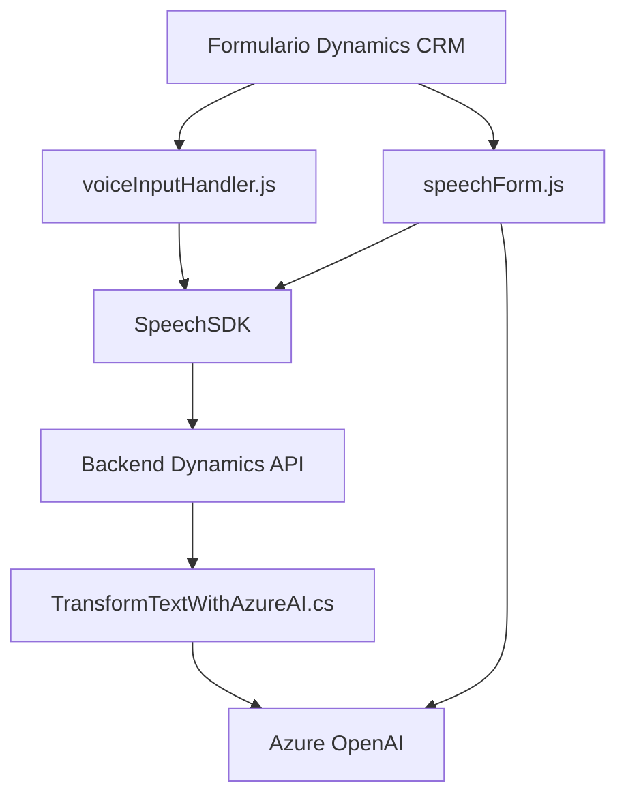

## Análisis técnico:

### Breve resumen técnico:
El proyecto es una solución de integración con Dynamics CRM que habilita dos funcionalidades principales:
1. **Frontend JavaScript**: Extensiones para procesamiento de datos en formularios de Dynamics CRM que utilizan **Speech SDK** de Azure para lectura y síntesis de voz.
2. **Backend Plugin en .NET**: Plugins personalizados que procesan texto con **Azure OpenAI** para generación de JSON estructurado.

Está diseñado como una solución complementaria para automatizar la interacción en Dynamics CRM mediante procesamiento de datos y servicios externos.

---

### Descripción de arquitectura:
Este es un proyecto híbrido que presenta dos capas principales:
- **Capa de presentación**: Frontend/JavaScript integrado directamente en Dynamics utilizando extensiones API nativas (`executionContext`) y dependencias externas como el **Azure Speech SDK**. Es modular con funciones específicas para procesamiento de formularios y voz.
- **Capa de negocio**: Plugins (.NET/c#). La arquitectura sigue los patrones tradicionales de componentes de Dynamics CRM, usando el patrón **pipeline plugin**, donde cada plugin se acopla al flujo de ejecución de entidades y eventos del CRM.
- En conjunto, las capas están acopladas indirectamente mediante el API de Dynamics CRM.

La arquitectura combina **n capas** con integración por APIs externas (Azure Cognitive Services y OpenAI), manteniendo el procesamiento fuertemente orientado a contexto y entidad.

---

### Tecnologías usadas:
- **Frontend**:
  - Lenguaje: **JavaScript**.
  - Framework/librerías: **Azure Speech SDK**.
  - API: Contexto y formularios de **Dynamics CRM**.
- **Backend**:
  - Lenguaje: **C#**.
  - Framework: **Dynamics CRM SDK**.
  - Librerías: 
    - `Microsoft.Xrm.Sdk` para interacción CRM.
    - `System.Text.Json` para manejo de JSON.
  - Servicio externo: **Azure OpenAI Service** (GPT).
  - HTTP Client para solicitudes web.
- Otros:
  - Carga dinámica de dependencias (Azure Speech SDK en tiempo de ejecución).

### Dependencias y/o componentes externos:
1. **Azure Speech SDK**: Reconocimiento y síntesis de voz.
2. **Azure OpenAI Service**: Para procesamiento avanzado de texto hacia JSON estructurado.
3. **Dynamics CRM SDK**: Framework base para plugins y extensión de formulario.
4. **Frontend/formularios Dynamics**: Contextos proporcionados por la plataforma.
5. **HTTP Client**: Librería estándar para integración de servicios REST.

---

### Diagrama Mermaid para representación del flujo (compatible con GitHub Markdown):

---

### Conclusión final:
Esta es una solución híbrida que proporciona extensiones funcionales específicas para formularios y eventos en Dynamics CRM, habilitando automatización a través de reconocimiento de voz y procesamiento de texto mediante servicios de Azure. Sigue patrones tradicionales pero bien estructurados, como modularidad funcional en el frontend y el uso de plugins en el backend. Puede beneficiarse de mejoras como mayor desacoplamiento entre las capas y optimización en la comunicación asincrónica para operaciones externas.

El diseño facilita un enfoque contextual para Dynamics CRM, empleando capacidades avanzadas de **Azure Speech SDK** y **OpenAI** para incrementar la eficiencia del usuario final. Sin embargo, requiere configuraciones específicas para los entornos de Azure. Excelente solución para escenarios que requieren automatización y asistentes inteligentes en plataformas empresariales.