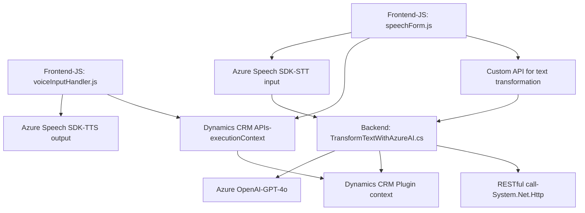

### Breve resumen técnico:
Este repositorio contiene tres módulos principales orientados a la interacción con formularios de Dynamics 365 y tecnologías de Azure, específicamente Speech y OpenAI. Está diseñado para implementar funcionalidades avanzadas como entrada y salida de voz en formularios, así como transformación de datos mediante inteligencia artificial. 

---
### Descripción de arquitectura:
La solución sigue una arquitectura de **modelo modular**, apoyada en dependencias externas como SDKs y APIs para extender las funcionalidades del CRM. El procesamiento está distribuido entre componentes frontales (JavaScript) y plugins de servidor (`TransformTextWithAzureAI.cs`), lo que le da una estructura de sistema híbrido con integración de servicios en la nube.

- **Frontend**: Interacción del usuario con el navegador mediante JavaScript (específicamente Dynamics 365).
- **Backend**: Plugins .NET ejecutados en el servidor del CRM con interacción síncrona con OpenAI para la transformación de datos.
- **APIs externas**: Uso intensivo del SDK de Azure Speech para TTS/STT y de Azure OpenAI para transformar texto.

Patrón clave: **Eventos de callback** para cargar y operar servicios externos (SDK como dependencia dinámica).

---
### Tecnologías usadas:
1. **Frontend** (JavaScript):
   - Dynamics 365 CRM API.
   - Azure Speech SDK para TTS y STT.
   - DOM API para manipulación en tiempo real.

2. **Backend**:
   - Dynamics CRM SDK (`Microsoft.Xrm.Sdk`).
   - Azure OpenAI Platform (GPT-4o).
   - .NET Framework/C#.
   - `System.Net.Http`, `System.Text.Json`, `Newtonsoft.Json.Linq` para manejo de APIs y JSON.

Patrones:
- **Modularización de funciones** en JavaScript (función-responsabilidad única).
- **Plugin Pattern** para la clase `TransformTextWithAzureAI`.
- Uso de APIs externas (Azure Speech, Azure OpenAI) y diseño basado en callbacks para dinámicamente cargar dependencias.

---
### Diagrama **Mermaid**:

---
### Conclusión final:
La solución implementada en este repositorio está diseñada para proporcionar interacción avanzada con formularios de Dynamics 365 mediante tecnologías modernas como reconocimiento y síntesis de voz (Azure Speech SDK) y procesamiento de datos con IA (Azure OpenAI). La arquitectura se adapta a un modelo **modular** y posiblemente una variante híbrida con integración de microservicios, ya que los módulos frontales se apoyan en varios servicios externos para cumplir funciones específicas. 

La solución muestra un diseño robusto y extensible, aunque podría mejorarse mediante patrones asincrónicos más eficaces en el plugin de backend, especialmente para las llamadas HTTP.