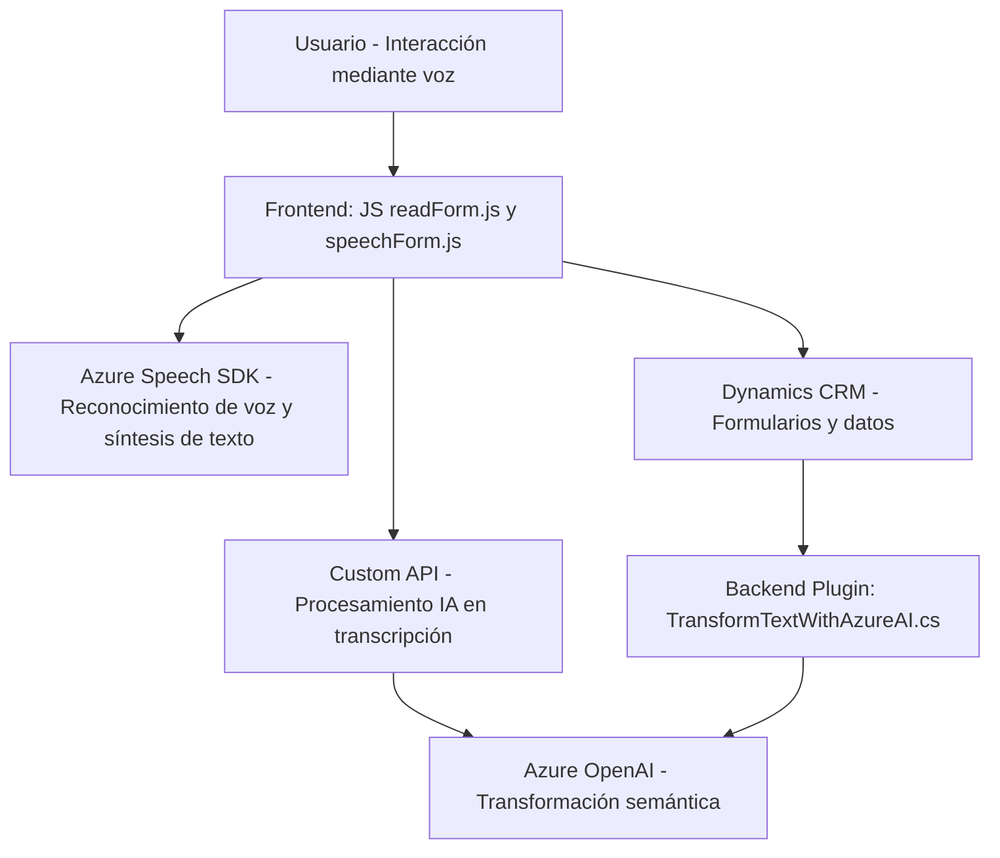

### **Breve resumen técnico**
El repositorio explora la integración de Microsoft Azure Speech SDK y OpenAI con formularios de Dynamics CRM, proporcionando funcionalidades como reconocimiento de voz, síntesis de texto y transformación de datos mediante inteligencia artificial. La solución parece estar compuesta por un **front-end en JavaScript** y un **plugin en C# para Dynamics CRM** (backend). Su propósito es habilitar una interacción más intuitiva entre usuarios y formularios mediante comandos de voz y procesamiento de datos con IA.

---

### **Descripción de arquitectura**
La arquitectura presenta características de un sistema **n-capas** con una clara separación entre el front-end (gestión de formularios) y el back-end (plugin de Dynamics CRM). Además, utiliza servicios externos (Azure Speech SDK y OpenAI) para llevar a cabo tareas específicas, lo que introduce elementos de **microservicios externos** utilizando APIs REST para procesamiento de voz y análisis semántico. La solución está orientada a integrarse sobre un sistema empresarial como Dynamics 365.

---

### **Tecnologías usadas**
1. **Frontend JavaScript:**
   - **Azure Speech SDK**: Para síntesis de texto a voz y reconocimiento de voz.
   - **Dynamics CRM Web API**: Interacción con formularios dinámicos.
   - **Custom API**: Procesamiento de transcripciones con Azure AI.

2. **Backend (.NET/C# Plugin):**
   - **Microsoft.Xrm.Sdk**: Para la ejecución del plugin en Dynamics CRM.
   - **Newtonsoft.Json**: Manipulación de JSON.
   - **System.Net.Http**: Para consumir external APIs.
   - **Azure OpenAI (GPT-4)**: Transformación de texto en JSON basado en reglas.

3. **Patrones arquitectónicos:**
   - **Facade pattern**: Simplificación de lógica de voz en el front-end.
   - **Adapter pattern**: Manejo de datos dinámicos para ajustar valores.
   - **Plugin architecture**: Encapsulación de lógica en el CRM backend.
   - **Event-driven design**: Lógica basada en eventos tanto en SDK como en CRM.

---

### **Diagrama Mermaid compatible con GitHub**

---

### **Conclusión final**
Esta solución combina distintas tecnologías de front-end y back-end para establecer un sistema interactivo y dinámico de gestión de formularios. Usando Dynamics CRM, Azure Speech SDK y OpenAI (GPT-4), se automatizan procesos de entrada de datos mediante reconocimiento y síntesis de voz, junto con transformación semántica de texto. La arquitectura modular permite una separación clara de responsabilidades, logrando un diseño extensible y adaptable a otros sistemas empresariales.