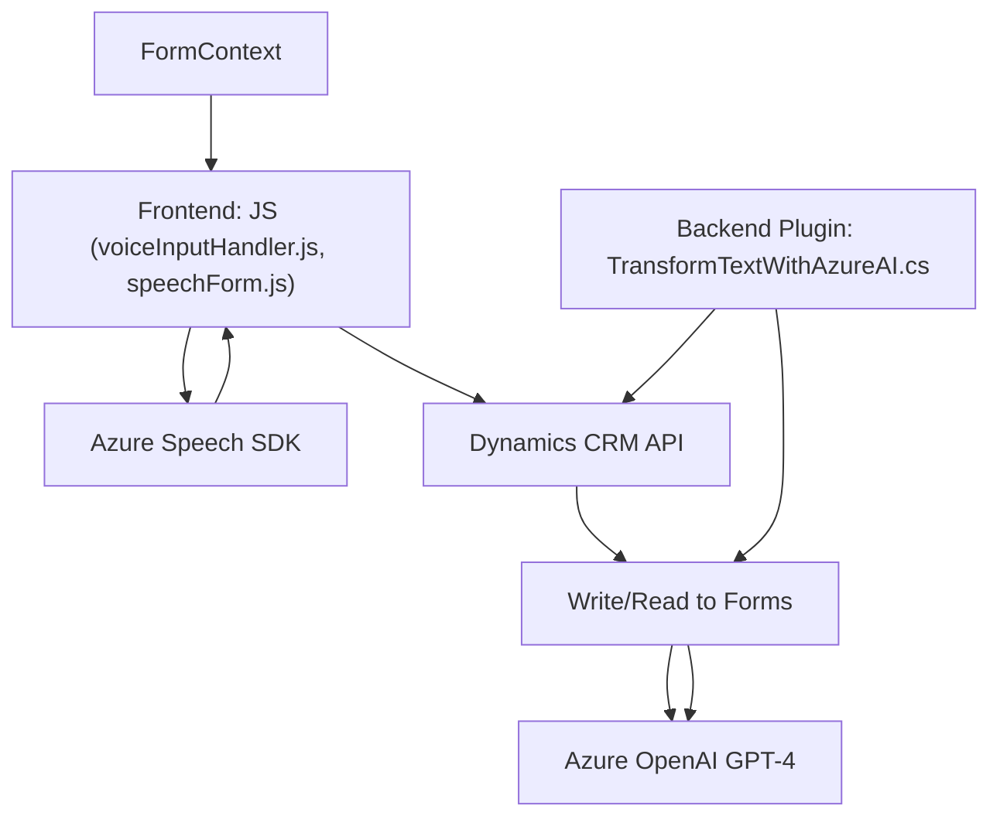

### Breve resumen técnico:

El repositorio incluye múltiples archivos relacionados con la transformación, procesamiento y síntesis por voz y texto en un sistema basado en Dynamics CRM, utilizando tecnologías como Azure Speech SDK y Azure OpenAI. Se centra en la lectura de formularios, interpretación de datos por voz y transformación del texto mediante inteligencia artificial (GPT-4 en Azure OpenAI), para aplicaciones integradas dentro del entorno del CRM. Presenta un diseño modular para la captura, transformación y lectura de datos, con una arquitectura orientada a servicios.

---

### Descripción de arquitectura:

La solución implementa componentes en tres áreas principales:  
- **Frontend/JavaScript**: 
  Scripts que interactúan directamente con el SDK de Azure Speech para la lectura y síntesis de voz, además de la integración con formularios CRM mediante Dynamics API (`Xrm.WebApi`).
- **Plugins/Dynamics**: 
  Componente backend en C# que extiende la funcionalidad de Dynamics CRM mediante procesamiento avanzado de texto con Azure OpenAI (GPT-4) y retorna un JSON estructurado para ser usado en la capa de frontend o en procesos internos.  
   
#### Tipo de arquitectura: **n-capas orientada a servicios**.  
La arquitectura presenta una separación clara entre frontend (captura y síntesis de voz), integración con APIs de terceros (Azure, Dynamics CRM), y backend procesado por el plugin en C# para lógica empresarial más avanzada.

---

### Tecnologías utilizadas:

1. **Frontend (JavaScript)**:
   - **Framework**: Vanilla JS (sin otros frameworks evidentes).
   - **Servicios externos**: 
     - **Microsoft Azure Speech SDK** para síntesis y reconocimiento de voz.  
   - **Patrones empleados**:
     - Modularización (cada archivo encapsula la funcionalidad).
     - Carga condicional/Asíncrona de dependencias (gestión de SDK dinámico).

2. **Backend (C# Plugin para Dynamics CRM)**:
   - **Framework**: .NET Framework.
   - **Servicios externos**:
     - **Azure OpenAI GPT-4 (REST API)** para procesamiento avanzado con IA.
   - **Librerías utilizadas**: Newtonsoft.Json, System.Net.Http, Microsoft.Xrm.Sdk.
   - **Patrones empleados**:
     - Plugin Pattern (expandiendo lógica en Dynamics CRM).
     - API Consumer Pattern (llama a servicios externos mediante REST).

---

### Dependencias o componentes externos:

1. **Microsoft Azure Speech SDK**:
   - Dinámicamente cargado para reconocimiento y síntesis de voz.  
   - Usado directamente desde el navegador (`https://aka.ms/csspeech/jsbrowserpackageraw`).
  
2. **Azure OpenAI GPT-4 API**:
   - Utilizado para transformar texto de acuerdo con reglas específicas. Se comunica con el endpoint definido (`https://openai-netcore.openai.azure.com`) a través de REST.

3. **Dynamics CRM API**:
   - Extensión del sistema base mediante el framework SDK (`IPlugin` y otros servicios).
   - Interacción constante con los formularios para aplicar datos.

4. **HTTP y JSON Libraries**:
   - Newtonsoft.Json y System.Net.Http para manejo de comunicaciones REST y JSON formateado.

---

### Diagrama Mermaid:

---

### Conclusión final:

La solución es **un sistema extensible de procesamiento de voz y texto**, con integración directa a Dynamics CRM. Utiliza tecnologías cloud de vanguardia como Azure Speech SDK y Azure OpenAI para habilitar funcionalidades avanzadas de síntesis y reconocimiento de voz, además del procesamiento semántico del texto. La arquitectura basada en **n-capas orientada a servicios** es adecuada para la implementación en entornos empresariales, con frontend y backend bien desacoplados. 

Para mejorar la seguridad, las claves de API y otros datos sensibles deben moverse a un gestor de configuración seguro en lugar de incluirlos dentro del código fuente. La modularidad presente en la estructura facilita la escalabilidad.