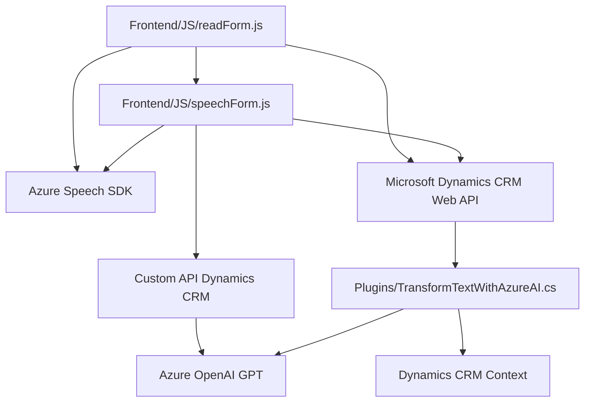

### Breve Resumen Técnico
El repositorio contiene una solución enfocada en la integración de capacidades de reconocimiento de voz, síntesis de texto a voz, y procesamiento de datos enriquecidos por IA en un entorno de Microsoft Dynamics CRM. La solución parece estar diseñada para mejorar la interacción del usuario en formularios mediante tecnologías de Azure como el Speech SDK y OpenAI, en combinación con funciones en JavaScript y C#.

---

### Descripción de Arquitectura
La arquitectura utiliza un enfoque modular y orientado a servicios. Sobresalen los siguientes aspectos:
- **Front-end:** Implementación en JavaScript con funciones para reconocimiento de voz, síntesis de voz, y procesamiento de datos interactivos con formularios.
- **Back-end:** Plugins en C# ejecutados en Dynamics CRM, conectando servicios de Azure para transformación enriquecida de datos.
- **Estructura distribuida:** Uso de servicios externos como el Azure Speech SDK y Azure OpenAI para delegar capacidades avanzadas fuera del entorno local.

El diseño principal refleja una arquitectura híbrida entre **n capas** (interacción clara entre front-end y back-end) y **orientada a servicios/microservicios** por el consumo de APIs externas.

---

### Tecnologías y Frameworks Usados
**Front-end:**
- **JavaScript con integración de librerías:**
  - Azure Speech SDK para reconocimiento y síntesis de voz.
  - Funciones de manipulación de archivos y formularios en Dynamics CRM.
  - APIs de REST y promesas para soportar integración.

**Back-end:**
- **C# con Dynamics CRM Plugins:**
  - Framework de Dynamics SDK (`IPlugin`) para la ejecución dentro del entorno de CRM.
  - **HttpClient** para comunicación con el servicio de Azure OpenAI.
  - **Newtonsoft.JSON** y **System.Text.Json** para transformaciones JSON y manipulación de datos.

---

### Dependencias o Componentes Externos Presentes
1. **Azure Speech SDK:** Para reconocimiento de voz y síntesis de texto a voz.
2. **Azure OpenAI API:** Para procesamiento avanzado de texto enriquecido mediante IA GPT.
3. **Microsoft Dynamics CRM Web API:** Para integración con formularios, asignación de valores, y ejecución de Custom APIs.
4. **Custom API en Dynamics CRM:** Procesamiento de texto enriquecido por IA.
5. **Newtonsoft.Json:** Manejo avanzado de datos JSON (C# Plugin).

---

### Diagrama Mermaid

---

### Conclusión Final
La solución presentada en el repositorio es una integración avanzada entre tecnologías de reconocimiento y síntesis de voz, enriquecimiento de datos con IA, y un sistema CRM robusto. Utiliza un enfoque modular en el front-end combinado con plugins en el back-end, delegando la lógica compleja a servicios externos de Azure. Este diseño resulta óptimo para soluciones empresariales que requieren alta adaptabilidad, interacción avanzada, y procesamiento bajo demanda.