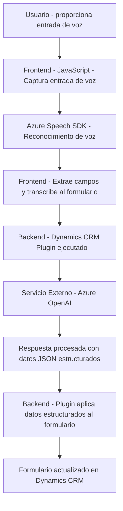

### **Breve resumen técnico**
Este repositorio contiene una solución orientada a integrar reconocimiento de voz y procesamiento de lenguaje natural en formularios de Microsoft Dynamics CRM. Utiliza dos componentes principales: un **frontend en JavaScript** que opera con Azure Speech SDK para tareas de reconocimiento y síntesis de voz, junto con un **backend en C# para Dynamics CRM**, que ejecuta un plugin que utiliza Azure OpenAI para transformar texto en JSON estructurado según normas predefinidas.

---

### **Descripción de arquitectura**
La arquitectura del sistema tiene las siguientes características:
1. **Híbrida n-capas integrada con un CRM:** Combina un frontend en JavaScript para interactuar con usuarios mediante voz, y un backend que amplía las funciones de Dynamics CRM a través de un plugin. El flujo de datos entre las capas se gestiona mediante API externas (Azure Speech API y Azure OpenAI).
2. **Distribución funcional:** Las responsabilidades están claramente segmentadas entre el frontend (interacción usuario y lógica de cliente) y el backend (procesamiento avanzado y llamadas a Azure OpenAI).
3. **Backend event-driven en Dynamics CRM:** El plugin responde a eventos del CRM, procesando datos y devolviendo resultados estructurados según normas específicas.
4. **Modular, con dependencias externas:** Se apoyan en SDKs externos para reducir la carga de implementación interna (p. ej., Azure Speech SDK para reconocimiento de voz y Azure OpenAI para procesamiento de datos).

---

### **Tecnologías usadas**
- **Frontend**:
  - **JavaScript**: Creación del frontend para procesar formularios y manejar voz (reconocimiento y síntesis).
  - **Azure Speech SDK**: Tecnología de Microsoft utilizada para funcionalidad de reconocimiento de voz y síntesis, gestionada mediante carga dinámica.
- **Backend**:
  - **C#.NET**: Desarrollo del plugin para el CRM en Dynamics.
  - **Microsoft.Xrm.Sdk**: Framework para extender funcionalidades del CRM.
  - **Azure OpenAI**: Procesador externo para implementar transformaciones avanzadas de texto.
  - **HTTPClient** y **JSON frameworks**: Integración con APIs externas y procesamiento de datos en formato JSON.
- **Integraciones**:
  - **Dynamics CRM**: Como plataforma principal donde ocurre la ejecución del plugin y desde donde los formularios son interactuados.

---

### **Diagrama Mermaid**

---

### **Conclusión final**
Este repositorio implementa una solución que combina reconocimiento de voz y procesamiento de lenguaje natural para enriquecer formularios en Dynamics CRM. La arquitectura combina un frontend orientado a eventos con un backend basado en plugins CRM, logrando integración directa con tecnologías externas de Microsoft como Azure Speech SDK y Azure OpenAI. Este enfoque modular y altamente extensible facilita la implementación de asistentes conversacionales o automatización avanzada en entornos empresariales.