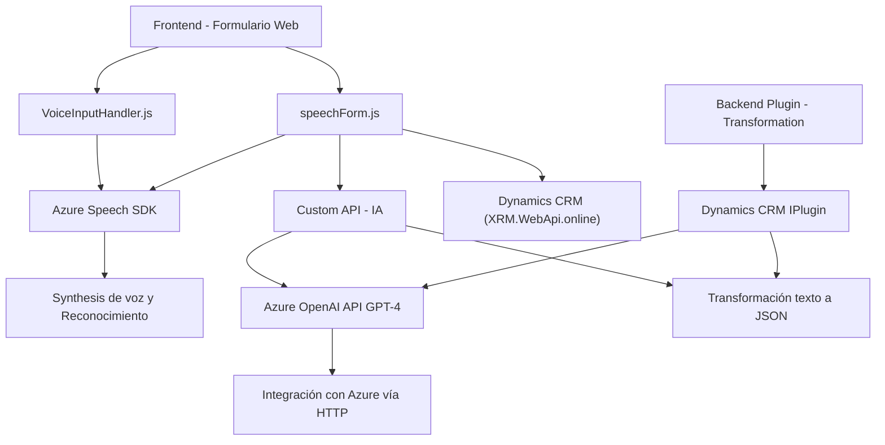

### Breve resumen técnico
El repositorio describe componentes de software organizados principalmente en tres áreas:
1. **Frontend (JavaScript)**: Integración con Azure Speech SDK para capturar, procesar y verbalizar datos del formulario mediante reconocimiento y síntesis de habla.
2. **Backend Plugin (C#)**: Utilización de Azure OpenAI para transformar texto usando modelos GPT y vinculación directa con Dynamics CRM.
  
Los elementos del repositorio reflejan una solución cloud híbrida donde se orquesta la interacción entre servicios de reconocimiento de voz, síntesis de voz y procesamiento de texto mediante IA, con capacidad dinámica para administración de datos en un CRM.

---

### Descripción de arquitectura

1. **Frontend JS**: 
   - Usa una arquitectura de **n capas**:
     - **Capa de interfaz (HTML)**: Formulario interactivo.
     - **Capa lógica (JavaScript)**: Procesamiento y mapeo dinámico de datos del formulario.
     - **Capa servicio (Azure Speech SDK)**: Interacción directa con servicios cloud para síntesis y reconocimiento de voz.
   
2. **Plugin Backend C#**:
   - **Arquitectura Microservicio híbrida**: El plugin actúa como un microservicio que transforma texto con Azure OpenAI en el contexto de Dynamics CRM (IPlugin).
   - **Integración en capas**: Colabora con una arquitectura existente extendiendo funcionalidades esenciales del CRM.

---

### Tecnologías usadas
1. **Frontend**:
   - **Azure Speech SDK**: Reconocimiento y síntesis de voz.
   - **JavaScript**: Para orquestación y mapeo de formularios.
   - **Async/Await + Promesas**: Gestión robusta de operaciones asíncronas.
2. **Backend Plugin**:
   - **Dynamics CRM SDK (Microsoft.Xrm.Sdk)**: Interacción directa con módulos y eventos del CRM.
   - **Azure OpenAI Models (GPT-4)**: Transformación de texto con IA.
   - **Newtonsoft.Json + System.Text.Json**: Procesamiento JSON.

---

### Diagrama Mermaid

---

### Conclusión final

La solución presentada combina tecnologías modernas y patrones bien definidos para proporcionar una experiencia interactiva basada en voz y procesamiento textual avanzado:
1. **Tipo de solución**: Una solución híbrida enfocada en **interacción hombre-máquina**, destacando el uso de reconocimiento, síntesis de voz y procesamiento de texto. Es una mezcla de frontend interactivo y backend extensible.
2. **Arquitectura**: La solución adopta una arquitectura de **n capas** en el frontend y un **patrón de microservicio híbrido** en el plugin backend, garantizando modularidad y escalabilidad con el uso de servicios cloud como Azure Speech y OpenAI.
3. **Ventajas principales**: Uso de componentes externos (Azure Speech SDK, Azure OpenAI API) permite mantener mínima la lógica compleja dentro de ambas capas, relegando la responsabilidad de tareas críticas a dichos servicios.
  
El sistema se presta para evolucionar, y es robusto para entornos empresariales que requieren accesibilidad e integración con CRMs como Dynamics.