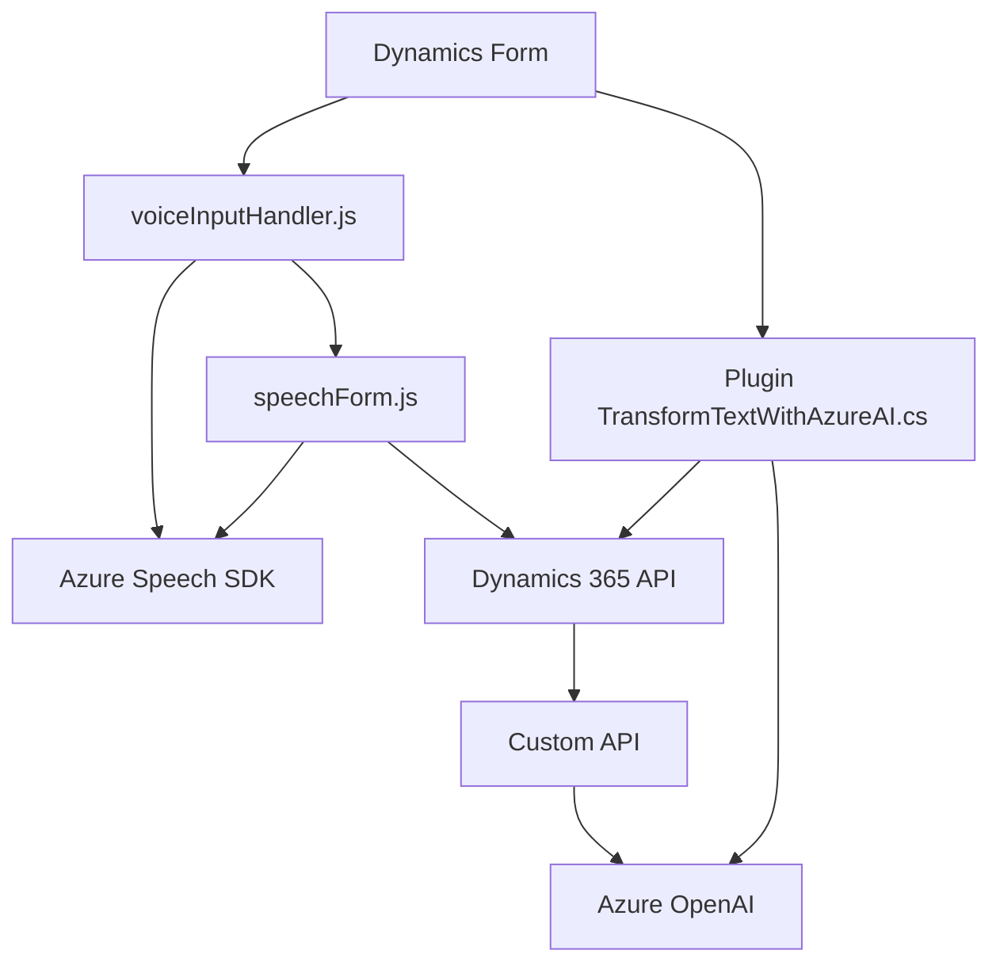

### Breve resumen técnico
El repositorio contiene una solución destinada a integrar mecanismos de entrada y salida de voz, así como procesamiento de datos utilizando Microsoft Dynamics 365 y servicios de Azure (Azure Speech SDK y Azure OpenAI). La solución incluye dos módulos principales: uno enfocado en el frontend (Dynamics 365 forms) y otro en plugins backend para procesamiento avanzado.

---

### Descripción de arquitectura
La solución sigue una arquitectura híbrida:
1. **Frontend (JavaScript):** El código JavaScript opera como un middleware entre el usuario y los servicios de Azure, utilizando un enfoque modular para la interacción asincrónica, SDKs externos y Dynamics 365.
2. **Backend (C#):** Incluye un plugin basado en Dynamics 365 que utiliza el patrón **Service Integration** para procesar texto con Azure OpenAI.
3. **Arquitectura Global:** La estructura combina características de **n capas** (presentación, lógica y persistencia) con integración de servicios distribuidos, reflejando un diseño **Service-Oriented Architecture (SOA)**.

---

### Tecnologías usadas
- **Plataforma:** Dynamics 365 CRM.
- **Frontend:**
  - JavaScript (ES6).
  - Azure Speech SDK (para síntesis y transcripción de voz).
- **Backend:**
  - C#.
  - Dynamics 365 SDK (IPlugin).
  - Azure OpenAI (GPT-4).
- **Dependencias generales:**
  - HTTP Client y JSON Libraries (System.Net.Http, System.Text.Json).
  - `Newtonsoft.Json.Linq` para manipulación avanzada de JSON.

---

### Diagrama Mermaid
El siguiente diagrama ilustra la alta interacción entre los componentes del sistema:

---

### Conclusión final
La solución está diseñada para enriquecer la experiencia de usuarios en Dynamics 365 mediante entrada y salida de voz integrada con servicios avanzados de Azure. El uso de SDKs y APIs refleja una arquitectura moderna basada en **n capas**, destacando un desacoplamiento entre el frontend (módulos JavaScript) y el backend (plugins y servicios OpenAI). Esto garantiza escalabilidad, claridad estructural y una buena integración de tecnologías distribuidas.