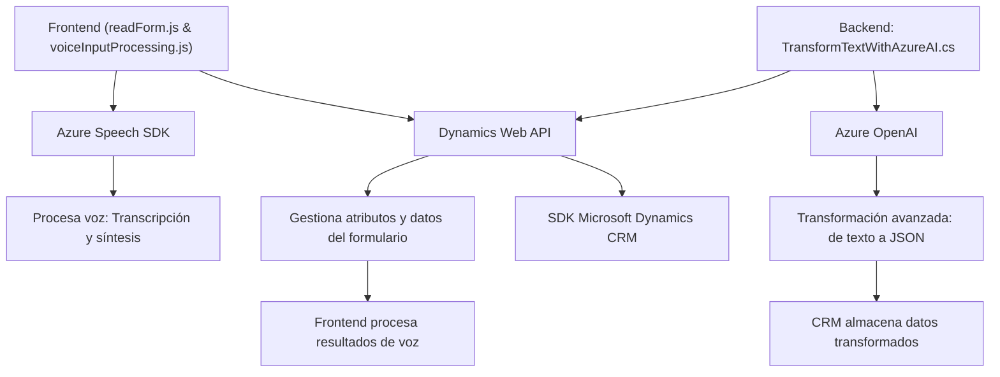

# Breve resumen técnico

El repositorio analiza elementos de procesamiento de voz y texto integrados con tecnologías de Microsoft y servicios en la nube. Las principales funcionalidades giran en torno al uso de Azure Speech SDK para captura y síntesis de voz, procesamiento dinámico de datos en formularios con Microsoft Dynamics CRM y transformación mediante Azure OpenAI. Estos archivos incluyen tanto soluciones frontend (basadas en JavaScript) como plugins server-side (.NET).

---

# Descripción de arquitectura

La solución exhibe una **arquitectura de múltiples capas**:
1. **Capa de presentación (Frontend)**: Implementada con JavaScript, facilita la interacción del usuario mediante funciones de reconocimiento de voz y síntesis, incorporadas por Azure Speech SDK.
2. **Capa de lógica de negocio (Backend)**: Encapsulada dentro de un plugin en C# que gestiona la interacción programática con Dynamics CRM y delega el procesamiento avanzado al servicio Azure OpenAI.
3. **Capa de servicios externos**: Dependencias como Azure Speech SDK y Azure OpenAI, junto con Microsoft Dynamics Web API, reflejan una arquitectura orientada al consumo y delegación de servicios externos.

Los patrones de diseño predominantes incluyen **Modularidad Funcional**, **External API Integration**, **Context-Aware Logic** en el frontend, y el **Plugin Design Pattern** en el backend.

---

# Tecnologías usadas

1. **Front-End (JavaScript)**:
   - **SDK de Azure Speech**: Para la captura y síntesis de voz.
   - **Microsoft Dynamics Web API**: Gestión de atributos y entidades en CRM.
2. **Backend (C#)**:
   - **Microsoft Dynamics CRM SDK**: Desarrollo de plugins para integración directa con entidades CRM.
   - **Azure OpenAI**: Procesamiento avanzado de estructuras JSON para generación de respuestas.
   - **HttpClient** (desde .NET): Comunicación HTTP con servicios externos.
   - **Newtonsoft.Json** y **System.Text.Json**: Procesamiento y manipulación de datos JSON.
3. **Infraestructura**:
   - **Microsoft Azure**: Hospedaje de servicios OpenAI y Speech SDK, y base para CRM Dynamics.

---

# Diagrama Mermaid válido para GitHub

---

# Conclusión final

La solución presentada combina múltiples capas para proporcionar funcionalidades robustas para manejo de voz y texto en plataformas orientadas al usuario, integradas con Microsoft Dynamics CRM. La arquitectura refuerza la modularidad y reutilización, utilizando servicios externos como Azure Speech SDK y OpenAI para ampliar las capacidades del sistema. Es adecuada para entornos empresariales que requieran alta interacción entre datos ingresados y presentados en formularios.