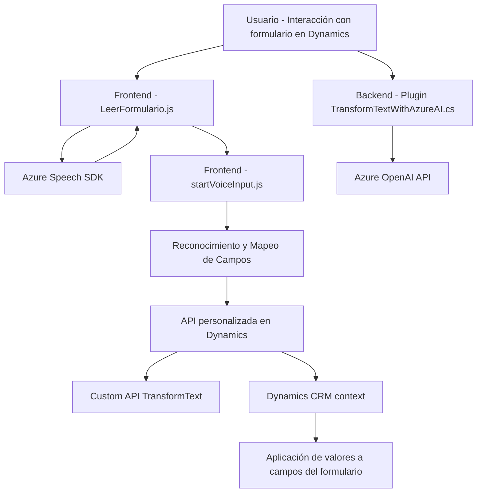

### Breve resumen técnico

El repositorio contiene funcionalidad para una solución basada en reconversión de datos y voz. Los archivos muestran una integración clara entre Dynamics 365 y servicios de Azure (Speech SDK y OpenAI) para capturar datos, procesarlos y transformarlos conforme a las reglas del negocio. La mezcla de frontend basado en JavaScript y backend con Dynamics CRM (C#) sugiere una arquitectura orientada a servicios.

---

### Descripción de arquitectura

La solución tiene las siguientes características arquitectónicas:
1. **Estilo arquitectónico general**: 
   - En el frontend: Arquitectura de una capa para manejo de eventos en el cliente.
   - En el plugin (C#): Arquitectura basada en eventos en Dynamics CRM con soporte de procesamiento por servicios externos.
2. **Patrones observados**:
   - **Monolítica**: El código del frontend concentra toda la lógica de proceso y está dividido únicamente en archivos por funcionalidad. No hay separación explícita en capas como presentación, negocio, o persistencia.
   - **Arquitectura extensible basada en eventos**: Característica del plugin utilizado en Dynamics CRM.
   - **Integración**: Uso de servicios como Azure Speech SDK y Azure OpenAI.

---

### Tecnologías usadas

- **Frontend**:
  - **Tecnología principal**: JavaScript.
  - **Servicios externos**: Azure Speech SDK (asíncrono, para síntesis de voz y reconocimiento).
  - Framework especializado: `Dynamics 365 Form API`.

- **Backend**:
  - **Tecnología principal**: C#.
  - **Framework especializado**: Dynamics CRM SDK.
  - **Bibliotecas**:
    - Newtonsoft.Json para manipulación de JSON en C#.
    - System.Net.Http para llamados HTTP hacia Azure OpenAI.

- **Servicios externos**:
  - Azure Speech SDK para reconocimiento de voz y síntesis de texto a voz.
  - Azure OpenAI para transformar texto utilizando IA avanzada.

---

### Diagrama Mermaid válido para GitHub

---

### Conclusión final

La solución implementada en este repositorio puede clasificarse como una integración funcional entre cliente (JS) y backend (C#). Su principal propósito es habilitar interacciones avanzadas mediante voz en formularios Dynamics 365 y procesamiento de texto enriquecido, usando servicios de Azure Speech SDK y OpenAI.

### Puntos clave destacados:
1. **Estructura Modular**: El repositorio implementa funciones específicas pero no muestra separación clara en capas.
2. **Dependencias sensibles**: La clave y region de Azure son críticas, deben manejarse con seguridad.
3. **Uso extensivo de API externas**: La solución no funcionará sin servicios externos como Azure Speech o OpenAI.
4. **Futuras mejoras**: Se puede refactorizar para incluir capas de presentación, negocio y datos, alineándose mejor a principios de arquitectura hexagonal o n-capas.