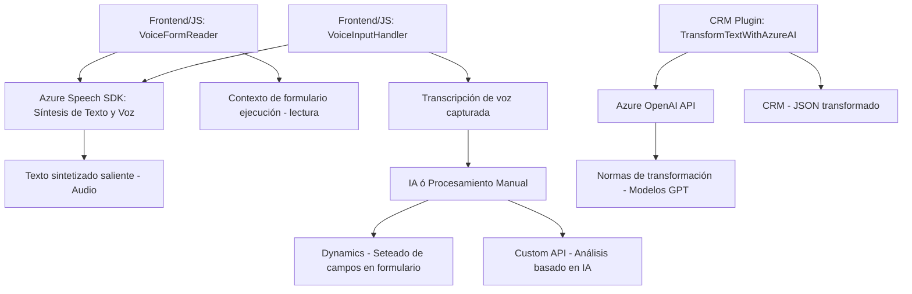

### Breve resumen técnico:
El repositorio parece implementar una solución integrada para la interacción de usuarios con formularios en Dynamics 365 mediante voz y texto, utilizando tecnologías avanzadas de IA como **Azure OpenAI** y **Azure Speech SDK**. La estructura incluye componentes de frontend en JavaScript para captura de voz y síntesis de texto, herramientas para transcripción basada en IA, y plugins desarrollados en C# para transformar texto en el ecosistema CRM.

---

### Descripción de arquitectura:
La solución tiene componentes distribuidos entre un frontend que interactúa con usuarios y una extensión del backend CRM mediante un plugin. Aunque la arquitectura no está basada completamente en microservicios, tiene características de una arquitectura **basada en eventos y API-first**, con patrones de integración hacia servicios externos como el Azure Speech SDK y Azure OpenAI. Podría clasificarse como una **arquitectura híbrida orientada a cliente y servidor**, adaptada específicamente a entornos de Dynamics CRM.

---

### Tecnologías usadas:
1. **Frontend:**
   - **JavaScript:** Desarrollo del cliente orientado a formularios.
   - **Azure Speech SDK:** Para síntesis de texto a voz y reconocimiento de voz.
   - **Dynamics Context API (Xrm.WebApi):** Integración con el entorno del formulario.

2. **Plugin Backend:**
   - **C#, .NET Framework/Dynamics SDK:** Extensiones del CRM mediante plugins.
   - **Azure OpenAI API:** Modelo GPT para análisis y transformación de texto.
   - **JSON Libraries:** Procesamiento y serialización de datos (e.g., `Newtonsoft.JSON.Linq`).

3. **Patrones:**
   - **Responsabilidad única:** Cada clase y método cumple funciones específicas (e.g., extracción de datos, procesamiento de texto).
   - **Integración con servicios externos:** Azure Speech SDK y OpenAI API.
   - **Carga dinámica:** SDK cargado bajo demanda en el frontend.
   - **Adaptación de datos:** Procesamiento de entrada, mapeo y seteo en formularios CRM como parte del **patrón Adapter**.
   - **Pipeline funcional:** De entrada (texto/voz) a salida procesada.

---

### Diagrama Mermaid:

---

### Conclusión final:
La solución implementada en el repositorio es un sistema basado en una arquitectura híbrida que combina elementos de cliente y servidor para interactuar con los servicios de Dynamics CRM. Su diseño se basa en patrones como carga dinámica, separación de responsabilidades y adaptación de datos, aprovechando herramientas de Microsoft y capacidades de IA en la nube. Es eficiente para la automatización de entradas en formularios mediante voz y texto, constituyendo una integración avanzada con tecnologías de AI.