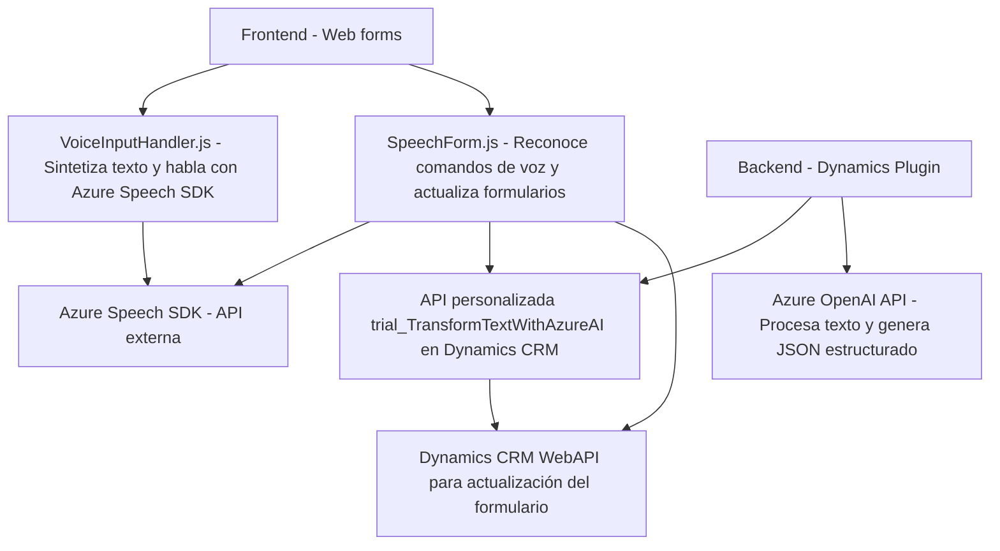

### Breve resumen técnico

El repositorio contiene varios archivos que implementan funcionalidades interactivas y de integración para aplicaciones con Dynamics CRM y Azure. Los principales aspectos técnicos abordan:

- **Frontend**: Manejo de formularios web dinámicos combinados con reconocimiento de voz y síntesis de texto mediante el SDK de Azure Speech.
- **Backend/plugin**: Procesamiento de texto con Azure OpenAI para estructurar datos y actuar como complementos dentro del pipeline de Dynamics CRM.

---

### Descripción de arquitectura

#### **Tipo de solución**: 
Principalmente, este repositorio parece implementar un sistema híbrido que incluye:
- Una **interfaz frontend interactiva** para formularios web con integración directa con el Azure Speech SDK.
- Una **funcionalidad de procesamiento backend** (plugin en C#) para extender capacidades de Dynamics CRM, facilitando el procesamiento avanzado de texto estructurado mediante Azure OpenAI.

#### **Arquitectura**: 
La arquitectura del sistema combina los siguientes enfoques:
- **N-capas**: Divide las responsabilidades entre frontend (UI/formularios), lógica de negocio (plugins) y servicios externos (APIs de Azure Speech/AI).
- **Integración con APIs externas**: Se apoya en Azure OpenAI para procesamiento de texto estructurado y en Azure Speech para interacción audio-vocal.
- **Event-driven programming**: Gran parte de la arquitectura está basada en eventos (interacciones del usuario, ejecución de plugins, respuesta de APIs).
- **Cloud-oriented architecture**: Conexión con servicios nube (REST y SDK basado en web).

---

### Tecnologías usadas

#### **Frontend:**
- **Azure Speech SDK**: Reconocimiento de voz y síntesis de texto.
- **DOM API**: Manipulación de elementos del HTML.
- **JavaScript**: Para lógica en el cliente, gestión dinámica de la carga de scripts y procesamiento del DOM.

#### **Plugin Backend:**
- **Microsoft Dynamics CRM SDK**: Extiende funcionalidades mediante el patrón `IPlugin`.
- **Azure OpenAI API**: Procesamiento de texto en lenguaje natural estructurado.
- **C#**, namespaces (`System`, `Newtonsoft.Json.Linq`, etc.) para construcción del plugin y acceso a datos del CRM.
- **REST API (HTTP)**: Llamadas a servicios externos.

#### **Otros**:
- JSON para intercambio de datos estructurados entre dependencias.
- **Dynamic Script Loading**: Importación de librerías en navegador en tiempo de ejecución.

---

### Diagrama Mermaid válido para GitHub

---

### Conclusión final

La solución es un sistema híbrido de integración que conecta funcionalidad frontend (reconocimiento de voz y formularios dinámicos) con servicios backend en un CRM. Se apoya en servicios externos basados en Azure (Speech y OpenAI). La arquitectura muestra características específicas:
- **N-capas** con separación de responsabilidades entre frontend dinámico, lógica del negocio como plugin, y servicios externos.
- Uso explícito de APIs externas y SDKs para extender capacidades vocales y de procesamiento de texto.

Aunque la solución parece funcionar en conjunto, su dependencia de múltiples servicios en la nube implica puntos críticos ligados a la disponibilidad y configuración de Azure. Además, es extensible, especialmente en los aspectos de reconexión de dependencias o integración en otras plataformas cloud.