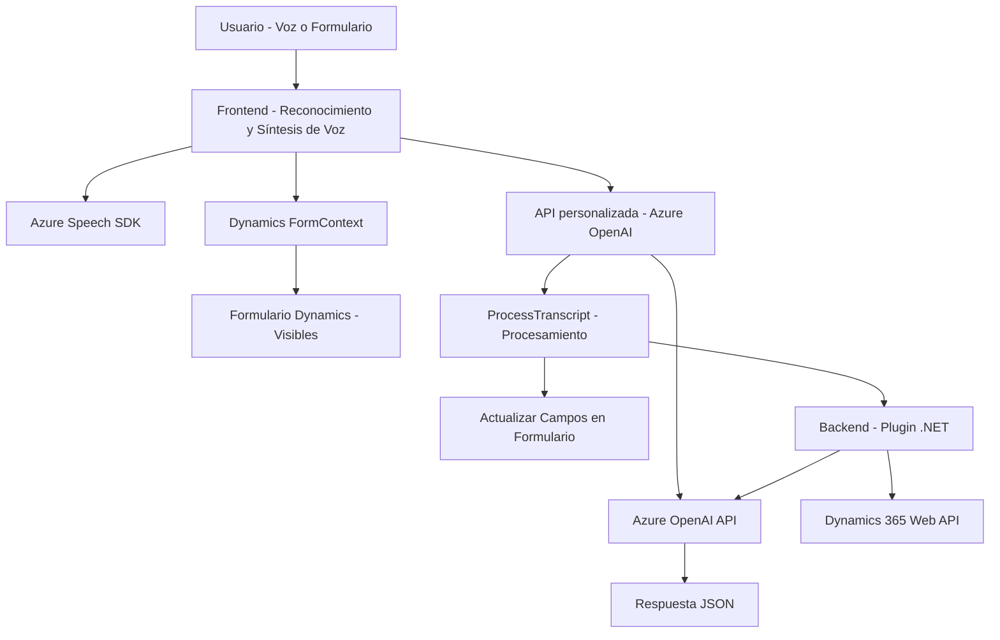

# Breve Resumen Técnico

Este repositorio contiene un sistema modular diseñado para integrar reconocimiento de voz, síntesis de voz y procesamiento avanzado de texto, básicamente orientado a la interacción dinámica con formularios en entornos de Dynamics 365 y servicios externos en la nube como Azure Speech y Azure OpenAI.

---

# Descripción de la Arquitectura

La solución parece ser una combinación de **API y frontend** con un diseño de arquitectura en **n capas**, dado que tiene:

1. **Frontend (JavaScript)**: Encargado de la interacción con el usuario para la captura de voz, el reconocimiento y procesamiento de datos visibles en los formularios de Dynamics 365.
   - Los datos capturados se procesan y se entregan al backend a través de una API para realizar transformaciones avanzadas.
2. **Backend (Plugin en .NET)**: Funciona como un módulo que se integra directamente en Dynamics 365, utilizando un patrón de eventos (Plugins). Realiza tareas específicas: transformar texto usando Azure OpenAI y manejar las respuestas estructuradas.
   - Este backend interactúa con servicios externos y usa la API de Dynamics 365 para modificar los datos en ese sistema.

---

# Tecnologías Usadas

1. **Frontend**:
   - Lenguaje: JavaScript.
   - Frameworks/Librerías: SDK de Microsoft Azure Speech para reconocimiento y síntesis de voz.
   - Integración con Dynamics 365 vía métodos del contexto (`formContext`, `Xrm`).

2. **Backend**:
   - Lenguaje: C# (.NET).
   - Frameworks/Librerías:
     - **Dynamics 365 SDK**: Para construir plugins y manipular entidades en el sistema.
     - **Azure OpenAI API**: Usado para procesamiento de texto avanzado.
     - **Newtonsoft.Json** y **System.Text.Json**: Para procesamiento de JSON en el backend.
     - **HttpClient**: Para la interacción con la API de Azure OpenAI.

3. **Patrones Arquitectónicos**:
   - **Modularidad**: División clara entre lógica relacionada a reconocimiento/síntesis y procesamiento de texto.
   - **Cargador dinámico**: El SDK de Azure Speech se carga solo cuando es necesario (`ensureSpeechSDKLoaded`).
   - **Eventos/Plugins**: Implementación del patrón basado en eventos en Backend para Dynamics 365.

---

# Diagrama **Mermaid**

---

# Conclusión Final

Este repositorio implementa un sistema centrado en la integración de servicios cloud (Azure Speech y OpenAI) con el ecosistema Dynamics 365. La arquitectura es modular y se distribuye en **n capas**, separando claramente:
- **Frontend** para interacción directa: Sobresale en el reconocimiento y síntesis de voz.
- **Backend** para procesamiento avanzado (mediante un plugin para Dynamics): Extiende las funcionalidades mediante APIs de terceros.

Las tecnologías utilizadas son robustas, con SDKs formales (Azure y Dynamics), además del uso de principios modernos como la modularidad y la responsabilidad única. Esto hace que la solución sea altamente dinámica, extensible y bien preparada para escenarios empresariales relacionados con automatización mediante IA.