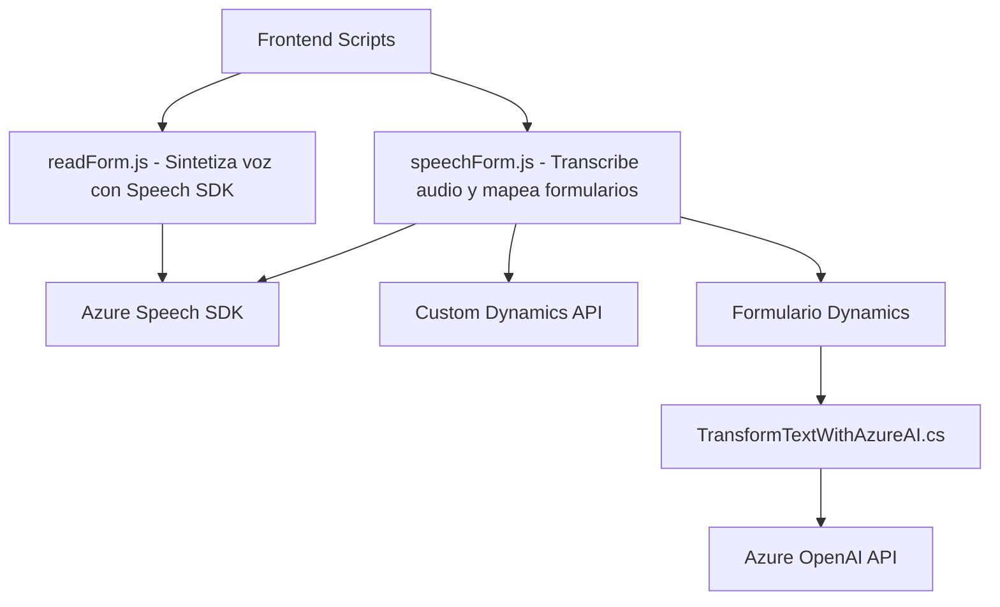

### Breve Resumen Técnico

El repositorio contiene componentes frontales basados en JavaScript que integran servicios de voz y síntesis (Azure Speech SDK) y plugins en C# para Microsoft Dynamics CRM que utilizan APIs de Azure OpenAI. Los scripts JavaScript están orientados a la interacción con usuarios mediante voz y la integración en formularios dinámicos. Los plugins en C# amplían las funcionalidades del CRM mediante el uso de IA para transformar texto.

### Descripción de Arquitectura

La arquitectura combinada del repositorio se puede clasificar como **arquitectura híbrida**, en donde se integran:
1. **Frontend Modular:** Scripts JavaScript que interactúan con APIs externas (Azure Speech SDK y API personalizada en Dynamics). Adopta un patrón cliente-servidor.
2. **Plugins CRM:** Complementos autónomos en Dynamics que utilizan una arquitectura por eventos, diseñada para ejecutar operaciones específicas a través de servicios de integración.
3. **Servicios Cloud:** Uso de servicios cognitivos de Azure (Speech SDK, OpenAI) para ofrecer capacidades de síntesis de voz y transformación de mensajes.

### Tecnologías Usadas

1. **Frontend (JavaScript):**
   - **Frameworks/Librerías:** 
     - Azure Speech SDK.
     - API personalizada de Dynamics.
   - **Patrones:**
     - Cargador dinámico de dependencias.
     - Encadenamiento de eventos.
     - Factory para dinámicas de mapeo y atributos del formulario.

2. **Backend (C# Plugins):**
   - **Frameworks/Librerías:**
     - Microsoft Dynamics CRM SDK.
     - Azure OpenAI Service.
     - Newtonsoft.Json para JSON.
     - System.Net.Http para clientes HTTP.
   - **Patrones:**
     - API Wrapper.
     - Plug-in Dynamics.
     - Modularidad en servicios externos.

### Diagrama Mermaid

### Conclusión Final

El repositorio mezcla un enfoque de componentes frontend y backend con integración en la nube. Esto permite a usuarios interactuar con sistemas mediante capacidades avanzadas de procesamiento de voz y síntesis, ampliando las capacidades de interfaces en Microsoft Dynamics 365 con servicios cognitivos de Azure. La solución es escalable y combina patrones como modularidad, integración de API, y dinámicas de eventos propios del CRM para trabajar en entornos empresariales.