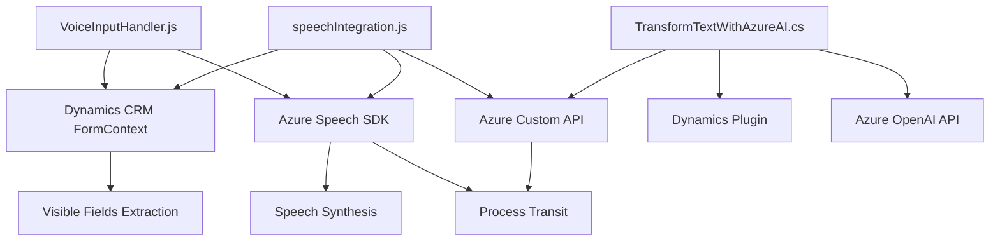

### Breve resumen técnico
El repositorio contiene tres componentes que ofrecen soluciones orientadas a la interacción con formularios mediante reconocimiento de voz, síntesis de voz, y procesamiento de texto usando inteligencia artificial. Se integra con tecnologías de Azure, Dynamics CRM, y APIs específicas para habilitar el flujo automatizado de datos.

---

### Descripción de arquitectura
La arquitectura combina:
- **Frontend modular**: Los archivos en la carpeta `FRONTEND/JS` se encargan de la interacción auditiva mediante el Azure Speech SDK y llamadas a APIs, siguiendo un patrón de modularidad en funciones individuales. También soportan carga dinámica de dependencias.
- **Plugin basada en Azure OpenAI para Dynamics CRM**: Los archivos en `Plugins` implementan lógica empresarial en Dynamics usando el patrón de arquitectura de Plugins. Este diseño permite extender la funcionalidad de CRM mediante lógica personalizada que interactúa con servicios externos.
- **Servicios externos y APIs Customizadas**: Se utilizan APIs de Azure OpenAI y Speech SDK para el manejo de texto y audio.

La arquitectura general sigue un modelo **multicapa basada en servicios**:
- **Presentación**: Componentes JavaScript (Frontend). Procesamiento de interacción de usuario.
- **Negocio**: Plugins y lógica en Dynamics CRM (procesamiento de texto con Azure AI).
- **Datos**: Comunicación con los formularios y servicios mediante integraciones API.

---

### Tecnologías usadas
1. **Frontend**:
   - **JavaScript**: Base de implementación de lógica relacionada con reconocimiento/síntesis de voz y manejo del DOM.
   - **Azure Speech SDK**: API para reconocimiento y síntesis de voz.
   - **Dynamics CRM JavaScript SDK** (`Xrm.WebApi.online.execute`): Para trabajar con formularios y las APIs.

2. **Backend**:
   - **Dynamics CRM Plugin Framework**:
     - Extiende funcionalidades mediante C#.
     - Usa Microsoft.Xrm.Sdk para manipular entidades CRM.
   - **Azure OpenAI**:
     - API de procesamiento de texto.
     - Modelo `gpt-4o`, para transformar texto plano en JSON estructurado.

3. **Patrones**:
   - **Modularidad**: Separación de funciones específicas en archivos JS para frontend.
   - **Plugin-based architecture**: Extensión de Dynamics CRM mediante plugins en C#.
   - **Integración de servicios externos**: Manejo de SDK de Azure Speech y solicitudes HTTP hacia Azure.

---

### Diagrama Mermaid válido para GitHub

---

### Conclusión final
La solución implementada en este repositorio combina frontend modular en JavaScript para síntesis y reconocimiento de voz, integración dinámica con SDK y APIs externas (Azure Speech y OpenAI), y plugins en C# para procesamiento de texto. La arquitectura sigue un enfoque multicapa orientado a servicios, donde los archivos colaboran para manejar flujos complejos de entrada de datos mediante voz y validación/transacción de texto.

En general, el desarrollo demuestra robustez en la integración con tecnologías como Dynamics CRM y servicios en la nube (Azure), proporcionando una arquitectura flexible y escalable orientada a mejorar la interacción de usuario a través de la inteligencia artificial y canal auditivo.