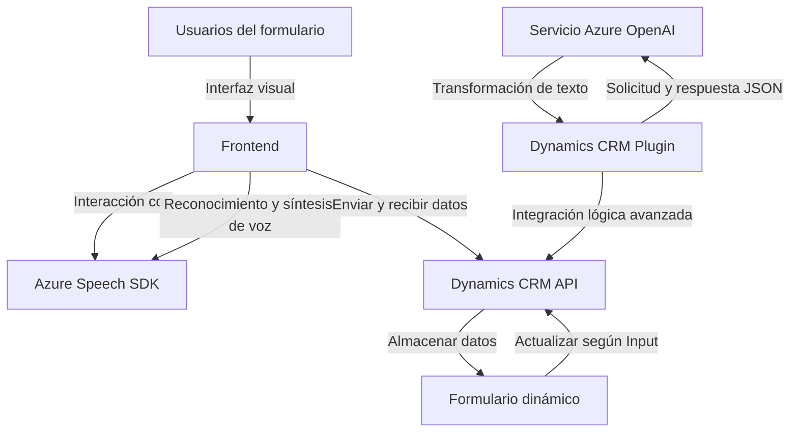

### **Breve resumen técnico**
El repositorio contiene componentes utilizados para una solución orientada al procesamiento de datos de formularios mediante entrada y salida de voz, integrándose con servicios externos como **Azure Speech SDK** y **Azure OpenAI**. Los archivos analizados incluyen scripts en JavaScript para la lógica de frontend/formulario en el navegador y un archivo C# que actúa como un complemento (plugin) en Dynamics CRM para realizar transformaciones avanzadas en el backend con Azure OpenAI.

---

### **Descripción de arquitectura**
El sistema presenta una **arquitectura híbrida cliente-servidor** donde el frontend, desarrollado en JavaScript, interactúa con un CRM basado en Dynamics 365. En el backend, un plugin de Microsoft CRM construido en **C#** maneja la lógica empresarial avanzada y realiza llamadas al servicio externo **Azure OpenAI**.

- **Frontend:** Scripts en **JavaScript** son utilizados para trabajar con formularios dinámicos en el navegador dentro de Dynamics 365.
    - Utiliza **Azure Speech SDK** para síntesis y reconocimiento de voz en tiempo real.
    - Se enfoca en transformar datos y presentarlos en voz, así como convertir datos hablados en texto procesable.

- **Backend:** Plugins creados para Dynamics 365 enriquecen la funcionalidad del sistema al integrar servicios como Azure OpenAI. Estos plugins emplean:
    - **Microsoft.Xrm.Sdk** para interactuar con el modelo de datos de Dynamics y ejecutar lógica personalizada.
    - Comunicación con servicios REST externos (específicamente el modelo GPT-4.0 de Azure OpenAI).
    - Operaciones con JSON avanzadas para estructurar y transformar datos.

La arquitectura está centrada en:
- **Una arquitectura en capas** con un enfoque de integración cliente-servidor. 
- Uso de **patrón de integración externa** para delegar tareas en servicios como Azure Speech SDK y Azure OpenAI.
- **Modularidad** en la forma en que las funcionalidades específicas están separadas en scripts y clases.

---

### **Tecnologías, frameworks y patrones utilizados**
1. **Tecnologías:**
    - **Frontend:** JavaScript con integración del **Azure Speech SDK**.
    - **Backend:** C# (.NET Framework), Microsoft Dynamics 365 SDK, Azure OpenAI Service (GPT-4).
2. **Frameworks y bibliotecas:**
    - **Dynamics CRM SDK**: Procesos personalizados mediante plugins.
    - **Newtonsoft.Json** y **System.Text.Json**: Librerías para procesamiento de JSON en .NET.
    - **Azure Services** (Speech SDK y OpenAI): Servicios cloud para inteligencia artificial.
3. **Patrones:**
    - **Plug-in design pattern**: En el desarrollo de extensiones para Dynamics CRM.
    - **Facade Pattern**: Uso de métodos que encapsulan las interacciones con APIs externas.
    - **Callback pattern**: Control de la carga del SDK en el frontend para evitar interrupciones.

---

### **Diagrama Mermaid**

---

### **Conclusión final**
El repositorio define una solución que utiliza técnicas avanzadas de integración entre módulos (frontend, backend, y servicios cloud). La arquitectura se basa en una estrategia orientada a servicios (Azure Speech SDK, Azure OpenAI) en combinación con herramientas de personalización de Dynamics CRM. Esto permite enriquecer la interacción humano-ordenador, ofreciendo funcionalidades que transforman campos de formularios y procesamiento de voz.

Aunque la solución es muy bien organizada y modular, presenta áreas de mejora como:
1. **Centralización de configuración:** La información sensible (como la API Key de Azure OpenAI) debe moverse a un nivel seguro (ej.: Azure Key Vault).
2. **Mejora en manejo de excepciones:** Se podrían implementar estrategias más robustas para manejar errores en las solicitudes externas al backend.
3. **Gestión de normas externas:** Las reglas de negocio deberían ser externas al código (por ejemplo, almacenadas en base de datos o servicios de configuración).

Finalmente, la combinación de los sistemas asegura una solución flexible y potente para manejo de formularios dinámicos y procesamiento de datos basados en inteligencia artificial.