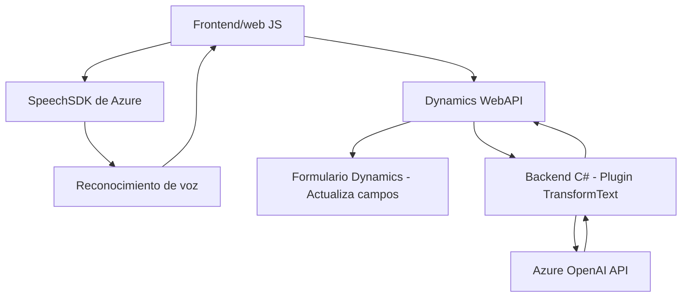

### Resumen Técnico
Este repositorio implementa funcionalidades basadas en servicios ofrecidos por **Azure Speech SDK** y **Azure OpenAI API** para integrar capacidades de reconocimiento, síntesis de voz y procesamiento de texto en **Microsoft Dynamics 365**. La solución tiene dos componentes principales:
1. **Frontend (JS)**: Integración de Azure Speech SDK para trabajar en entornos web, interfaciando con formularios de Dynamics 365.
2. **Backend (C#)**: Plugin de Dynamics 365 que procesa las solicitudes de texto mediante Azure OpenAI API.

---

### Descripción de arquitectura
La solución utiliza una **arquitectura n capas**, dividiendo las responsabilidades de Frontend y Backend:
1. **Frontend**: Implementa integración con el navegador para la entrada y salida de voz usando `SpeechSDK`. Usa funciones orquestadoras (`startVoiceInput`) para organizar los pasos del proceso.
2. **Backend**: Utiliza la arquitectura basada en **Plugins de Dynamics CRM**. El plugin sirve como un proxy hacia la API externa de Azure OpenAI, encapsulando la lógica de llamada REST y su transformación en el contexto de Dynamics.

La arquitectura también incorpora interacción con servicios externos como Azure Speech SDK, Azure OpenAI API y Dynamics 365 Web APIs.

---

### Tecnologías usadas
- **Frontend:** Lenguaje JavaScript, SDK de Azure Speech, dependencias propias de Dynamics 365.
- **Backend:** Lenguaje C#, .NET Framework, SDK de Dynamics CRM (`Microsoft.Xrm.Sdk`) y manipulación JSON (`Newtonsoft.Json`, `System.Text.Json`).
- **Servicios Externos:** Azure Speech SDK, Azure OpenAI API (GPT), Microsoft Dynamics 365 Web APIs.

### Principales patrones aplicados
1. **Proxy API:** En el backend, el plugin actúa como proxy para unificar la interacción de Dynamics con Azure OpenAI.
2. **Orquestador Funcional:** En el frontend, se utiliza una orquestación modular para dividir claridad entre síntesis, procesamiento de datos y entrada de voz.
3. **Carga dinámica:** Las dependencias externas en el frontend (como el Speech SDK) se cargan dinámicamente durante la ejecución.

---

### Dependencias y componentes externos
- **Frontend:**  
  - `SpeechSDK`: Azure Speech SDK cargado desde una URL pública.
  - Claves de Azure (`azureKey` y `azureRegion`): Proporcionadas de forma estática en el código, lo que puede ser un problema de seguridad.

- **Backend:**  
  - Azure OpenAI API:
    - Claves y endpoint deben configurarse en el plugin para procesar texto.
    - Implementa solicitudes REST mediante `HttpClient`.
  - Plugins de Dynamics CRM: Dependencia de `IPlugin` para lógica integrada en el sistema.

---

### Diagrama Mermaid 
El siguiente diagrama describe el flujo general de la solución, destacando interacciones con APIs externas y los módulos internos del frontend y backend:

---

### Conclusión Final
La solución es una integración avanzada de Microsoft Dynamics 365 con servicios de Azure (Speech y OpenAI). Combina reconocimiento de voz, síntesis y procesamiento de texto con una arquitectura modular. La división en frontend y backend sigue la filosofía de n capas y garantiza extensibilidad con soporte para interacción en tiempo real mediante APIs externas.

**Puntos destacados:**
- Excelente uso de SDKs y APIs de Azure para extender el entorno Dynamics 365.
- La seguridad podría mejorarse evitando claves estáticas en el código.
- Diagrama representa de manera clara las interacciones internas y externas de los componentes.