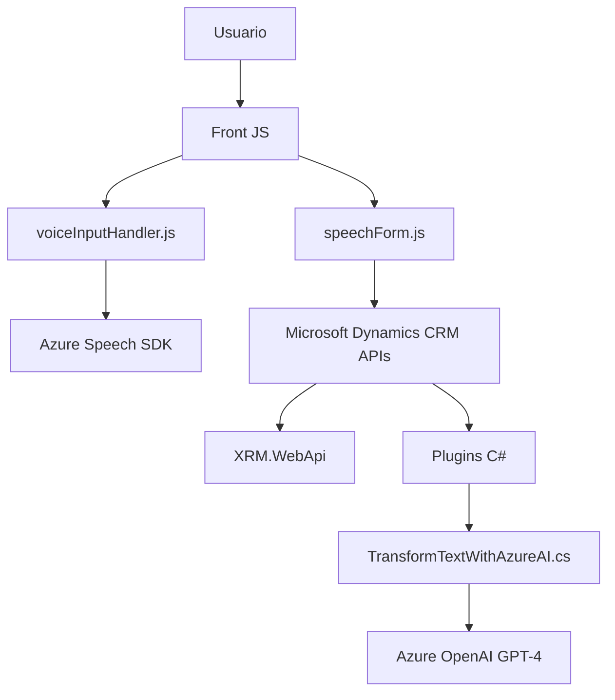

### Breve resumen técnico

Basado en la revisión de los archivos proporcionados en el repositorio, se trata de una solución que integra un **frontend en JavaScript** y **plugins en entorno Dynamics CRM (C#)** con soporte para servicios externos como Microsoft Azure Speech SDK y Azure OpenAI API. El propósito principal es optimizar la interacción del usuario en formularios mediante reconocimiento y síntesis de voz, y transformar texto contextual utilizando IA.

---

### Descripción de arquitectura

La arquitectura general puede clasificarse como **multicapa** con integración directa de servicios externos (Service-oriented Architecture - SOA). La solución contempla tres áreas principales:
1. **Frontend:** Desarrollado en JavaScript, interactúa con el usuario mediante UI y voz, y también se integra con APIs externas a través del navegador.
2. **Backend plugins:** Extiende la funcionalidad de Microsoft Dynamics CRM mediante lógica personalizada (en C#) y comunicación con el sistema.
3. **Servicios externos:** Usa APIs de Microsoft Azure para la síntesis y análisis inteligente del diálogo humano.

El flujo principal en el frontend trabaja modularmente bajo un **patrón de diseño basado en eventos y modularidad funcional**. En el backend (C#), la arquitectura Plugin-Based refuerza la lógica asociada al contexto de negocio de Microsoft Dynamics mediante la interfaz `IPlugin`.

---

### Tecnologías usadas

1. **Frontend (JavaScript):**
   - **Framework y SDK:** Azure Speech SDK, Microsoft Dynamics CRM form API (`executionContext`, etc.).
   - **Tecnologías:** ES6+ (JavaScript moderno), DOM manipulation, Fetch API.
   - **Patrones:** Lógica basada en eventos, modularidad funcional, integración de servicios, adaptador de datos.

2. **Backend (C# Plugin):**
   - **Frameworks y SDK:** 
     - Microsoft Dynamics SDK (`IPlugin`)
     - Azure OpenAI (GPT-4)
   - **Librerías utilizadas:** `System.Net.Http` para solicitudes HTTP, `Newtonsoft.Json` para manejo de JSON, `System.Text.Json` para generación de payloads.
   - **Patrones:** Plugin-Based Architecture, SOA, Builder Pattern.
   - **DevOps Consideración:** Hardcode de credenciales en código podría ser reemplazado por métodos más seguros utilizando Azure Key Vault.

---

### Diagrama Mermaid válido para GitHub

---

### Conclusión final

La solución está claramente diseñada para mejorar la interacción de usuario en formularios mediante tecnología de reconocimiento y síntesis de voz, integrando la capacidad de IA en un entorno empresarial como Dynamics CRM. La elección de las tecnologías (Azure Speech SDK, Azure OpenAI API, Dynamics plugins) refleja una alineación con la arquitectura orientada a servicios y la modularidad necesaria para la escalabilidad y personalización.

Sin embargo, como mejora:
1. **Refactorización de credenciales:** Las claves API deben manejarse con seguridad, utilizando mecanismos como variables de entorno o servicios especializados como Azure Key Vault.
2. **Consideración para despliegue:** Es importante verificar si el frontend requiere minificación y empaquetado y si el backend necesita dependencias externas en el servidor CRM.
3. **Documentación adicional:** Un README con diagramas, ejemplos de uso, y configuración podría beneficiar enormemente la comprensión de este repositorio por desarrolladores externos.

En general, se nota claridad en los propósitos funcionales y una integración adecuada de tecnologías modernas.