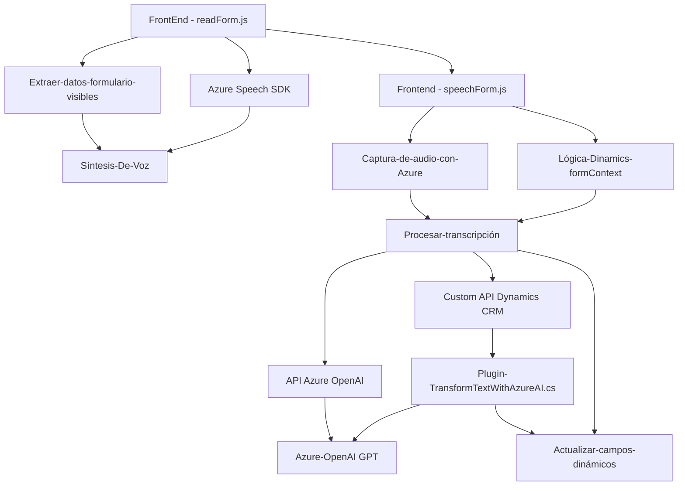

### Breve resumen técnico
El repositorio combina funcionalidades en **frontend (JavaScript)** y **plugins (.NET)**, integrándose con servicios gestionados en la nube (Azure Speech SDK y Azure OpenAI). Las soluciones proporcionadas trabajan principalmente en dos áreas: **procesamiento de entrada/salida de voz** y **transformación de texto en estructuras JSON usando IA, todo esto ligado a un contexto de Dynamics CRM**.

### Descripción de arquitectura
1. **Tipo de solución**: La solución es un híbrido de **frontend interactivo**, **API interna personalizada (custom API en Dynamics)** y **plugins de extensión para Dynamics CRM**. Combina un componente de entrada/salida de voz (frontend) y procesamiento de texto con OpenAI GPT desde un plugin back-end, que podrá ser considerado una arquitectura interconectada.
   
2. **Arquitectura predominante**
    - **Cliente-servidor (multi-capa)**:
      - **Capa de presentación**: Código en JavaScript para facilitar interacción con datos del formulario y entrada/salida de voz (integración con Dynamics CRM frontend: `Xrm.WebApi`, `executionContext`).
      - **Capa de lógica del negocio**: Plugins C# que se ejecutan en el pipeline de Dynamics CRM, como el `TransformTextWithAzureAI.cs` encargado de realizar transformaciones de texto con una API externa (Azure OpenAI).
      - **Capa de almacenamiento/servicios**: Interacción directa con el SDK y servicios de Azure (Speech SDK y OpenAI) para gestionar voz y texto en la nube.
   
    - **Patrones implementados**:
      - **Service Layer**: Ambas partes (frontend y plugin) dividen su funcionalidad en métodos independientes, cumpliendo un enfoque orientado a servicios reutilizables.
      - **Decorator/Wrapper para SDK**: Los métodos como `ensureSpeechSDKLoaded` encapsulan la ejecución de SDK externos con comprobaciones previas, asegurando la disponibilidad del recurso.
      - **Plugin-based design**: La arquitectura del plugin está diseñada para integrarse modularmente en el pipeline de procesos de Dynamics CRM.
      
### Tecnologías usadas
1. **Frontend**:
   - **JavaScript**: Lógica orientada a funciones.
   - **Azure Speech SDK**:
     - Clases como `SpeechConfig`, `AudioConfig`, `SpeechSynthesizer`.
     - Dinámica de voz y texto, cargando el SDK desde el navegador.
   - **Integración con Dynamics CRM** mediante `executionContext` y `WebApi`.

2. **Backend**:
   - **C# (.NET Framework)**:
     - Clases nativas de Dynamics CRM: `IPlugin`, `IServiceProvider`.
     - Bibliotecas para manipulación y procesamiento de datos: `System.Text.Json`, `Newtonsoft.Json.Linq`.
     - **Plataforma Azure OpenAI**: Consume el modelo GPT mediante solicitudes HTTP dentro del plugin.

### Dependencias y componentes externos presentes
- **Azure Speech SDK**: Utilizado en el frontend para procesamiento de entrada y síntesis de voz, con interacción dinámica (e.g., cargando el SDK desde un script en el navegador).
- **Azure OpenAI**: Comunicación con el API basada en GPT para transformación de texto.
- **Sistema Dynamics CRM**: Parte de la integración del plugin y controles de frontend.
- **JavaScript / C# core utilities**: Uso estándar de lógica y métodos para el procesamiento de datos.

### Diagrama **Mermaid**

### Conclusión final
La propuesta del repositorio describe un diseño de arquitectura híbrida que combina un frontend con capacidades dinámicas de voz/texto asemejándose a un **modelo n-capas** con integración en plataformas y servicios gestionados como Azure y Dynamics CRM. Presenta una alta dependencia externa de SDK y API en la nube, pero al mismo tiempo cumple funcionalidad modular con patrones como "Service Layer" y "Plugin-based architecture". Esto permite su extensibilidad y potencial interoperabilidad en entornos empresariales con requerimientos de automatización e inteligencia artificial.