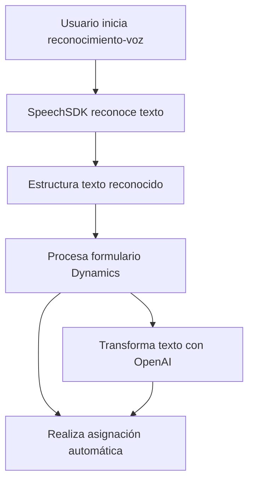

### Breve resumen técnico
El repositorio contiene la implementación de un sistema híbrido que combina reconocimiento y síntesis de voz con capacidades de procesamiento de inteligencia artificial, utilizando Azure Speech SDK y Dynamics CRM. La solución permite transformar formularios de entrada hablada en interacción y datos estructurados.

### Descripción de arquitectura
La arquitectura es de **n capas**, dividiendo claramente responsabilidades en frontend (interacción con formularios y servicios de voz) y backend (procesamiento de texto vía plugins). Se integra con servicios externos como Azure Speech SDK y Azure OpenAI para funciones de voz y procesamiento de texto, respectivamente. Además, el sistema utiliza el modelo de **plugin architecture** de Dynamics CRM para la extensibilidad del backend.

### Tecnologías usadas
1. **Frontend:**
   - JavaScript
   - Azure Speech SDK
   - Dynamics CRM Web API (`Xrm`)

2. **Backend:**
   - .NET Framework
   - Azure OpenAI API
   - Dynamics CRM SDK

3. **Patrones arquitectónicos:**
   - Plugin Architecture (Dynamics CRM backend extensibility)
   - Modularización (funciones independientes por responsabilidad)
   - Interfaz de servicios externos
   - Delegación (para síntesis, reconocimiento de voz y procesamiento de texto)

### Diagrama Mermaid válido para GitHub

### Conclusión final
El repositorio implementa una solución híbrida ideal para entornos como Dynamics CRM, que demanda interacción avanzada con usuarios mediante reconocimiento/síntesis de voz y transformación inteligente de texto. La modularidad de los archivos, el uso de patrones como servicio externo y plugin architecture, y la integración con Azure apuntan a un diseño moderno y escalable. Es recomendable asegurarse de la correcta gestión de credenciales (`Azure Key`) y optimizar los tiempos de respuesta al interactuar con los servicios externos.