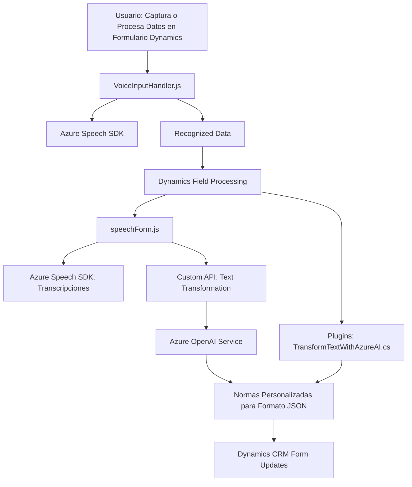

### Breve resumen técnico:
El repositorio contiene archivos organizados principalmente en dos módulos: **Frontend** (JavaScript) y **Backend**/Plugins (C#). Su propósito general es integrar capacidades avanzadas de procesamiento y síntesis de voz utilizando **Azure Speech SDK** y **Azure OpenAI Service** para aplicaciones de Dynamics 365 CRM. Estas funcionalidades están distribuidas entre la captura, transformación y exportación de datos provenientes de formularios en Dynamics 365.

---

### Descripción de arquitectura:
La solución implementa una **arquitectura modular orientada a servicios con múltiples capas**:
1. **Frontend (JavaScript)**:
   - Permite capturar datos de formularios y sintetizarlos en voz mediante integración con SDK's externos (Azure Speech SDK).
   - Realiza reconocimiento de voz para actualizar datos dinámicamente en formularios de Dynamics 365.
   
2. **Backend (C#)**:
   - Integración con Dynamics 365 Plugin Framework para el procesamiento externo de datos. Este módulo usa servicios como Azure OpenAI para transformar texto/adaptar formatos.
   - Los plugins y servicios implementan un diseño desacoplado, delegando la lógica pesada al backend externo (Azure Services).
   
Patrones utilizados:
- **Integración API**: Uso extensivo de APIs de terceros (Azure).
- **Front Controller/MVC**: En el frontend, las funciones están organizadas para orquestar datos y controladores de módulos individuales.
- **Plugin Framework**: En el backend, los plugins son llamados como extensiones dentro del modelo de ejecución de Dynamics CRM.
- **Facade**: Funciones del frontend centralizan las interacciones con servicios.

---

### Tecnologías usadas:
1. **Frontend**:
   - **JavaScript** para el manejo de DOM/formularios.
   - **Azure Speech SDK** como dependencia externa para síntesis y reconocimiento de voz.

2. **Backend**:
   - **C#** como lenguaje principal para la lógica empresarial dentro de Dynamics CRM.
   - **Newtonsoft.Json** y **System.Text.Json** para manejar estructuras JSON.
   - **Azure OpenAI Service** para procesamiento avanzado de texto.

3. **Dynamics 365 Framework**:
   - Abstracciones típicas como `IPlugin`, `IOrganizationService` para manipulación y extensión de funcionalidades de Dynamics CRM.

---

### Diagrama Mermaid válido para GitHub:

---

### Conclusión final:
La solución engloba una combinación de **integración avanzada de servicios externos**, **procesamiento dinámico en frontend** y **extensiones empresariales en backend**. Su diseño modular basado en servicios lo hace escalable y compatible con integraciones en tiempo real. La arquitectura está orientada a resolver puntos específicos de automatización y enriquecimiento de aplicaciones Dynamics 365 mediante el uso de inteligencia artificial y procesamiento de voz.