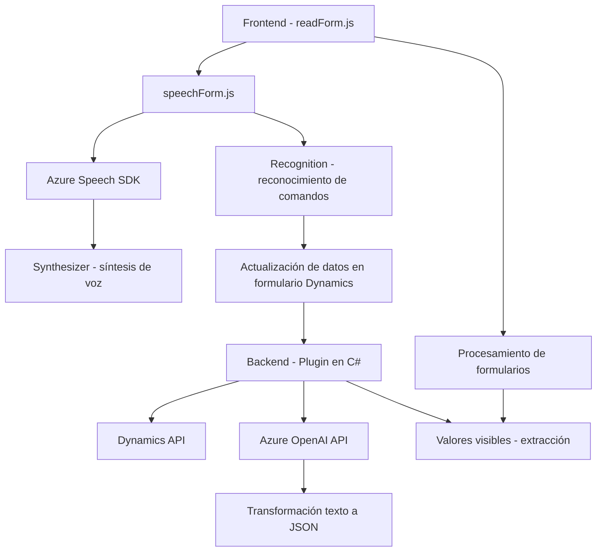

### Breve resumen técnico
El repositorio presenta una solución multifacética que incluye componentes frontend diseñados para interactuar con formularios mediante voz y procesamiento inteligente, así como un plugin backend que conecta Dynamics CRM con Azure OpenAI. La integración con servicios de Microsoft Azure es el núcleo funcional, utilizando herramientas como Azure Speech SDK y Azure OpenAI para sintetizar voz, procesar comandos de voz, y transformar datos con IA.

---

### Descripción de arquitectura
La arquitectura de la solución es **híbrida**, combinando características de una arquitectura **n-capas** y **cliente/servidor**. El frontend actúa como la capa presentación y procesamiento local, mientras los servicios externos (Azure Speech SDK y Dynamics CRM) funcionan como una capa lógica y de integración remota (Middleware/API Gateway). El backend incluye un **plugin al estilo microservicio** para Dynamics CRM que interactúa con el servicio Azure OpenAI, generando datos estructurados en formato JSON.

- **Frontend:** Utiliza una estructura modular y funcional para crear una capa de interacción de voz con formularios web mediante JavaScript y Azure Speech SDK.
- **Backend:** Desarrollado como un plugin de Dynamics CRM, este interactúa con el servicio REST de Azure OpenAI para transformar texto y actualizar datos en la plataforma CRM.

---

### Tecnologías usadas
1. **Lenguajes y frameworks:**
   - **Frontend:** JavaScript.
   - **Backend:** C# (Microsoft Dynamics SDK, hecha para .NET).
2. **Servicios y SDKs externos:**
   - **Azure Speech SDK**: Utilizando tanto síntesis de voz como reconocimiento de voz.
   - **Azure OpenAI**: API para procesamiento de texto inteligente.
   - **Dynamics CRM Web API**: Para manipulación de datos desde formularios.
3. **Estructuras y patrones:**
   - **Modularidad**: Funciones bien separadas según su propósito.
   - **Callback/event-driven programming:** Uso de funciones asíncronas y eventos.
   - **API Gateway pattern:** Integración con APIs externas (Azure y Dynamics).
   - **Plugin Design pattern:** En el componente backend como una extensión de Dynamics CRM.

---

### Diagrama Mermaid válido para GitHub

---

### Conclusión final
La solución del repositorio es una arquitectura cliente/servidor con componentes integrados para interactuar con servicios de voz e inteligencia artificial en tiempo real. Se destaca por:
1. Uso extensivo de tecnologías modernas como Azure Speech SDK y Azure OpenAI.
2. Modularidad aplicada en el frontend junto con un plugin para el backend que optimiza el procesamiento de datos en Dynamics CRM.
3. Desacoplamiento entre frontend y backend mediante servicios externos, siguiendo principios de interoperabilidad API.

Este diseño facilita la extensibilidad, es escalable y es apropiado para entornos empresariales que requieren interacción multimodal con plataformas CRM basadas en datos.