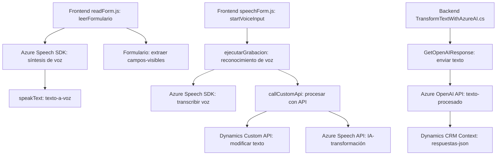

### Análisis detallado

#### Breve resumen técnico
Los archivos configurados en el repositorio presentan una solución orientada principalmente a la **automatización de formularios dinámicos** y su integración con servicios de voz y procesamiento de texto asistidos por la inteligencia artificial de Azure. Está compuesto por:
1. **Frontend**: Scripts en JavaScript para síntesis y reconocimiento de voz, así como interacción con parámetros de formularios dinámicos.
2. **Backend/Plugin CRM**: Un complemento tipo `plugin` utilizado en Microsoft Dynamics CRM para transformar texto mediante la **Azure OpenAI API**.

---

#### Descripción de arquitectura
La arquitectura general da señales de un enfoque **multicapa**, donde cada capa (frontend y backend) tiene su responsabilidad claramente definida:
1. **Presentación/Usuario (Frontend)**: Manejo de interacción del usuario mediante formularios y voz (síntezis y reconocimiento).
2. **Procesamiento/Backend**: Un plugin que transforma datos y conecta con una API externa (Azure OpenAI).

Aunque existen integraciones con servicios en la nube (Azure), la estructura general corresponde a una **arquitectura n-capas**, ya que toda la lógica está concentrada en un único punto de gestión: el Microsoft Dynamics CRM.

---

#### Tecnologías, frameworks y patrones utilizados
- **Frontend**:
  - **Tecnologías**: JavaScript para la implementación de los módulos, integración con web SDKs y mecanismos de transcripción de datos.
  - **Frameworks/SDKs**:
    - Azure Speech SDK: Para síntesis y reconocimiento de voz.
    - Microsoft Dynamics Form Context: Para manipular valores y atributos en formularios dinámicos.
  - **Patrones**:
    - Modularidad: Separación clara de responsabilidades dentro de cada archivo.
    - Event-driven Architecture: Utilización de eventos para capturar datos en tiempo real y procesarlos.
    - Observador: Uso de `callbacks` en el reconocimiento y síntesis de voz.

- **Backend/Plugins (CRM)**:
  - **Tecnologías**: C#.NET para implementación del plugin compatible con Microsoft Dynamics CRM.
  - **Frameworks/APIs**: 
    - Microsoft Dynamics CRM SDK: Para integración como plugin del sistema.  
    - Azure OpenAI API: Transformación de texto basado en normas.  
    - Newtonsoft.Json para manejo de datos JSON.  
    - System.Net.Http para integrar servicios web externos.
  - **Patrones**:
    - Plugin Pattern: Dinámico y extensible para Microsoft CRM.
    - External API Integrations: Encapsulación de la comunicación con servicios remotos como Azure OpenAI.  

---

#### Dependencias o componentes externos
1. **Azure Speech SDK**: Para síntesis de voz y reconocimiento de voz.
2. **Azure OpenAI API**: Transformación de texto basado en reglas mediante inteligencia artificial.
3. **Microsoft Dynamics CRM SDK**: Para manejar formularios y ejecutar lógicas especializadas.
4. **Newtonsoft.Json** / `System.Text.Json`: Manejo de estructuras de datos y objetos JSON.
5. **System.Net.Http**: Comunicación con servidores remotos a través de solicitudes HTTP.

---

#### Diagrama Mermaid

---

#### Conclusión final
La solución analizada representa un sistema **n-capas** eficiente y extensible, enfocado en la automatización de tareas relacionadas con el habla y los formularios dinámicos en entornos de CRM. Utiliza servicios de IA (OpenAI y Speech API) de Azure para mejorar la experiencia del usuario y la automatización de procesos. Aunque el enfoque es más cercano a una arquitectura **monolítica centralizada** debido al uso exclusivo de Dynamics CRM para el backend, la integración de servicios externos amplía su capacidad.