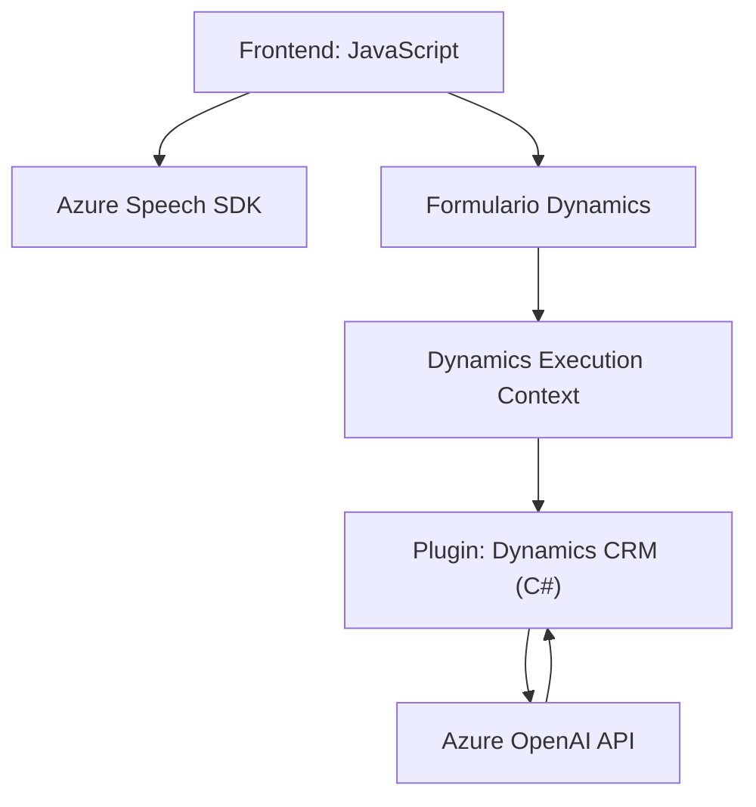

## Breve resumen técnico

El repositorio presenta una solución enfocada en integración entre formularios de Dynamics 365 y tecnologías de Azure, mediante manejo de entrada y salida de voz, reconocimiento de voz, y procesamiento avanzado de texto. Está compuesto por tres componentes principales:
1. **Frontend (JavaScript):** Implementa sistemas para recopilar información de formularios y manipularla mediante Azure Speech SDK.
2. **Backend Plugin (C#):** Incluye un plugin de Dynamics 365 para estructuración avanzada de texto usando Azure OpenAI.
3. **Integración común:** Todos los módulos usan servicios de Azure como APIs externas (Azure Speech SDK y Azure OpenAI).

---

## Descripción de arquitectura

### Tipo de solución
La solución es una arquitectura híbrida orientada a servicios que integra una interacción dinámica entre frontend (procesos del lado del cliente, voz y reconocimiento) y backend (procesos del lado del servidor, transformación textual).

### Patrones observados
1. **Client-Server:** La comunicación entre los componentes frontend y backend se realiza a través de servicios en la nube (Azure).
2. **Plug-in extensibility:** El backend utiliza plugins implementados para Microsoft Dynamics CRM.
3. **Service-Based:** Uso de APIs externas (Azure Speech SDK y Azure OpenAI).
4. **Cargador dinámico:** Garantiza la disponibilidad de librerías externas como Azure Speech SDK en tiempo de ejecución.
5. **Modularidad:** Separación clara de funciones por responsabilidades específicas.

### Tipo de arquitectura
La arquitectura general sigue el **patrón n-capas**:
- **Presentación (Frontend):** Implementa interacción mediante formularios e integración de voz.
- **Aplicación (Middle Layer):** Módulos en JavaScript para el consumo de APIs y procesamiento lógico.
- **Datos (Backend/CRM Plugin):** Transformación y consumo de datos mediante código C# y llamadas REST hacia Azure OpenAI.

---

## Tecnologías usadas

1. **Frontend:**
   - **Lenguaje:** JavaScript.
   - **Frameworks y herramientas:** Azure Speech SDK (procesamiento de voz), Dynamics API (manipulación de formularios CRM).
   - **Patrones tecnológicos:** Modularidad, cargador dinámico (SDK), cliente API.

2. **Backend:**
   - **Lenguaje:** C#.
   - **Frameworks:** Microsoft Dynamics CRM SDK, Azure OpenAI.
   - **Patrones tecnológicos:** IPlugin interface (extensibilidad), transformación JSON.

3. **Librerías principales:**
   - **JavaScript:** Azure Speech SDK.
   - **C#:** Newtonsoft.Json, System.Net.Http, System.Text.Json.

---

## Diagrama Mermaid

---

## Conclusión final

La solución presenta una arquitectura bien diseñada y modular, que integra tecnologías de Azure con Microsoft Dynamics CRM. El frontend gestiona la entrada y salida de datos en el formulario, mientras el backend utiliza plugins que aprovechan el procesamiento natural de lenguaje en Azure OpenAI para estructuración. El patrón n-capas es ideal para mantener separadas las responsabilidades de cada módulo. El uso de APIs externas como Azure Speech SDK y OpenAI garantiza escalabilidad y capacidades avanzadas sin sobrecargar la solución. Sin embargo, para entornos de producción sería recomendable implementar mecanismos de cacheo y optimización en el consumo de estos servicios externos.