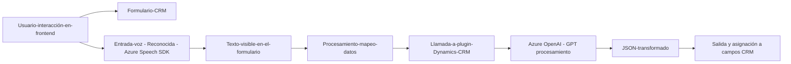

**Breve resumen técnico:**

El repositorio es parte de un sistema integrado que emplea servicios de Microsoft Azure para proporcionar soporte de voz y procesamiento de texto a través de un CRM como Dynamics. Incluye un frontend basado en JavaScript para la interacción de usuarios con formularios y un backend desarrollado como un plugin de Dynamics CRM en C#. Utilizan el SDK de Azure Speech para funcionalidades de síntesis y reconocimiento de voz y Azure OpenAI para procesamiento avanzado de texto mediante modelos GPT.

---

### 1. **Descripción de arquitectura:**
La solución representa un sistema enfocado en manejar interacción de texto y voz en formularios CRM/Dynamics con integración directa a servicios de Microsoft Azure. La arquitectura tiene las siguientes características:

- **N capas:** Existe separación de responsabilidades entre frontend (captura y síntesis de voz mediante JavaScript y Azure Speech SDK) y backend (en forma de plugin para procesamiento con Azure OpenAI). Las responsabilidades están bien compartimentadas entre interacción de usuario, procesamiento y lógica empresarial.
  
- **Extendibilidad y escalabilidad:** Las capacidades del plugin, junto con el uso de servicios Azure, permiten extender funcionalidades hacia nuevas APIs o IA.

---

### 2. **Tecnologías usadas:**

#### **Frontend (JavaScript):**
- **Azure Speech SDK:** Usado para:
  - Convertir texto en voz (síntesis de voz).
  - Procesar audio y convertirlo en transcripciones textuales (reconocimiento de voz).
- **API del CRM Dynamics:** Se interactúa con el contexto, atributos y controles de formularios CRM.

#### **Backend (.NET/C#):**
- **Plugin para Dynamics CRM:** Diseñado con el patrón "plugin" basado en la interfaz `IPlugin` de Microsoft Dynamics.
- **Azure OpenAI:** Utiliza el modelo GPT-4 para procesar texto y transformarlo en JSON según normas específicas.
- **Validación con dependencias:** Uso de `Newtonsoft.Json` y `System.Text.Json` para parseo y serialización.
- **System.Net.Http:** Interacción con el servicio de Azure OpenAI mediante llamadas HTTP.

---

### 3. **Dependencias o componentes externos:**
- **Servicios de Azure:**
  - Azure Speech SDK (síntesis/lectura de voz y reconocimiento de texto hablado).
  - Azure OpenAI API (modelo GPT-4).
- **Frameworks/bibliotecas:**
  - Newtonsoft.Json: Manipulación de datos JSON.
  - System.Text.Json: Alternativa integrada para manejar JSON en .NET.
  - System.Net.Http: Realización de peticiones HTTP a servicios de Azure.

- **API del CRM Dynamics:** Conexión con el modelo interno de representación de datos mediante `Xrm.WebApi`.

---

### 4. **Diagrama Mermaid válido para GitHub:**

---

### Conclusión final:

La solución está bien estructurada para cumplir el propósito de interactuar con el usuario mediante entradas de voz y texto, integradas directamente a un sistema CRM como Dynamics. El uso de servicios de Azure para tareas complejas (síntesis/reconocimiento de voz y procesamiento basado en IA) demuestra una acertada elección arquitectónica para aprovechar servicios externos. La compatibilidad con plugins de Dynamics y su modularidad sugiere que la solución podría adaptarse fácilmente o escalarse.

La implementación utiliza patrones modernos (cargadores dinámicos, adaptadores de datos, estructura modular y espacialidad entre frontend y backend), aunque se observan áreas de mejora, como la externalización de claves de servicios en un almacén de secretos.