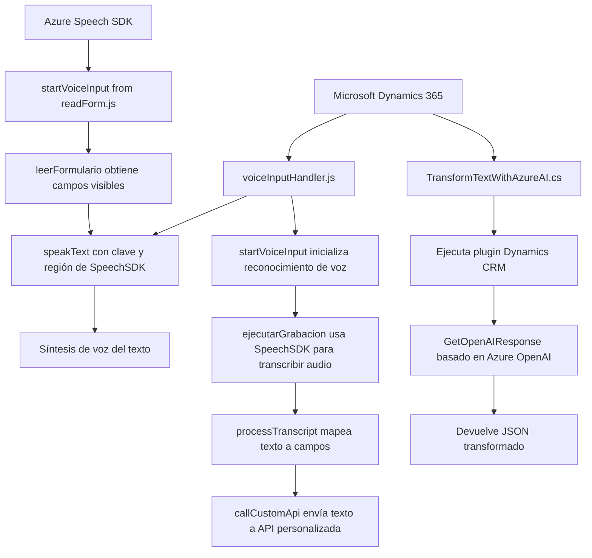

### Breve resumen técnico

El repositorio parece estar diseñado para trabajar en un entorno de Microsoft Dynamics 365, integrando tecnologías como el **Azure Speech SDK** y **Azure OpenAI**. Su funcionalidad principal incluye interacción por voz, procesamiento de formularios dinámicos y capacidades avanzadas basadas en inteligencia artificial.

---

### Descripción de arquitectura

- **Tipo de solución**:  
Este repositorio implementa varios componentes para una aplicación híbrida que combina un frontend interactivo (con JavaScript) y lógica backend en forma de plugins para Dynamics CRM. La solución foca en:
  - Captura y síntesis de entrada por voz.
  - Transformación de texto mediante APIs de Azure OpenAI.
  - Actualización dinámica de formularios basados en su contexto y la entrada obtenida.

- **Arquitectura**:  
La arquitectura puede considerarse una combinación de **n capas** (frontend y backend) y **orientada a eventos**. El frontend se encarga de la interacción directa entre el usuario, la voz, y el formulario, mientras que el backend está diseñado como plugins dentro de Dynamics CRM con procesos de integración hacia servicios externos (Azure Speech y Azure OpenAI).

---

### Tecnologías usadas

1. **Frontend**:
   - **JavaScript**: Lenguaje principal para implementar funciones interactivas en el navegador.
   - **Azure Speech SDK**: Para síntesis de voz (Text-to-Speech), reconocimiento de entrada de voz, y manejo dinámico de audio.
   - **Microsoft Dynamics API**: Funcionalidades de integración profunda con el contexto de formularios en Dynamics CRM.

2. **Backend**:
   - **C# .NET**: Lenguaje para plugins en Dynamics CRM.
   - **Microsoft Dynamics SDK**: Framework de extensibilidad para la interacción de entidades en Dynamics CRM.
   - **Azure OpenAI API (GPT)**: Procesamiento de texto avanzado usando IA.
   - **Newtonsoft.Json**: Para manipulación y generación de JSON en C#.
   - **System.Net.Http**: Solicitudes HTTP para comunicación con APIs externas.

3. **Patrones**:
   - **Facade Pattern** en el frontend: Facilita abstracción de llamadas al SDK externo.
   - **Service-Oriented Architecture (SOA)** para integración con servicios externos como Azure Speech y OpenAI.
   - **Event-driven architecture**: Se utiliza lógica basada en disparadores de eventos del formulario en el frontend y backend.

---

### Dependencias o componentes externos

1. **Azure Speech SDK y OpenAI**: Para procesamiento de datos externos.
2. **Xrm.WebApi**: Para operaciones CRUD y solicitudes en Dynamics CRM.
3. **Newtonsoft.Json**: Biblioteca para manipulación JSON en C#.
4. **System.Net.Http**: Para manejo de peticiones HTTP hacia APIs externas.
5. **Endpoint de Azure Speech SDK Browser Package**: URL específica para cargar dinámicamente el SDK en el navegador.
6. **API personalizada en Dynamics 365**: Posiblemente usada como endpoints mencionados en los archivos frontend.
7. **Servicios internos de Dynamics CRM**: Como `IOrganizationService`.

---

### Diagrama Mermaid para GitHub

---

### Conclusión final

El repositorio implementa una solución robusta para integrar entrada de voz, manipulación de formularios dinámicos y AI avanzada basada en servicios de Azure en el ecosistema de Dynamics CRM. Su arquitectura modular, tecnologías modernas, y patrones bien estructurados hacen que sea una solución escalable y útil en escenarios que requieren automatización y experiencia de usuario innovadora. El diagrama muestra cómo interactúan los componentes dentro de la arquitectura.