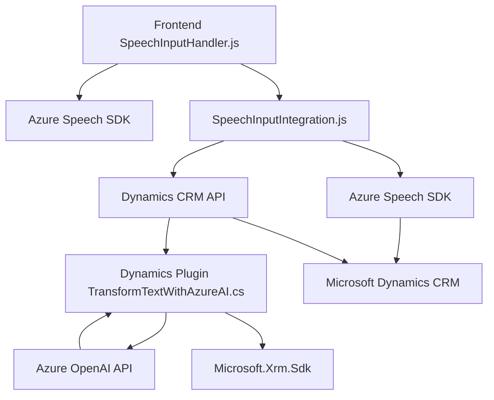

### Breve resumen técnico
El repositorio contiene componentes relacionados con la interacción entre la interfaz de usuario (frontend), sistemas CRM (Dynamics), y servicios externos como Azure Speech SDK y Azure OpenAI. El objetivo general es la integración de datos de formularios y reconocimiento de voz con CRM Dynamics mediante un módulo especializado en procesamiento y síntesis de voz, junto con plugins para transformar texto en estructuras JSON.

---

### Descripción de arquitectura
Este sistema emplea **una arquitectura modular en capas** combinada con una integración de servicios externos. Se presentan las siguientes capas:
1. **Presentación**: Archivos de frontend (`SpeechInputHandler.js`, `SpeechInputIntegration.js`) relacionados con formularios y reconocimiento de voz.
2. **Lógica de integración externa**: Usa **Azure Speech SDK** para síntesis y transcripción de voz, y APIs personalizadas (CRM y OpenAI).
3. **Lógica empresarial**: Plugin (`TransformTextWithAzureAI.cs`) que extiende funcionalidades de Dynamics CRM mediante reglas específicas.
4. **Servicios externos**: Azure AI, Speech SDK y Dynamics CRM se integran mediante APIs para añadir procesamiento inteligente fuera del sistema.

El patrón arquitectónico incluye la lógica en capas para diferenciación de responsabilidades, con los siguientes elementos destacados:
- **Patrón cliente ligero**: Las interacciones de frontend se cargan dinámicamente y delegan procesamiento a servicios externos.
- **Plugin-based architecture**: En CRM se extienden capacidades usando plugins.
- **API-first Approach**: Servicios de Azure (Speech SDK y OpenAI) como base de la lógica principal.
- **Integración con terceros**: Dinámica mediante SDK y API REST.

---

### Tecnologías usadas
1. **Frontend**: 
   - JavaScript (ECMAScript) para manejo de lógica en la interfaz.
   - Manipulación del DOM para la carga dinámica de SDK.
   - Azure Speech SDK para reconocimiento de voz y síntesis de texto.

2. **Backend/Lógica empresarial**:
   - Lenguaje C# para el plugin en Dynamics CRM.
   - Microsoft Dynamics SDK (`Microsoft.Xrm.Sdk`) para interacción con CRM.
   - Plugins con `IPlugin` como capa de extensión.
   - Azure OpenAI API para transformación de texto con IA.
   - JSON (mediante `Newtonsoft.Json` y `System.Text.Json`) para serialización y deserialización.

3. **Servicios externos**: 
   - Azure Speech SDK y OpenAI para procesamiento de voz y texto.
   - APIs de Dynamics CRM (`Xrm.WebApi`).

4. **Patrones**:
   - Modularización (funciones/lógica independiente por responsabilidad).
   - Cliente-Servidor (frontend interactúa con servicios externos y plugins en el backend).
   - Plugin-based architecture para extensiones de CRM Dynamics.

---

### Diagrama Mermaid (100% compatible con GitHub Markdown)
El siguiente diagrama representa los componentes principales y cómo están relacionados:

---

### Conclusión final
El repositorio implementa una solución modular que articula el frontend con capas de servicio externo y lógica empresarial en un entorno CRM. Usa Azure Speech SDK para reconocimiento y síntesis de voz, facilita entrada de datos basada en comandos hablados, y transforma texto en estructuras JSON mediante IA.

- **Ventajas**: Modularidad y desacoplamiento de lógica, extensibilidad mediante plugins y APIs.
- **Desafíos**: Dependencia alta de servicios externos (Azure Speech/OpenAI y Dynamics CRM).
- **Arquitectura recomendada**: Mantener un enfoque modular y considerar factorización de la lógica en servicios más desacoplados (eventualmente migrar por completo a microservicios).  

El diagrama describe claramente las relaciones entre los elementos integrados y muestra una solución cliente-servidor orientada a procesos inteligentes en formularios y datos CRM.