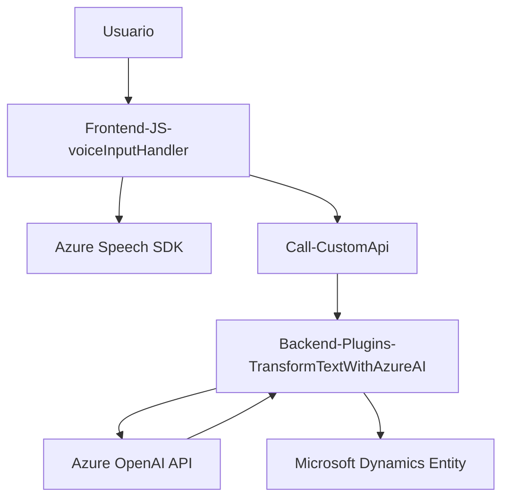

# Resumen Técnico
El repositorio describe un sistema basado en la interacción entre un **frontend** y **backend** dentro de un entorno de **Microsoft Dynamics 365**, con soporte para reconocimiento de voz y procesamiento de texto utilizando servicios de Azure (Speech SDK y OpenAI API).

El sistema facilita la síntesis y reconocimiento de voz en el **frontend**, mientras que el **backend** procesa comandos hablados o texto mediante Azure OpenAI. Este diseño habilita una experiencia interactiva que incluye la extracción estructurada de información y la manipulación de formularios usando inteligencia artificial.

---

# Descripción de Arquitectura
1. **Arquitectura Multicapa**: El sistema tiene tres capas:
   - **Frontend**: Procesa interacción con usuarios, principalmente mediante comandos hablados y la síntesis de voz.
   - **Backend (Plugins)**: Extiende Microsoft Dynamics 365 mediante plugins personalizados. Amplía las capacidades del CRM con comunicación directa hacia APIs externas.
   - **Servicios Externos**: Integración con **Azure Speech SDK** para reconocimiento/síntesis de voz y **Azure OpenAI** para procesamiento avanzado de texto.

2. **Elemento clave** con la **desacopladura** entre componentes utilizando APIs (REST APIs) y SDKs.

3. **Patrones utilizados**:
   - **Event-Driven**: Los SDKs en el frontend se cargan y operan bajo eventos asincrónicos.
   - **Microservicio Enfocado**: Integración con APIs externas como Azure Speech y OpenAI.
   - **Modularidad**: El diseño basado en funciones reutilizables y extensibles facilita su integración con otros sistemas.

---

# Tecnologías Usadas
- **Frontend**:
  - **JavaScript**: Implementación de lógica para procesamiento de voz, interacción con formularios y APIs de reconocimiento/síntesis.
  - **Azure Speech SDK**: Para conversión de texto a voz (Text-To-Speech) y reconocimiento de voz (Speech-To-Text).

- **Backend**:
  - **C# (Microsoft Dynamics Plugins)**:
    - `IPlugin`: Extiende comportamiento de entidades y eventos en Dynamics 365.
    - HTTP Client Libraries: Para interacción con APIs de Azure.

- **Servicios externos**:
  - **Azure Speech SDK**: Reconocimiento y síntesis de voz.
  - **Azure OpenAI API**: Para transformación de texto usando modelos de IA como GPT-4.
  - **Microsoft Dynamics Web API**: Para interacciones con formularios y entidades de CRM.

---

# Diagrama Mermaid (100% Compatible con GitHub Markdown)

---

# Conclusión Final
El sistema utiliza una arquitectura **multicapa** práctica y modular que combina backend basado en plugins de Dynamics 365 con funcionalidades frontend de voz gestionadas mediante servicios de Azure. Esto permite un flujo desacoplado y escalable que facilita la interacción avanzada con el usuario usando voz, complementado con inteligencia ambiental.

**Puntos clave**:
- Uso de **Azure Speech SDK** para voz y **Azure OpenAI API** para IA en backend.
- Modularidad fuerte en el frontend con funciones reutilizables.
- Arquitectura extensible capaz de integrarse con otras funcionalidades, ideal para entornos CRM.