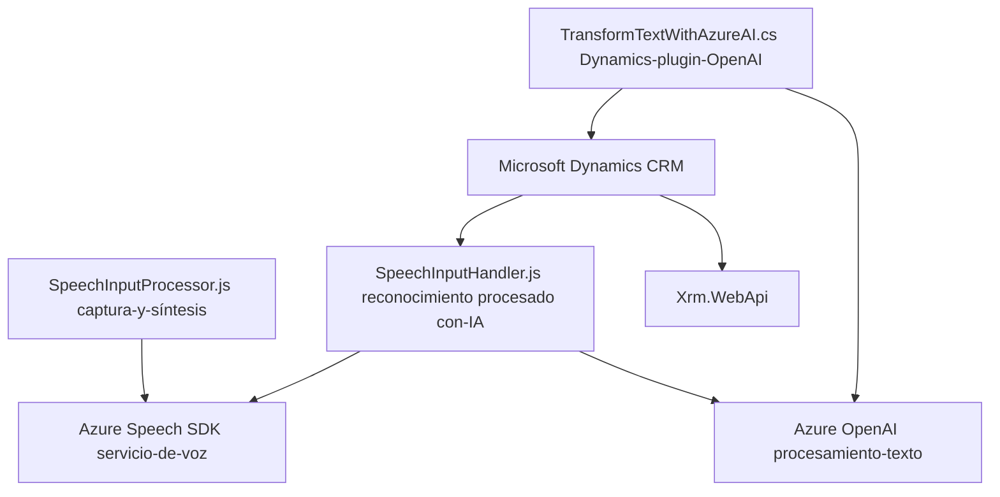

### Breve resumen técnico
El repositorio parece estar enfocado en integrar funcionalidades avanzadas de reconocimiento de voz y procesamiento de texto con inteligencia artificial en una solución sobre **Microsoft Dynamics CRM** utilizando servicios de **Azure Speech SDK** y **Azure OpenAI**. Ofrece capacidad para interactuar con formularios, automatizar la captura de datos y transformarlos en estructuras JSON mediante IA. La solución incluye componentes frontend para captar y procesar datos y un plugin backend en C# para tareas más complejas de AI y lógica empresarial.

---

### Descripción de arquitectura
La arquitectura de la solución es **híbrida**, combinando **tres capas principales**:
1. **Frontend (JavaScript)**:
   - Responsable de la interfaz de captura de la voz del usuario y la interacción dinámica con los formularios.
   - Utiliza componentes modulares que encapsulan la lógica necesaria para la síntesis y reconocimiento de voz, integrando servicios de Azure Speech.

2. **Backend Plugin (C#)**:
   - Ampliación de Microsoft Dynamics CRM mediante un plugin que interactúa con el contexto del sistema.
   - Admite la transformación de datos mediante Azure OpenAI API para integrar funcionalidades de inteligencia artificial.

3. **Servicios externos**:
   - Integra servicios basados en la nube, como Azure Speech SDK y Azure OpenAI API.
   - Admite la invocación de APIs mediante Dynamics CRM (Xrm.WebApi) desde el frontend para funcionalidades avanzadas.

En un análisis más detallado, se puede deducir una **arquitectura en capas**, donde cada componente cumple un rol independiente: interfaz de usuario, lógica de negocios, y capa de servicio.

---

### Tecnologías usadas
1. **Frontend**:
   - **JavaScript**: Desarrollo de scripts para interacciones dinámicas del cliente.
   - **Azure Speech SDK**: Reconocimiento de voz, síntesis de voz.

2. **Backend**:
   - **C# y .NET Framework**: Desarrollo de plugins extensibles para Dynamics CRM.
   - **Azure OpenAI API**: Procesamiento avanzado de texto respaldado por IA.

3. **Frameworks**:
   - Microsoft Dynamics CRM SDK: Extensiones plugin.
   - Xrm.WebApi: Consumidores de APIs REST para Dynamics CRM.

4. **Otros**:
   - **Newtonsoft.Json y System.Text.Json**: Manipulación y serialización JSON en el plugin backend.
   - **System.Net.Http**: Invocaciones HTTP desde el backend.

---

### Diagrama Mermaid válido para GitHub

---

### Conclusión final
El repositorio implementa una solución multicapa centrada en Dynamics CRM, que fusiona interacción directa con formularios del sistema, reconocimiento de voz y procesamiento avanzado mediante inteligencia artificial. La arquitectura se caracteriza por la modularidad y una dependencia controlada de servicios de Azure, favoreciendo escalabilidad y personalización de las funcionalidades. Es una buena base para sistemas empresariales que busquen combinar automatización y facilidad del usuario con capacidades avanzadas de IA.