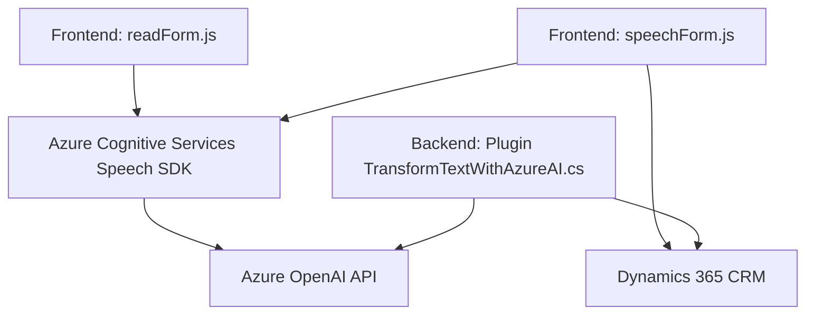

---

### Breve Resumen Técnico
El repositorio presenta una solución con múltiples componentes diseñados para integrar un sistema CRM (como Dynamics 365) con servicios de Azure, particularmente Azure Speech SDK y Azure OpenAI Service. Los archivos sugieren una solución enfocada en proporcionar funciones de entrada y salida de datos mediante voz, además de transformar texto en JSON estructurado usando la API de OpenAI.

---

### Descripción de Arquitectura

1. **Tipo de Solución:**
   - La solución parece ser una integración personalizada para un sistema CRM (Dynamics 365) basada en **Microsoft Azure servicios cognitivos**. Combina elementos orientados al frontend (JavaScript para procesamiento en el navegador) con un backend basado en plugins para Dynamics CRM (escrito en C#).

2. **Arquitectura de la Aplicación:**
   - **Microservicios**: Aunque el sistema utiliza componentes modulares (como Speech SDK y OpenAI Service), todo parece estar integrado principalmente conDynamics CRM como plataforma base. Es posible referirse a la arquitectura como **plugin-microservices orientados a propósito específico**, manteniendo un flujo de datos que delega tareas especializadas en Azure.

3. **Patrones Arquitectónicos:**
   - **MVC/Repository**: Los formularios en Dynamics usan lógica controlada en los backends del CRM y en los scripts del navegador (Frontend).
   - **Event-driven architecture**: El uso de eventos asincrónicos (promesas y callbacks) se observa tanto en el frontend como en la parte del plugin (Reactivo).
   - **Modular Architecture**: Los scripts JavaScript están segmentados en varios módulos funcionales de tamaño pequeño, cada uno responsabilizándose de funciones específicas.
   - **Delegación en servicios externos**: Azure Speech SDK y OpenAI para reducir la lógica interna en los archivos y simplificar operaciones complejas.

---

### Tecnologías Usadas
1. **Frontend**:
   - **JavaScript** con interacción y dinámicas para formularios en CRM.
   - Integración del **Azure Speech SDK** para entradas por voz y síntesis de texto a audio.
   - Interfaz directa con APIs personalizados o APIs de Dynamics 365 (`Xrm.WebApi`).

2. **Backend**:
   - **C#**: Desarrollo de plugins para Dynamics CRM y procesamiento de texto integrado con Azure OpenAI.
   - Dependencias: `Newtonsoft.Json`, `System.Net.Http`, `System.Text.Json`.

3. **Servicios Externos**:
   - **Azure Speech SDK**: Usado tanto en el frontend para reconocimiento de voz como síntesis de texto.
   - **Azure OpenAI Service**: API para procesar texto y transformarlo según normas específicas, compatible con JSON estructurado.

---

### Diagrama **Mermaid** Representativo

---

### Conclusión Final
La solución presentada corresponde a una **integración robusta de CRM (Dynamics 365)** que utiliza tecnologías modernas para resolver problemas relacionados con datos de formularios mediante voz (entrada/salida) y procesamiento avanzado de texto (transformaciones estructurales). La arquitectura del sistema está modularizada para facilitar componentes independientes como plugins y scripts JavaScript que interactúan principalmente con Azure Cognitive Services. En términos generales, adopta varios patrones arquitectónicos adecuados para un caso de uso CRM, incluyendo **modularidad**, **event-driven** y **integración de servicios externos**, garantizando extensibilidad y reutilización.