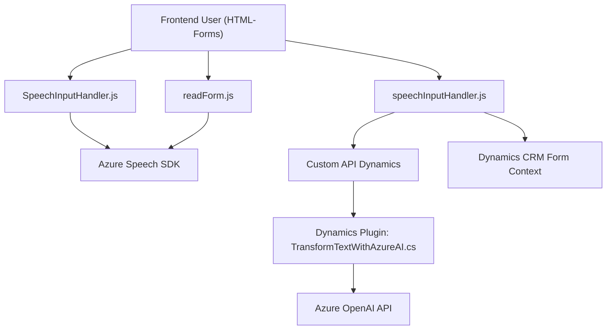

## Breve Resumen Técnico

El repositorio contiene tres archivos con diferentes propósitos, todos ellos subyacen en el contexto de una solución integrada en Microsoft Dynamics 365. Su funcionalidad principal gira en torno al procesamiento de formularios y la integración con servicios de Microsoft Azure, específicamente Azure Speech SDK y Azure OpenAI. Incluye funcionalidades para lectura de formularios mediante síntesis de voz, procesamiento de entrada de datos a través de voz en un entorno web, y transformación de texto hacia un formato estructurado mediante un plugin en Dynamics 365.

---

## Descripción de la Arquitectura

La solución se orienta a una arquitectura modular y basada en integración con APIs y SDKs de Microsoft Azure y Dynamics CRM. Los archivos se pueden clasificar en:

1. **Frontend JavaScript (Modular)**: Maneja interacciones con el usuario en la interfaz y configura la comunicación con los servicios de Azure. Sigue un modelo centralizado de flujo en el cliente.
   
2. **Plugins (Archivos `.cs`)**: Implementan procesamiento en el backend directamente en Dynamics 365, usando el patrón de plugins proporcionado por la plataforma. Esto integra de forma eficiente Azure OpenAI para la conversión de texto.

La arquitectura general sigue un patrón de integración de servicios (teniendo diferentes capas o componentes que interactúan: Dynamics CRM frontend, plugins y servicios Azure). Es una solución **n-capas**, donde cada capa aborda una responsabilidad específica: presentación, lógica de negocios, y terceros externos (Azure Speech/OpenAI).

---

## Tecnologías Usadas

1. **Frontend (JavaScript):**
   - **Frameworks**: Basado en JavaScript nativo.
   - **Servicios Externos**:
     - Azure Speech SDK.
   - **Patrones**: Modularidad, carga dinámica mediante scripts, event-driven programming.

2. **Backend (C# Plugin):**
   - **Frameworks**: `System`, `Microsoft.Xrm.Sdk`, `Newtonsoft.Json` (para JSON), HTTP Client (integración con API).
   - **Servicios Externos**:
     - Azure OpenAI API (a través de endpoint RESTful).
   - **Patrones**: Responsabilidad única mediante el uso explícito en la implementación de `IPlugin`, comunicación REST.

---

## Diagrama Mermaid

---

## Conclusión Final

Esta solución representa una integración entre Microsoft Dynamics 365, el SDK Speech de Azure y la API de OpenAI, lo que la hace ideal para proyectos que requieren servicios de síntesis y reconocimiento de voz, junto con transformación avanzada de datos en lenguaje natural. El diseño modular de la solución, junto con la separación de responsabilidades entre frontend, plugins en backend y servicios externos, la posicionan como una solución escalable y adaptable, aunque podría mejorar en algunos aspectos como la centralización de la configuración (por ejemplo: claves de Azure no hardcodeadas) y un modelo más desacoplado en el frontend (uso de frameworks como React o Angular para futuras evoluciones).