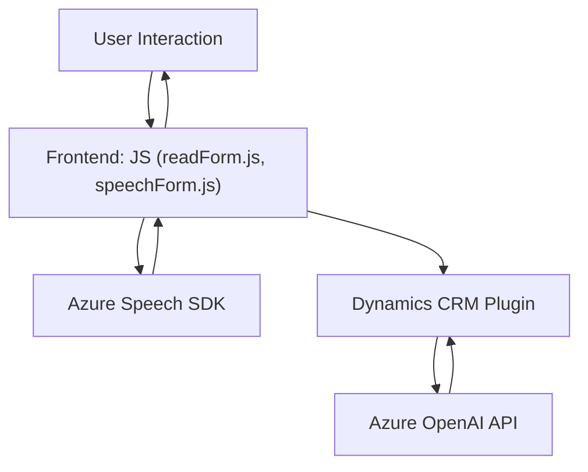

### Breve resumen técnico
El repositorio describe una solución que integra tecnologías de frontend, plugins y servicios externos (Azure Speech SDK y Azure OpenAI API) con Dynamics CRM para la interacción natural por voz y el procesamiento automatizado. Las principales funcionalidades incluyen síntesis de voz, reconocimiento de voz, y transformación de texto mediante IA. Técnicas como modulación de funciones y llamadas a APIs externas son comunes en el diseño.

---

### Descripción de arquitectura
#### **Arquitectura principal:**
La solución emplea una **arquitectura basada en n capas**, con integración de servicios externos y una fuerte modularidad. Mientras el frontend realiza la síntesis y el reconocimiento de voz mediante Azure Speech SDK, el backend incluye plugins que delegan lógica compleja a servicios hospedados en Azure OpenAI para procesamiento avanzado. Las capas principales son:
1. **Frontend JavaScript:** Controla la interacción con el usuario, extrae datos visibles de formularios y los envía a servicios para síntesis o reconocimiento de voz.
2. **Backend Dynamics CRM:** Usa plugins C# especializados para realizar transformaciones de texto y almacenamiento.
3. **Servicios externos (Azure Speech y OpenAI):** Manejan el procesamiento intensivo, delegando tareas como reconocimiento de voz y generación de texto estructurado.

#### **Principales características arquitectónicas:**
1. **Modularidad:** Código dividido en funciones y clases con responsabilidades específicas que refuerzan el principio de separación de responsabilidades.
2. **Integración con servicios externos:** Depende de APIs Azure Speech SDK y OpenAI para ofrecer capacidades avanzadas.
3. **Patrón Plugin:** Extiende la funcionalidad nativa de Dynamics CRM mediante C# en backend.
4. **Event-driven architecture:** Activadores como eventos de voz o interacciones con formularios impulsan la lógica.
5. **RESTful integration:** Realiza llamadas HTTP asincrónicas para la comunicación con los servicios de Azure.

---

### Tecnologías usadas
1. **Frontend:**
   - **JavaScript:** Principal lenguaje de desarrollo.
   - **Azure Speech SDK:** Para síntesis y reconocimiento de voz.
2. **Backend:**
   - **C# y .NET Framework:** Implementación de plugins Dynamics CRM.
   - **Azure OpenAI API:** Integración con modelos GPT-4 para transformar texto.
   - **Newtonsoft.Json:** Para manejar datos JSON de Azure OpenAI.
   - **System.Net.Http:** Para realizar solicitudes HTTP al servicio OpenAI.
   - **Plug-ins de Dynamics CRM:** Implementación del patrón `IPlugin` para extensibilidad.
3. **Servicios externos:**
   - Azure Speech SDK: Síntesis y reconocimiento de voz.
   - Azure OpenAI API: Procesamiento avanzado de texto.

---

### Diagrama Mermaid válido para GitHub

---

### Conclusión final
Este repositorio presenta una solución que utiliza tecnologías modernas para facilitar la interacción de los usuarios con aplicaciones de negocio como Dynamics CRM, empleando voz para sintetizar texto y procesar comandos. La integración de servicios externos como Azure Speech SDK y OpenAI API aporta capacidades avanzadas y flexibilidad, mientras que la modularidad del código asegura mantenimiento sencillo y adaptabilidad.

La arquitectura es consistente con una solución **n capas** con fuertes componentes de integración de servicios externos y extensibilidad a través de plugins en el backend. Esta solución es robusta y adecuadamente diseñada para manejar procesos que involucren interacción por voz y procesamiento dinámico de formularios.