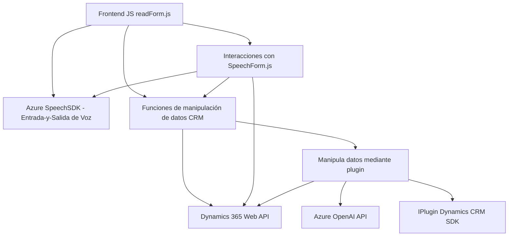

### Breve resumen técnico:
El repositorio representa una solución híbrida centrada en la interacción con formularios mediante entrada de voz y procesamiento avanzado de texto. Está compuesto por archivos de frontend que manejan la interfaz y SDK de voz, así como un backend basado en Microsoft Dynamics CRM que utiliza un plugin de .NET con integración a Azure OpenAI Service.

### Descripción de arquitectura:
La solución utiliza una arquitectura de **aplicación n-capas**. La capa de presentación está desarrollada en JavaScript orientada a la manipulación de formularios en el frontend, la capa de negocio se encuentra en los Plugins de Dynamics CRM y las capas de datos y servicios externos incluyen un servicio API en la nube (Azure API para OpenAI Service), Dynamics CRM Web API y el Speech SDK de Azure. 

### Tecnologías usadas:
1. **Frontend**:
   - Lenguaje: JavaScript (ES6+).
   - Framework/SDK: Azure Speech SDK.
   - Interacción: HTML formulada desde interfaces CRM de Microsoft Dynamics.

2. **Backend**:
   - Framework: Microsoft Dynamics CRM SDK.
   - Lenguaje: C# (.NET).
   - Servicio externo: Azure OpenAI Service.
   - API externa: Dynamics Web API para manipulación de datos.

3. **Técnicas/Patrones aplicados**:
   - **Patrón Modular:** Las funciones y clases están separadas por áreas específicas de funcionalidad en el frontend.
   - **Carga dinámica:** Implementación de un sistema para la carga dinámica del Azure Speech SDK en el frontend.
   - **Plugin-Based Architecture:** Integración del plugin con Dynamics CRM mediante la interfaz `IPlugin`.
   - **Abstracciones:** Métodos de ayuda para extraer datos y gestionar la conversión en formatos legibles/estructurados.

### Posibles dependencias o componentes externos:
- **Azure Speech SDK**: Para la entrada de voz y síntesis de audio desde CDN.
- **Azure OpenAI Service**: Para transformar texto siguiendo normas específicas.
- **Dynamics Web API**: Para modificar y manipular datos en formularios de Dynamics.
- **Microsoft Dynamics CRM SDK**: Para la integración de plugins en la capa de negocio.
- **HTTP Client (C#)**: Comunicación con servicios externos.
- **Newtonsoft JSON**: Para parseo y procesamiento de datos JSON.

### Diagrama Mermaid:

### Conclusión final:
La solución se configura como una **aplicación n-capas** que integra un frontend basado en JavaScript con funcionalidades de entrada/salida de voz y un backend basado en un plugin para Microsoft Dynamics CRM. Utiliza tecnologías avanzadas como **Azure Speech SDK** y **Azure OpenAI Service** para proveer accesibilidad y realizar transformaciones de texto basadas en IA. La arquitectura está bien diseñada, manteniendo la modularidad y separación de responsabilidades, destacando patrones modernos de integración de APIs y servicios externos. A nivel de mejora, se podrían considerar técnicas de tolerancia a errores de red y la externalización de configuraciones sensibles como claves y endpoints en un sistema de gestión seguro.