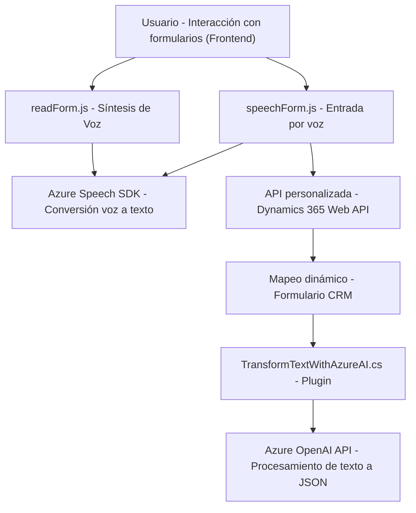

### **Análisis completo**

#### **Resumen técnico**
El repositorio contiene tres archivos principales que integran funcionalidades relacionadas con un sistema dinámico basado en formularios, procesamiento de datos y acceso mediante tecnologías de voz. Utiliza servicios de Azure, como Speech SDK y OpenAI API, junto con Dynamics 365 CRM. La solución muestra una mezcla de accesibilidad (procesamiento de entrada o salida de voz) y automatización basada en inteligencia artificial (Azure OpenAI).

---

### **Descripción de la arquitectura**
La arquitectura está diseñada de manera modular y se basa en **n capas**. Cada componente funciona de manera independiente y cumple una responsabilidad específica: entrada de datos (voz), salida de datos (síntesis de voz en formularios) y procesamiento avanzado (formalización y transformación de datos vía IA). Estos módulos interactúan entre sí a través de servicios externos proporcionados por Microsoft Azure y custom APIs de Dynamics CRM.

- **Frontend:** JavaScript (speechForm.js, readForm.js), encargándose de las interacciones de usuario y conectándose dinámicamente a Azure Speech SDK para manejar entrada/salida de voz desde formularios.
- **Backend:** Un plugin .NET (TransformTextWithAzureAI.cs), diseñado para integrarse con Dynamics CRM, permitiendo procesar y estructurar datos utilizando Azure OpenAI.
- **Integración API/Servicios:** Azure Speech SDK y OpenAI manejan las capacidades más avanzadas de procesamiento de voz e inteligencia artificial, y Dynamics CRM brinda el contexto estructural del sistema.

Este diseño modular permite la evolución de cada módulo o capa independientemente, pero está limitado por su dependencia en los servicios de Azure y Dynamics CRM.

---

### **Tecnologías utilizadas**
1. **Frontend**
   - **Lenguaje:** JavaScript.
   - **Bibliotecas/SDKs:** Azure Speech SDK.
   - **API externas:** API personalizada de Dynamics 365 Web API.
   - **Patrones:**
     - Lazy Loading (carga dinámica del Azure Speech SDK).
     - Funcionalidad basada en eventos y asincronía (para manejo de operaciones en tiempo real).
     - Encapsulación para lógica específica.

2. **Backend**
   - **Lenguaje:** .NET C#.
   - **Framework:** Dynamics CRM Plugin Framework, basado en `IPlugin`.
   - **Bibliotecas:** 
     - Newtonsoft.Json para manipulación JSON.
     - HttpClient para las solicitudes al servicio Azure OpenAI.
   - **Patrones:**
     - Plugin Pattern: Integrado directamente con los eventos de Dynamics CRM.
     - SOA (Service-Oriented Architecture): Dependencias externas como Azure OpenAI integradas mediante servicios.

3. **Servicios externos**
   - **Azure Speech SDK:** Procesa entrada/salida de voz, incluyendo transcripción y síntesis de voz.
   - **Azure OpenAI Service:** Procesamiento basado en inteligencia artificial para la normalización y estructuración de datos a través de prompts.
   - **Dynamics 365 Web API:** Interacción con datos empresariales y capacidades específicas del CRM.

---

### **Diagrama Mermaid válido para GitHub**

---

### **Conclusión final**
La solución representada en el repositorio combina **procesamiento de voz**, **inteligencia artificial** y **gestión dinámica de formularios en CRM**, conformando una arquitectura de **n capas** basada en servicios (API y SDKs). Cada módulo cumple una función altamente específica, utilizando servicios de Microsoft Azure y Dynamics 365 CRM para proporcionar una experiencia integradora y moderna.

Sin embargo, la arquitectura está fuertemente vinculada al ecosistema Microsoft, lo que limita su portabilidad a escenarios fuera de esta plataforma. Para propósitos como accesibilidad, optimización de procesos empresariales y automatización, la solución está bien planteada y podría servir como base para un sistema más complejo orientado a la transformación digital empresarial.