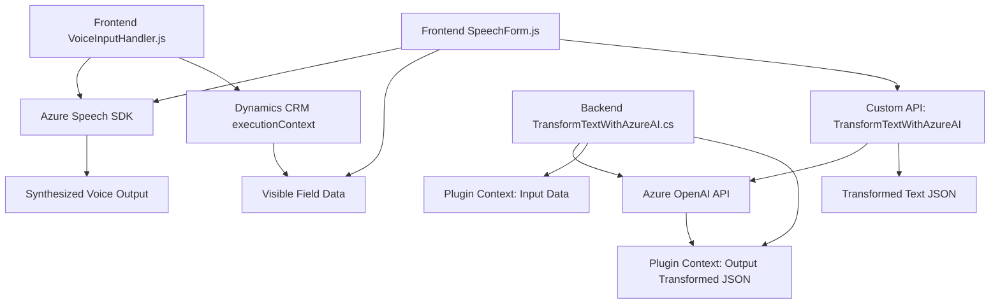

### Breve resumen técnico:
El repositorio contiene componentes de un sistema para interacción avanzada por voz y manipulación de formularios, integrados con Microsoft Dynamics CRM y servicios de Microsoft Azure (Speech SDK y OpenAI). Estos componentes configuran un ecosistema donde la entrada y salida de voz, junto con la transformación y procesamiento de texto, son claves. Incluye un plugin en .NET para procesamiento avanzado y módulos frontend en JavaScript para síntesis y transcripción de voz.

---

### Descripción de arquitectura:
- **Tipo de solución**: Un sistema híbrido que combina frontend (JavaScript) con lógica empresarial en un backend (Dynamics CRM plugins). También utiliza microservicios externos en Azure para procesamiento de voz (Speech SDK) y transformación de texto (OpenAI API).
- **Arquitectura**: Se puede clasificar como *n-capas*:
    1. **Frontend (UI)**: Procesa entrada de voz a texto y salida de texto a voz, interactuando con servicios de Azure.
    2. **Lógica empresarial y backend**: Ejecuta plugins en Dynamics CRM para procesar datos y conectarse con microservicios externos en Azure.
    3. **Servicios externos (Azure Speech/OpenAI)**: Componentes encargados de la síntesis y transformación.

---  

### Tecnologías usadas:
1. **Frontend:**
   - JavaScript (modular, estructurado).
   - **Azure Speech SDK**: Para servicios de entrada y salida de voz, cargado dinámicamente.
   - Uso de APIs y eventos propios de Dynamics CRM (`executionContext`, `Xrm.WebApi`).

2. **Backend:**
   - C# (plugin `IPlugin` en Dynamics CRM).
   - **Azure OpenAI API**: Servicios de transformación y formateo de texto.
   - Uso de estructuras para llamados HTTP (`HttpClient`) y manejo de JSON (`Newtonsoft.Json`, `System.Text.Json`).

3. **Patrones de diseño:**
   - Modularización: Cada archivo y función está diseñado para cumplir un propósito único.
   - Carga dinámica de dependencias: SDK y servicios externos se integran según necesidad.
   - Cliente-servidor: La interacción entre el frontend y backend distribuye responsabilidades.

---

### Dependencias o componentes externos:
1. **Azure Speech SDK**:
   - Interacción con servicios cloud para reconocimiento y síntesis de voz.
2. **Azure OpenAI API**:
   - Procesa mensajes y transforma texto según reglas definidas.
3. **Dynamics CRM SDK**:
   - Interfaz para eventos y manipulación de atributos y controles de formularios.
4. **Librerías de manejo de JSON**:
   - `System.Text.Json`, `Newtonsoft.Json`.

---

### Diagrama Mermaid válido para **GitHub Markdown**:

---

### Conclusión final:
El repositorio presenta una solución robusta y modular orientada a mejorar la interacción por voz en sistemas empresariales como Dynamics CRM, integrando servicios avanzados de Microsoft Azure. La arquitectura n-capas permite separar claramente las responsabilidades entre frontend, backend y servicios externos. Sin embargo, el acoplamiento directo con Azure puede limitar la flexibilidad en caso de migrar a otros proveedores. La elección de tecnologías y patrones garantiza eficacia y escalabilidad para escenarios dinámicos empresariales.