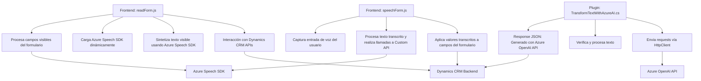

# Resumen técnico

El repositorio parece estar diseñado para interactuar con Microsoft Dynamics CRM, con foco en funcionalidades que integran reconocimiento de voz, síntesis de texto y transformación de textos mediante Azure Speech SDK y Azure OpenAI. La solución permite:
- En el frontend, capturar datos y voz del usuario, procesarlos, y alimentar formularios de Dynamics CRM. 
- En el backend, transformar texto mediante la integración de Azure OpenAI para responder con resultados estructurados como JSON.

Se observa una arquitectura híbrida basada en servicios de Microsoft Dynamics CRM, con extensiones personalizadas (plugins) para tareas específicas. Además, se emplea una integración con servicios de Azure para reconocimiento/síntesis de voz y procesamiento avanzado de texto.

---

# Descripción de arquitectura

### Tipo de solución:
La solución es principalmente **una aplicación integrada con Dynamics CRM**, que combina módulos de frontend en JavaScript y una extensión del backend basada en plugins (.NET). Además, se apoya en servicios externos (Azure Speech SDK y Azure OpenAI).

### Estructura/Patrones identificados:
1. **Frontend:**
   - Modularización y separación de lógica: Cada archivo JavaScript tiene funciones que manejan tareas específicas (sintetizar voz, procesar entradas de voz, interactuar con APIs de Dynamics CRM).
   - Uso de SDKs externos: Se carga dinámicamente el SDK de Azure Speech para reconocimiento y síntesis de voz.
2. **Backend:**
   - Uso de plugins: Implementado según el patrón extensible de Dynamics CRM (`IPlugin`), lo que permite ejecutar lógica personalizada en respuesta a eventos del sistema.
   - Integración de APIs externas (`Azure OpenAI`): Lógica para transformar texto con normas específicas mediante solicitudes HTTP sincronizadas.
3. **Servicios externos:** Dependencia de servicios de Microsoft (APIs de Dynamics CRM) y Azure (Speech SDK y OpenAI), lo que indica un enfoque de **arquitectura basada en servicios**.

### Arquitectura general:
La solución tiene componentes de arquitectura **n-capas** en el sentido de un frontend y un backend interactuando a través de APIs propias y servicios externos. Sin embargo, la estrecha dependencia del ecosistema de Dynamics CRM y Azure (con acoplamiento a SDKs y APIs) sugiere una arquitectura híbrida entre monolito extendido y servicios.

---

# Tecnologías usadas

1. **Frontend:**
   - **JavaScript (Vanilla)** para manipulación del DOM y gestión lógica.
   - **Azure Speech SDK:** Reconocimiento de voz, síntesis de texto en tiempo real.
   - **Xrm.WebApi (Dynamics CRM)** para manipular datos del servidor.

2. **Backend:**
   - **.NET Framework (Dynamics CRM plugins):** Implementación del patrón `IPlugin`.
   - **Azure OpenAI API:** Procesamiento avanzado de texto según reglas específicas vía llamadas HTTP.
   - **Newtonsoft.Json y System.Text.Json:** Manejo de objetos JSON.

3. **Servicios externos:**
   - **Dynamics CRM APIs:** Para interactuar con datos y estructuras de CRM.
   - **Azure Speech SDK y OpenAI:** Para reconocimiento/síntesis/listas de opción automatizadas.

---

# Diagrama **Mermaid** (GitHub Markdown compatible)

---

# Conclusión final

La solución presentada ofrece integración avanzada entre componentes de frontend y backend, con un fuerte acoplamiento al ecosistema de Microsoft Dynamics CRM y Azure. Este enfoque permite manejar datos, voz y texto transcrito para alimentar formularios dinámicos y realizar transformaciones avanzadas usando inteligencia artificial.

Si bien el diseño es funcional, algunas consideraciones técnicas podrían hacerla más robusta:
- **Desacoplar dependencias:** Evitar un fuerte acoplamiento con SDKs, API externas y servicios específicos (Azure/Dynamics), favoreciendo adaptabilidad en escenarios futuros.
- **Optimizar llamadas síncronas:** Las solicitudes a servicios externos (como Azure OpenAI) podrían transformarse en operaciones asincrónicas para mejorar el rendimiento en escenarios de alta demanda.
- **Gestión más segura de claves/API:** Las claves de servicios externos deben gestionarse mediante variables de entorno o sistemas secretos en lugar de incrustarlas en el código.

En general, la solución es sólida y aprovecha servicios de Azure y Dynamics CRM para resolver problemas específicos de interacción basada en texto y voz.