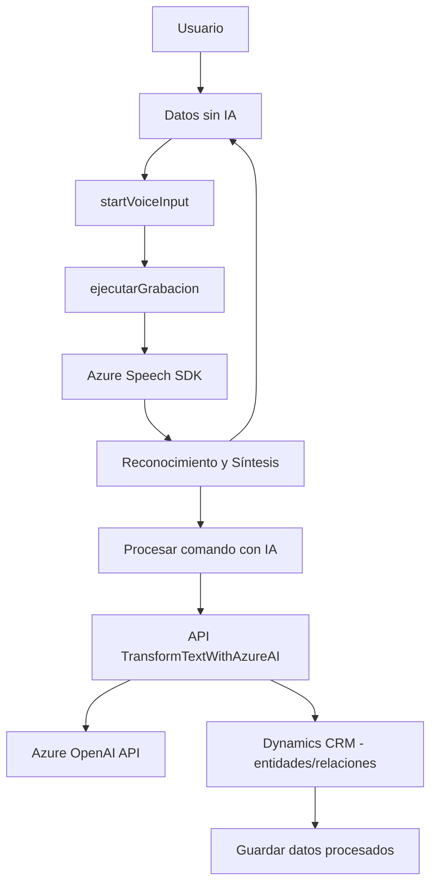

### Breve Resumen Técnico
El repositorio proporciona una solución que permite la integración de reconocimiento y síntesis de voz con formularios de Dynamics CRM mediante el uso de **Azure Speech SDK**, junto con un plugin en C# que utiliza el **Azure OpenAI API** para transformaciones textuales. La solución aplica tecnologías de inteligencia artificial para mejorar la interacción con el usuario, centralizada principalmente en la utilización del sistema Dynamics CRM y los servicios de Microsoft Azure.

---

### Descripción de Arquitectura
La arquitectura de esta solución es una combinación de varias capas y la integración de servicios externos mediante una arquitectura orientada a servicios. Podemos clasificar la solución como una arquitectura **n-capas** debido a la separación de responsabilidades:

1. **Capa de presentación**: Implementada en la carpeta `FRONTEND/JS`, relacionada directamente con la interacción entre el usuario y el formulario visible basado en Dynamics CRM.
2. **Capa de negocio**: Representada por la funcionalidad del plugin en C#, que interactúa con Dynamics CRM usando la API de Microsoft y delega el procesamiento de texto a la API de OpenAI.
3. **Capa de integración**: En la integración con servicios en la nube como Azure Speech SDK para reconocimiento/síntesis de voz y Azure OpenAI API para transformar texto utilizando IA.
4. **Capa de datos**: Representada por la interacción directa con Dynamics 365 como fuente auditada y manipulador de datos (mediante entidades, campos y relaciones).

El uso de APIs y plugins confirma un enfoque modular y escalable que es compatible con la arquitectura de un monolito extensible con elementos orientados a microservicios en el plugin.

---

### Tecnologías Usadas
1. **Lenguajes**:
   - **JavaScript**: Para el frontend relacionado con los formularios y la síntesis/reconocimiento de voz.
   - **C# (.NET Framework)**: Para el plugin que interactúa con Dynamics 365.

2. **Frameworks**:
   - **Microsoft Dynamics SDK**: Para selección y modificación de datos dentro de los formularios.
   - **Azure Speech SDK**: En el frontend para reconocimiento y síntesis de voz.
   - **Azure OpenAI SDK/API**: Desde el plugin para realizar transformaciones de texto estructurado.
   - **NewtonSoft.Json**: Para trabajar con datos JSON.

3. **Patrones de diseño y arquitectura**:
   - **Modularización**: El código organiza funcionalidades como módulos independientes, facilitando cambios y pruebas.
   - **Asynchronous Programming (async/await)**: Gestión de operaciones con servicios remotos de forma no bloqueante.
   - **Integración con APIs externas**: Uso de servicios de Azure mediante HTTP.
   - **Dynamic Mapping and Processing**: En el frontend, los nombres visibles de campos son transformados dinámicamente para interactuar con la estructura interna del CRM.

---

### Diagrama Mermaid

---

### Conclusión Final
La estructura del repositorio, las dependencias y los patrones de diseño apuntan a una **solución integrada de capas** con capacidades de interacción en tiempo real para procesamiento lingüístico y conversión de voz a texto. Utiliza componentes externos como **Azure Speech SDK** y **Azure OpenAI API**, que permiten realizar ciencia de datos aplicada al reconocimiento y síntesis de voz, además de procesamiento de comandos mediante inteligencia artificial. 

Si bien la arquitectura es modular, se podría considerar la evolución hacia una arquitectura basada en **microservicios** para desacoplar las funciones relacionadas con IA y CRM, mejorando la escalabilidad y el mantenimiento del sistema.