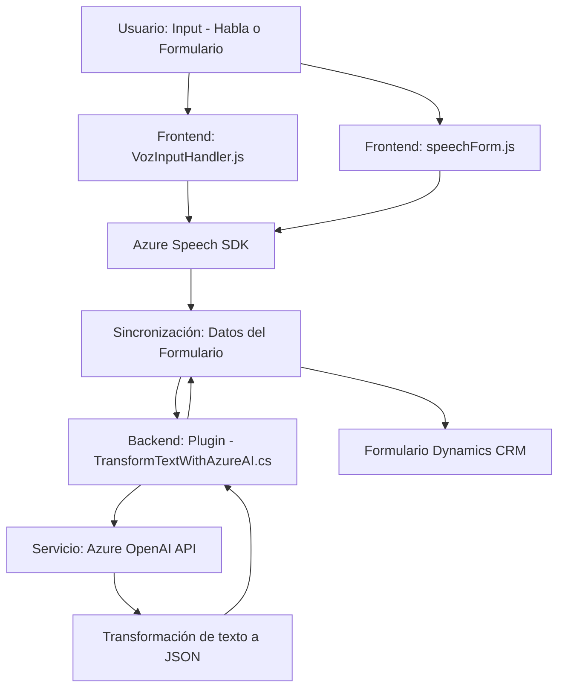

### Breve resumen técnico:

El repositorio se enfoca en integrar servicios basados en nube (principalmente Azure Cognitive Services y Dynamics CRM) con una aplicación de frontend y backend para establecer una solución que convierte voz en datos de formulario y viceversa. Esto incluye procesamiento de reconocimiento de voz, síntesis de texto a voz, manipulación de formularios y comunicación con API externas, como OpenAI para operaciones de transformación de texto mediante inteligencia artificial.

---

### Descripción de arquitectura:

La solución presenta los siguientes aspectos arquitectónicos:
1. **Del lado del cliente:** Hay un enfoque modular en el desarrollo con archivos JS del frontend que corresponden a aspectos específicos (lectura del formulario, entrada de voz, síntesis, etc.). Se pueden identificar rasgos de una arquitectura de cliente basada en *MVC* o *MVP*, donde los módulos encapsulan la lógica de negocio relacionada con la entrada y salida de datos según el contexto o el formulario en pantalla.
   
2. **Del lado del servidor:** Los *plugins* escritos en C# indican el uso del patrón arquitectónico de Dynamics CRM con la implementación de `IPlugin`. Aquí se aplica una arquitectura de integración mediante servicios externos (Azure y OpenAI) para transformar texto en JSON estructurado.

3. **Arquitectura general:** La aplicación muestra rasgos de una **arquitectura de n capas**:
   - **Capa de presentación:** Archivos JavaScript en el frontend que interactúan con el usuario y manejan la interfase visual.
   - **Capa de aplicación/lógica:** Incorporada en los plugins y módulos que realizan manipulación de datos y transformación de voz, integrando servicios externos.
   - **Capa de datos:** La interacción con la API de Dynamics CRM y servicios como OpenAI apunta a una capa de persistencia para almacenar y manipular los datos finales.

---

### Tecnologías usadas:

1. **Frontend:**
   - **JavaScript**: Para manejar la entrada de datos y operaciones con el SDK de Azure.
   - **Azure Speech SDK**: Síntesis de texto a voz y transcripción de voz.

2. **Backend:**
   - **C# y Microsoft Dynamics CRM SDK**: Implementación de plugins compatibles con Dynamics CRM.
   - **Azure OpenAI endpoint**: Integración con GPT para la creación y transformación de JSON estructurado basada en reglas dinámicas.
   - **Newtonsoft.Json** y **System.Text.Json**: Para manipular y serializar/deserializar JSON.

3. **Arquitectura y Patrones:**
   - **Plugin pattern en Dynamics CRM**: Encapsulación de lógica para extender funcionalidades del CRM.
   - **Fachada para Azure Speech SDK** en el frontend: Simplificación de las llamadas al SDK.
   - **Dynamic Dependency Loading (Lazy Loading)**: Carga de SDK externos solo cuando son necesarios.
   - **API Integration**: Comunicación con servicios externos (Azure OpenAI y Dynamics CRM APIs) siguiendo buenas prácticas con HTTP y JSON.

---

### Diagrama Mermaid válido para GitHub:

---

### Conclusión final:

La solución es una integración avanzada de frontend, backend y servicios en la nube para mejorar la interacción con formularios mediante entrada de voz y operaciones asistidas por IA. Se aprovecha el SDK de Azure Speech para manejar entrada de voz y síntesis de texto a voz en nube, mientras que en el backend se usa Dynamics CRM y Azure OpenAI para transformar y manejar datos de manera estructurada. La arquitectura de n capas asegura modularidad y separa claramente responsabilidades del cliente (frontend) y el servidor (backend), lo que mejora la mantenibilidad y escalabilidad del sistema.