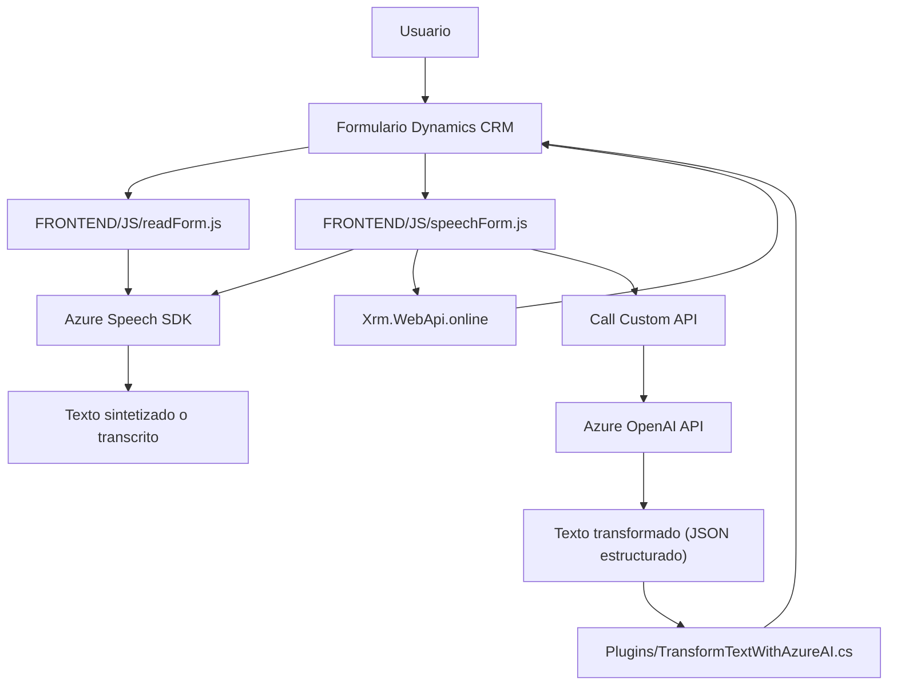

### Breve resumen técnico
El repositorio parece ser una solución integrada con **Microsoft Dynamics CRM** que utiliza funcionalidades de reconocimiento de voz y síntesis de texto a voz mediante **Azure Speech SDK**. Además, incluye un componente de procesamiento avanzado, conectado con **Azure OpenAI GPT**, para manipular texto configurado y transcribirlo o transformarlo según reglas específicas, integrándolo nuevamente en los formularios de Dynamics 365.

El sistema conforma una arquitectura orientada a servicios automatizados interactuando con APIs externas (Azure Speech SDK y OpenAI API) y el API interno de `Xrm.WebApi` de Dynamics.

---

### Descripción de arquitectura
#### Tipo de solución
- Es un conjunto integrado compuesto de un **frontend** basado en JavaScript, interactuando directamente con Dynamics CRM y recursos externos en Azure, como Speech SDK y OpenAI GPT. A su vez, emplea un plugin basado en .NET para acceder y enriquecer funcionalidades en Dynamics mediante la definición de extensiones personalizadas (plugins).

#### Arquitectura utilizada
- **N-capas**: La solución tiene una separación clara entre las capas:
  - **Frontend:** Implementa interfaces de usuario y lógica de interacción con formularios de Dynamics CRM.
  - **Backend (plugin):** Extiende la funcionalidad de Dynamics mediante una integración directa con el modelo Azure OpenAI para procesamiento de texto centralizado.
  - **Servicios externos:** Depende de servicios como Azure Speech SDK y Azure OpenAI para enriquecer sus capacidades.
- **Basada en eventos:** Utiliza el modelo de plugin de Dynamics CRM para desencadenar procesos en función de eventos como lecturas de campos o cambios en el formulario.

#### Patrones identificados
- **Modularización:** El código está dividido en diferentes componentes, cada uno responsable de tareas específicas como grabación de voz, lectura de formularios y transcripción de texto.
- **SDK y external APIs:** Utiliza servicios externos como **Azure Speech SDK** y **Azure OpenAI API**, distribuyendo la lógica crítica a través de recursos escalables.
- **Dependency Injection (DI):** El plugin implementa `IPlugin`, que inyecta recursos y servicios del entorno de Dynamics CRM.
- **Single Responsibility Principle (SOLID):** Los archivos muestran una clara división de responsabilidades para garantizar mantenimiento y escalabilidad.
- **Callback/Promises:** Usado ampliamente en el frontend para gestionar operaciones asíncronas.

---

### Tecnologías usadas
- **Frontend:**
  - JavaScript (manejo dinámico de DOM y lógica de negocio).
  - **Azure Speech SDK:** Para lectura de formularios usando síntesis de texto a voz, y para transcribir datos hablados.
  - Librerías nativas (`window.SpeechSDK`).

- **Backend:**
  - C# (.NET Framework o posiblemente .NET Core, dado el uso de plugins en Dynamics CRM).
  - **Microsoft Dynamics CRM API:** Para integración directa con formularios y datos de la plataforma.
  - **Azure OpenAI API:** Consume modelos GPT para procesamiento avanzado de texto.

- **APIs Externas:** 
  - `Xrm.WebApi.online` para manipulación directa de datos de Dynamics.
  - Azure Speech SDK y OpenAI integrados con servicios externos para procesamiento de voz y texto, respectivamente.

---

### Diagrama Mermaid válido para GitHub Markdown

---

### Conclusión final
La solución aborda un caso de uso avanzado de interacción con Microsoft Dynamics CRM mediante el título de voz y entrada texto natural, integrando reconocimiento/síntesis de voz (Azure Speech SDK) y un servicio de transformación con inteligencia artificial (Azure OpenAI GPT). 

Opta por una **arquitectura N-capas**, definida por la clara separación entre frontend (captura de voz y lógica de cliente), backend (transformación avanzada con Azure AI) y servicios externos (SDKs y APIs). Utiliza patrones como modularización, integración con servicios externos y programación basada en eventos para lograr una solución extensible y adecuadamente diseñada.

Si necesitas ajustar la arquitectura para tolerancia a fallos, una opción sería dividir la solución en **microservicios**, introduciendo capas adicionales de mensajería para garantizar que los sistemas externos no representen un "single point of failure". En general, esta solución es adecuada para integraciones complejas centradas en la automatización de formularios de CRM mediante reconocimientos avanzados.