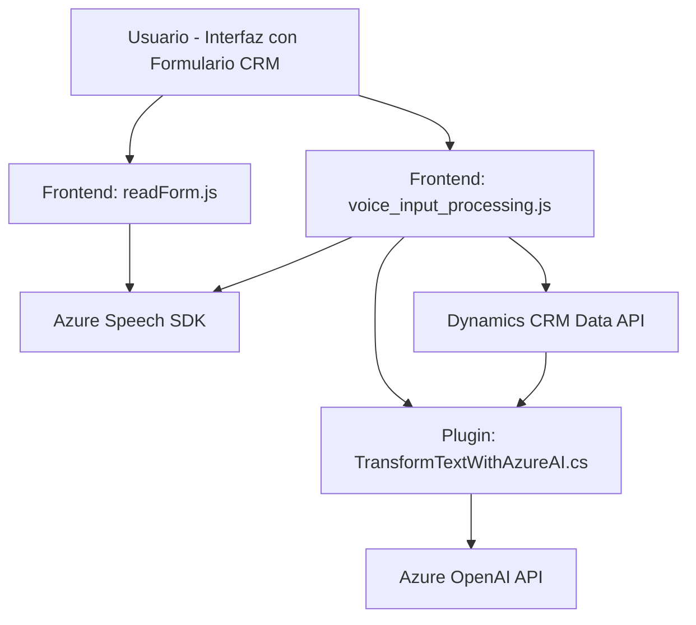

### Breve resumen técnico:
El repositorio contiene tres archivos principales: 

1. `readForm.js`: Implementa la lectura en voz alta de datos de formularios usando el **Azure Speech SDK** y configura el idioma en español.
2. `voice_input_processing.js`: Procesa el reconocimiento de voz del usuario para registrar datos en los formularios de Dynamics CRM, utilizando el **Azure Speech SDK** y APIs internas como `Xrm.WebApi`.
3. `TransformTextWithAzureAI.cs`: Es un plugin para Dynamics CRM que utiliza la **API de Azure OpenAI** para procesar texto y transformarlo en JSON estructurado.

---
### Descripción de la arquitectura:
#### Tipo de solución:
La solución es híbrida, con una combinación de frontend y backend diseñada para facilitar la interacción con formularios de **Microsoft Dynamics CRM**. También aprovecha un servicio externo (**Azure OpenAI**) para potenciar ciertas funcionalidades del sistema.

#### Arquitectura:
La arquitectura exhibe características de una **arquitectura de n capas**. Estas capas incluyen:
1. **Frontend**: Los archivos `readForm.js` y `voice_input_processing.js` forman la capa de presentación (frontend) para la interacción entre el usuario y los formularios.
2. **Backend**: El plugin `TransformTextWithAzureAI.cs` actúa como la capa de lógica del negocio en el contexto del servidor de Dynamics CRM.

Adicionalmente, hay integración con servicios externos como **Azure Speech SDK** y **Azure OpenAI API**.

#### Tecnologías usadas:
1. **Frontend**: 
   - Lenguaje: JavaScript.
   - SDK: Azure Speech SDK.
   - API: DOM y Web APIs, Dynamics Xrm.WebApi.

2. **Backend**:
   - Lenguaje: C# (.NET Framework).
   - Microsoft Dynamics SDK.
   - Azure OpenAI API.
   - JSON parsing (`Newtonsoft.Json.Linq`).

#### Patrones de diseño: 
1. **Dependency Injection**: Para manejar dinámicamente la carga de SDK en los scripts.
2. **Facade Pattern**: Encapsulación en puntos de entrada simples (`startVoiceInput`, `executeRecording`, etc.).
3. **Plug-in Architecture**: Implementación estándar de la interfaz `IPlugin` de Dynamics CRM.
4. **Modularización funcional**: Cada función o método se diseña con responsabilidades específicas y utiliza una arquitectura basada en micro-servicios para servicios externos de Azure.

---
### Dependencias / Componentes externos:
1. **Azure Speech SDK**: Integración para síntesis y reconocimiento de voz.
   - URL de recurso: `"https://aka.ms/csspeech/jsbrowserpackageraw"`.
2. **Azure OpenAI API**: Para procesar texto mediante IA dentro del plugin.
   - URL de recurso: `"https://openai-netcore.openai.azure.com/"`.
3. **Microsoft Dynamics Xrm.WebApi**: API interna para interacción con datos del servidor CRM (solo en frontend).
4. **Newtonsoft.Json.Linq**: Biblioteca usada en el plugin para manipulación de objetos JSON.
5. **APIs del navegador**: Para manejo de micrófono y carga dinámica de scripts.

---
### Diagrama Mermaid:
El diagrama representa cómo los componentes interactúan entre sí:

---
### Conclusión final:
La solución utiliza un **modelo híbrido de integración API**, combinando uso de servicios en la nube (Azure Speech y OpenAI) con el ecosistema de **Microsoft Dynamics CRM**. Permite funcionalidades avanzadas como la lectura en voz alta y el procesamiento de entrada de voz, aplicando transformaciones basadas en IA.

- **Fortalezas**: Alta modularidad con integración directa a servicios externos que amplían las capacidades del CRM estándar.
- **Mejoras posibles**: Incorporación de validación más robusta, optimización del manejo de errores, y diseño más flexible para soportar diferentes idiomas y entornos regionales.

Esta arquitectura tiene potencial para implementaciones similares en otros formularios o servicios externos que requieran operaciones con IA y entrada en tiempo real.