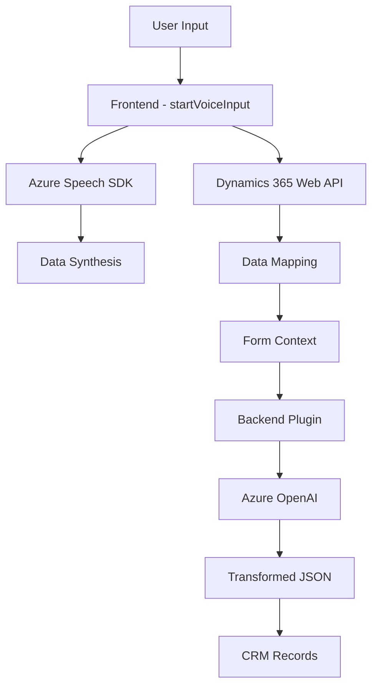

### Breve Resumen Técnico
El repositorio implementa una solución híbrida de frontend y plugins para Dynamics CRM que se integra con servicios de Azure (OpenAI y Speech SDK). La solución está orientada a la manipulación de datos y habilitación de interfaces de voz del lado del cliente, mientras que en el backend se procesan textos con IA y reglas definidas en CRM. 

### Descripción de Arquitectura
La arquitectura es de tipo **n-capas**, dividida principalmente en: 
1. **Frontend** con interacciones basadas en voz, utilizando Azure Speech SDK para síntesis y reconocimiento de texto.
2. **Backend escrito en C#**, que opera como un plugin de Dynamics CRM para transformar texto mediante Azure OpenAI Service.
3. **Integración de servicios externos** (Azure Speech/AI) para complementar las funciones del sistema CRM y proporcionar un flujo más natural e inteligente entre usuario y datos estructurados.

Este diseño aprovecha patrones como:
- Modulación de funciones en el frontend para interacción con APIs.
- Encapsulación de la lógica en el plugin backend mediante el patrón `IPlugin`.
- Uso de flujos asíncronos y comunicación externa (event-driven en frontend y client-server en backend).

### Tecnologías Usadas
1. **Frontend:**
   - **JavaScript**: Gestión de flujo de datos y manipulación de formularios.
   - **Azure Speech SDK**: Reconocimiento y síntesis de voz. 
   - **Dynamics 365 Web API (Xrm.WebApi)**: Integración con Dynamics CRM para lectura y escritura de datos del formulario en tiempo real.
2. **Backend:**
   - **C#**: Desarrollo del plugin para Dynamics 365.
   - **Microsoft Dynamics SDK (IPlugin)**: Extensión de funcionalidades de CRM.
   - **Azure OpenAI Service**: Procesamiento de texto con reglas específicas (`gpt-4o`).
   - **ASP.NET Core/HttpClient**: Para realizar solicitudes HTTP a servicios externos.
3. **Dependencias comunes:**
   - **JSON Parsing**: Uso de Newtonsoft.Json y Text.Json para gestión de objetos JSON.

### Diagram Mermaid
El diagrama a continuación muestra las interacciones entre componentes y servicios en esta solución:

### Conclusión Final
Este repositorio implementa una solución interactiva e inteligente para integrar sistemas CRM con servicios externos basados en IA y síntesis de voz. La arquitectura se basa en un modelo de capas, con un frontend que habilita la interacción por voz y un backend que procesa texto con reglas específicas. Su diseño es modular y puede adaptarse a flujos dinámicos según los requerimientos del cliente.