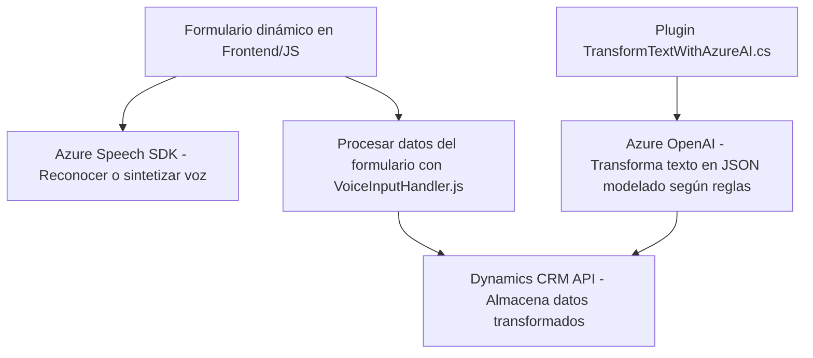

### Breve resumen técnico

Estos archivos representan partes de una solución mayor centrada en la interacción con Dynamics CRM a través de inteligencia artificial (Azure OpenAI) y reconocimiento de voz/síntesis de voz (Azure Speech SDK). Incluye interacción con formularios dinámicos, transformación de datos y modulación por voz.

---

### Descripción de arquitectura

La solución tiene una arquitectura híbrida, combinando una estructura **n-capas** para el frontend y plugins en Dynamics CRM, mientras se apoya en **microservicios externos** de Azure (Speech SDK y OpenAI) para tareas específicas. El diseño utiliza principios de modularidad y dependencia dinámica.

---

### Tecnologías usadas

1. **Frontend:**
   - **JavaScript:** Principal lenguaje para manipulación de formularios HTML y llamadas al SDK de Azure.
   - **Azure Speech SDK:** Reconocimiento de voz y síntesis en tiempo real.
   - **APIs de Dynamics CRM:** Para la escritura/lectura de datos en los formularios.

2. **Backend:**
   - **C#:** Para implementar un plugin en Dynamics CRM que interactúa con Azure OpenAI para procesar texto.
   - **Azure OpenAI:** Microservicio para transformar texto en JSON estructurado.

3. **Otros:**  
   - **Dynamics 365 CRM (Xrm.WebApi):** Para consultas y configuraciones.
   - **Newtonsoft.Json y System.Text.Json:** Librerías especializadas para manejo de JSON.

---

### Diagrama Mermaid

---

### Conclusión final

La solución combina una arquitectura **n-capas ampliada** orientada a frontend/backend con el uso de **microservicios externos**. Los archivos indican una integración eficiente de reconocimiento de voz y procesamiento avanzado de texto mediante Azure Speech SDK y OpenAI. La modularidad de las funciones facilita la mantenibilidad y escalabilidad, mientras que el uso de APIs de Dynamics CRM permite interactuar adaptativamente con formularios y datos dinámicos. El diseño atiende a patrones modernos como **dependency injection**, **modular programs** y **service-oriented architecture**.