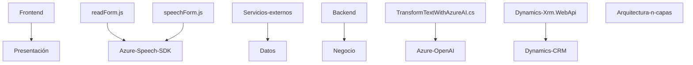

### Breve resumen técnico
El repositorio analiza archivos que implementan funcionalidades de entrada y salida de voz con Azure Speech SDK en el frontend, integran IA mediante Azure OpenAI en el backend, y sincronizan datos con Dynamics CRM. Esto apunta a una solución empresarial centrada en interacción de formularios, accesibilidad, y transformación de datos por voz o texto.

---

### Descripción de arquitectura
1. **Tipo de solución**: Aplicación híbrida con capacidades frontend (integración de voz) y un backend para transformación de texto.
2. **Arquitectura**: 
   - Frontend sigue una estructura modular con funciones procedurales y SDK.
   - Backend utiliza un modelo orientado a plugins con arquitectura de integración con Dynamics CRM.
   - Aplicación general utiliza una arquitectura **n-capas**, donde las capas principales son:
     - Presentación (frontend como interfaz).
     - Negocio (plugin en Dynamics).
     - Datos (API de Azure y CRM).
3. **Patrones importantes**:
   - Modularidad: Cada archivo organiza funciones autocontenidas.
   - SDK Integration: Uso de Azure Speech y OpenAI SDK como servicios externos.
   - Plugin: En el backend, los plugins (`TransformTextWithAzureAI.cs`) se integran dinámicamente en la lógica CRM.

---

### Tecnologías usadas
1. **Frontend**:
   - JavaScript.
   - Azure Speech SDK para síntesis y reconocimiento de voz.
   - `Promise` y callbacks para asincronía.
2. **Backend**:
   - C# para desarrollo de plugins en Dynamics CRM.
   - Azure OpenAI (GPT-4 para transformación de texto).
   - HTTP client (`System.Net.Http`) para consumir Azure APIs.
   - JSON libraries (`System.Text.Json`, `Newtonsoft.Json.Linq`).
3. **Servicios externos**:
   - Azure Speech y OpenAI APIs. 
   - Xrm.WebApi para trabajar con Dynamics CRM.

---

### Dependencias o componentes externos
1. **Azure Speech SDK**: Para conversión de voz a texto y viceversa.
2. **Azure OpenAI API**: Para IA en transformación y procesamiento de texto.
3. **Dynamics CRM API (`Xrm.WebApi`)**: Para sincronizar datos del formulario.
4. **HTTP & JSON libraries**: Manejo y transformación de solicitudes/objetos JSON.

---

### Diagrama Mermaid válido para GitHub

---

### Conclusión final
El repositorio implementa una solución basada en interacción por voz y procesamiento de texto mediante IA, diseñada para integrarse con Dynamics CRM. Sobresale por su modularidad, integración de servicios cloud (Azure Speech, OpenAI), y separación clara entre capas de presentación, negocio, y datos, cumpliendo con arquitecturas típicas de aplicaciones empresariales modernas. Sin embargo, el uso de credenciales dentro del código backend debe ajustarse por razones de seguridad.