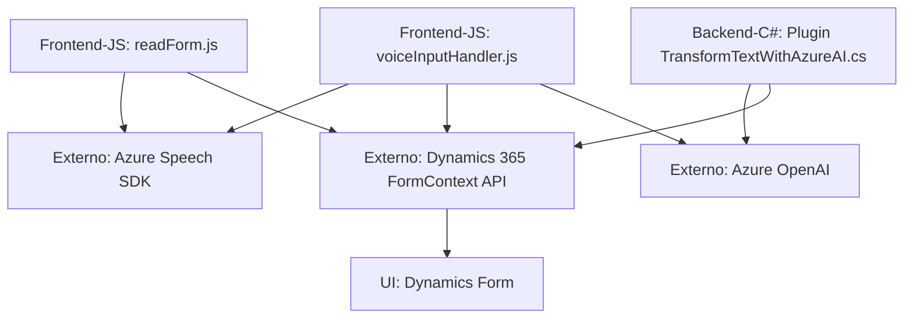

### Breve resumen técnico
El repositorio parece centrarse en soluciones de reconocimiento de voz, accesibilidad y análisis de texto, integrándose con **Dynamics 365**, **Azure Speech SDK** y **Azure OpenAI**. Los archivos muestran funcionalidades relacionadas con la conversión de texto en audio, grabación de input de voz y transformación de texto mediante APIs externas. La estructura enfatiza módulos frontend que interactúan con APIs y plugins backend.

---

### Descripción de arquitectura
1. **Tipo de solución:** Se trata de un ecosistema integrado para plataformas empresariales, compuesto por un **frontend de accesibilidad** que interactúa con formularios de Dynamics 365 y un **plugin backend** que realiza procesamiento avanzado de texto mediante Azure OpenAI.

2. **Arquitectura:**
   - **API Extendida en Dynamics 365:** Uso del patrón **plugin** para extender su funcionalidad backend mediante Azure OpenAI. 
   - **N-capas:** Separación de responsabilidades entre UI (frontend) y lógica compleja de negocio en el backend del CRM.
   - **Interacción con servicios externos:** Flujo típico de integración de APIs REST (Azure Speech SDK y OpenAI).
   - **Lazy Loading:** Comportamiento del frontend para cargar dependencias dinámicas (SDK) cuando sea necesario.

---

### Tecnologías usadas
1. **Frontend:**
   - JavaScript.
   - Azure Speech SDK: Para reconocimiento de voz y síntesis de texto a audio.
   - Dynamics 365 (Xrm API): Para manipulación dinámica de formularios.

2. **Backend**
   - Azure OpenAI: Para transformación de texto.
   - C#: `Microsoft.Xrm.Sdk` (para extensibilidad de Dynamics CRM).
   - `HttpClient`: Interacciones HTTP con APIs REST.
   - `System.Text.Json` y `Newtonsoft.Json.Linq`: Serialización/deserialización JSON.

3. **Patrones:**
   - Modularidad por funciones.
   - Lazy Loading en el frontend.
   - Patrón Plugin en Dynamics CRM backend.
   - Interacciones basadas en REST API.

---

### Diagrama Mermaid

---

### Conclusión final
Este repositorio implementa una solución de accesibilidad y análisis inteligente mediante integración de tecnologías modernas como Azure Speech SDK, Azure OpenAI y Dynamics 365. Está diseñado con una **estructura modular y extensible**, prometiendo una arquitectura en capas con una combinación de frontend dinámico y plugins en el backend. Aunque se optimiza para la plataforma Dynamics 365, podría adaptarse a otros contextos con una ligera personalización. Sin embargo, debería mejorarse la gestión de credenciales API para mitigar riesgos de seguridad.