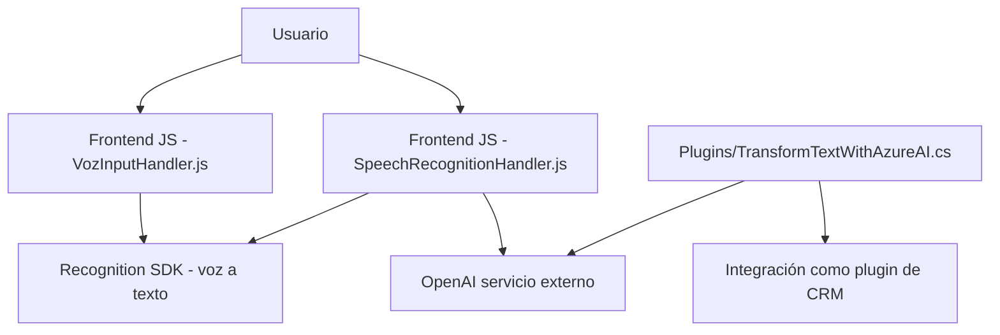

### Breve resumen técnico:
Este repositorio contiene fragmentos de código y archivos organizados en tres carpetas principales, cada uno enfocado en funcionalidades diferentes: los archivos de la carpeta **FRONTEND/JS** están diseñados para manejar la interacción entre el usuario y formularios web mediante reconocimiento de voz, síntesis de voz y procesamiento de formularios. Por otro lado, el archivo **Plugins/TransformTextWithAzureAI.cs** implementa un plugin que extiende Dynamics CRM con la capacidad de transformar texto mediante Azure OpenAI.

---

### Descripción de arquitectura:
La solución parece implementar una **arquitectura n-capas**:
1. **Capa de presentación/frontend**: Scripts JavaScript descritos en la carpeta `FRONTEND/JS` que gestionan la interacción de los usuarios con formularios web y la integración de voz mediante Azure Speech SDK.
2. **Capa de lógica de negocio/plugins**: El archivo en `Plugins` integra el servicio Azure OpenAI con Dynamics CRM, lo que indica que este repositorio extiende la capa lógica de negocio del sistema central.
3. **Capa de integración/API**: Conexiones a servicios externos proporcionados por Azure para IA (OpenAI) y Speech SDK.

Además, se nota una notable modularidad en la solución. Cada función y archivo está diseñado para cumplir con una responsabilidad claramente definida.

---

### Tecnologías usadas:
1. **Frontend (JavaScript)**:
   - Azure Speech SDK: Para síntesis y reconocimiento de voz.
   - FormContext (Dynamics CRM JavaScript API): Para manipulación de datos en formularios.
2. **Backend (C#)**:
   - Dynamics CRM SDK (Microsoft.Xrm.Sdk): Para la integración de plugins.
   - JSON manipulación (Newtonsoft.Json y System.Text.Json): Para estructuración y transformación de texto.
   - HTTP Client para integrar Azure OpenAI y realizar peticiones REST.
3. **Servicios externos**:
   - Azure OpenAI: Procesamiento de texto y generación de JSON.
   - Azure Speech SDK: Reconocimiento y síntesis de voz.

---

### Dependencias o componentes externos:
1. **Azure Speech SDK**:
   - Para sintetizar texto a voz y realizar reconocimiento de voz.
   - Cargado dinámicamente en el navegador.
2. **Azure OpenAI API**:
   - Transformación de texto según normas.
   - Integrado mediante solicitudes HTTP desde un plugin C#.
3. **Dynamics CRM SDK**:
   - Usado en el archivo `TransformTextWithAzureAI.cs` para extender funcionalidad del CRM.
4. **Internos**:
   - Estructuras CRM (`formContext`) para manipulación de datos y formularios.
   - Lógica del frontend optimizada para resolución específica en Chrome.

---

### Diagrama Mermaid:

---

### Conclusión final:
Esta solución combina un enfoque **n-capas** con integración modular de servicios externos, lo que le permite extender funcionalidades específicas de Dynamics CRM y agregar capacidades avanzadas basadas en IA (Azure OpenAI y Speech SDK). La arquitectura brinda flexibilidad para escalar y modificar módulos sin afectar las demás capas. Además, el código destaca por su alineación a patrones de diseño como la Adaptación, Procesamiento de Eventos y Modularidad Funcional. Sin embargo, se podrían mejorar aspectos como la centralización de configuraciones (por ejemplo, claves de API).