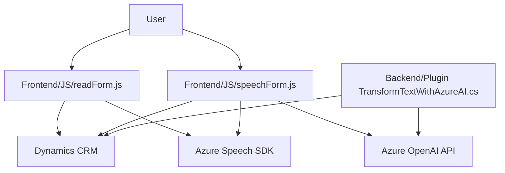

### Breve Resumen Técnico
El repositorio contiene archivos que integran funcionalidades avanzadas relacionadas con entrada/salida por voz, reconocimiento de comandos hablados, manipulación de datos de formularios, y transformación de texto mediante Azure Speech SDK y Azure OpenAI API. Los scripts se integran principalmente con sistemas Dynamics CRM usando patrones estándar de desarrollo API y SDK.

---

### Descripción de Arquitectura
La arquitectura general del sistema exhibe las siguientes características:
1. **Capas Funcionales:**
   - **Frontend:** Scripts JavaScript del manejador de formularios y entrada por voz.
   - **Backend:** Plugins (.NET) que procesan datos con Azure OpenAI.
   - **Servicios Externos:** Azure API (Speech SDK y OpenAI).
   
2. **Modelo de Arquitectura:**  
   - **Mixta (n-capas + hexagonal):** 
     - El frontend interactúa con el sistema CRM (capa presentación y lógica de negocio).
     - Los plugins encapsulan lógica de negocio.
     - Comunicación con APIs externas utilizando llamadas REST y SDK.
   - **Modularidad:** Los componentes están diseñados para tareas específicas resueltas mediante métodos o funciones autocontenidas.

3. **Integración:**  
   Una fuerte dependencia de Azure y Dynamics CRM muestra una arquitectura basada en servicios (Service-Oriented Architecture) y SDK.

---

### Tecnologías Usadas
1. **Frontend:**
   - **JavaScript**: Lógica de entrada/salida por voz y procesamiento de formularios.
   - **Dynamics CRM Context API (Xrm API)**: Interacción con datos de formularios.
   - **Azure Speech SDK**: Procesamiento de síntesis de voz y reconocimiento por voz.

2. **Backend:**
   - **C# (.NET Framework)**: Desarrollo de plugins personalizados para Dynamics CRM.
   - **Azure OpenAI API**: Uso de GPT-4 para transformar texto.
   - **RESTful API**: Comunicación con servicios externos (Azure).

3. **Patrones Implementados:**
   - Modularidad.
   - Delegación.
   - MVC (indirecto).
   - Cliente-Servidor.
   - Separación de responsabilidades (usando SDK y servicios Azure).

---

### Diagrama Mermaid

---

### Conclusión Final
El repositorio representa una solución híbrida que utiliza **Azure ecosystems** en conjunto con **Dynamics CRM** para ofrecer funcionalidades avanzadas como entrada por voz, reconocimiento de comandos hablados, y transformación de texto. La arquitectura muestra un diseño modular, extensible y alineado con patrones modernos, combinando capas funcionales (Frontend y Backend) con capacidades de servicios externos (Azure APIs).

Este enfoque es adecuado para industrias donde la automatización de tareas, entrada por voz, y facilidad de interacción con formularios son cruciales, como **empresas de ventas, soporte al cliente, y automatización de flujos de negocio**. Sin embargo, el sistema requiere una fuerte dependencia de las credenciales y conectividad con Azure y Dynamics CRM.